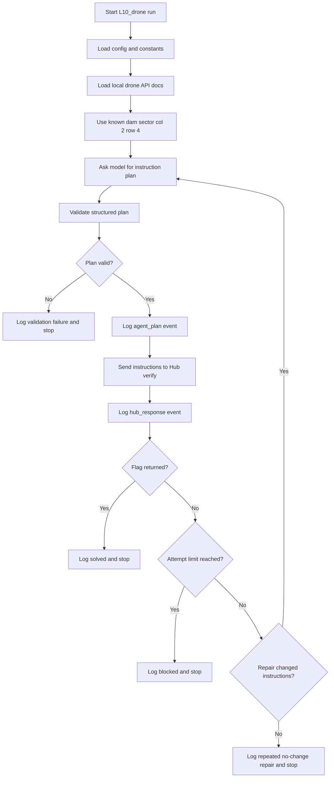

# L10 Drone README

## Table Of Contents

- [Purpose](#purpose)
- [Current Status](#current-status)
- [Known Inputs](#known-inputs)
- [Design Direction](#design-direction)
- [Workflow](#workflow)
- [Mermaid Logic Flow](#mermaid-logic-flow)
- [Model Role](#model-role)
- [Logging](#logging)
- [LLM Usage And Reviews](#llm-usage-and-reviews)
- [Configuration](#configuration)
- [Data Layout](#data-layout)
- [Run](#run)
- [Main Modules](#main-modules)
- [Verification](#verification)
- [Assumptions And Risks](#assumptions-and-risks)
- [Open Questions](#open-questions)
- [What This Task Should Teach](#what-this-task-should-teach)

## Purpose

`L10_drone` is the application workspace for the AI_devs L10 `drone` exercise.

The task is to send drone instructions to the Hub `/verify` endpoint. The intended target is the dam sector near the Zarnowiec power plant, not the power plant itself.

The planned app is a small local learning workflow. It should read already saved input artifacts, ask an LLM to plan and repair drone instructions from the local API documentation, submit attempts to the Hub, and write a clear JSONL log of what happened.

## Current Status

Status: solved and reviewed.

Completed:

- task description inspected from `_agent/references/exercises/L10_Exercise.md`
- local input artifact assumption accepted: the app does not need to download task files
- dam sector accepted as a manually confirmed input: column `2`, row `4`
- vision analysis intentionally removed from the app design
- MVP1 direction chosen: bounded LLM-assisted repair loop with JSONL logs
- DEV_NOTES created as the implementation reference plan
- LLM design checklist passed for MVP1 bounded LLM-assisted repair loop
- source modules implemented for config, local docs loading, planning, validation, Hub calls, JSONL logging, workflow, and CLI
- local tests passed with fake planner and fake Hub clients
- first real run reached Hub feedback and blocked after the model invented dam object IDs
- planner prompt and validation tightened to require `setDestinationObject(PWR6132PL)`, `set(2,4)`, `set(destroy)`, `set(return)`, and `flyToLocation`
- second real run solved the task on the first attempt
- flag-value redaction added after review: docs and logs must record only whether a flag was found, not the flag value
- LLM optimization review passed for the completed MVP1 workflow

Remaining follow-up:

- optional prompt cleanup after comparing future runs, if the same workflow is reused
- optional stricter grammar validation if another drone task variant appears

## Known Inputs

Known task facts:

| Item | Value | Notes |
| --- | --- | --- |
| Task name | `drone` | Sent in the Hub verification payload. |
| Power plant code | `PWR6132PL` | The mission context says the drone should not hit the power plant. |
| Dam sector column | `2` | Manually confirmed by inspecting `drone.png`; indexing starts at `1`. |
| Dam sector row | `4` | Manually confirmed by inspecting `drone.png`; indexing starts at `1`. |
| Hub verify endpoint | `HUB_VERIFY_URL` | Configured operational endpoint, expected to point at `/verify`. |
| Local inputs | `data/L10_drone/input/` | Artifacts are already saved locally. |

Expected local input artifacts:

| Path | Purpose |
| --- | --- |
| `data/L10_drone/input/drone.png` | Human-readable map used to confirm the dam sector. |
| `data/L10_drone/input/drone.html` | Local copy of the drone API documentation. Exact file name may be adjusted after checking the directory. |

## Design Direction

MVP1 should stay simple. This is a local course exercise, so production-oriented reliability, observability, and deployment patterns are intentionally out of scope.

The app will not use a vision model. A vision-based version would pass the map image to a vision-capable model, ask it to count the grid, locate the dam, and validate the sector. This version intentionally skips that step because the dam sector has already been manually confirmed from `drone.png`. Adding vision here would create extra cost, extra uncertainty, and more implementation surface without improving the current MVP1 workflow.

The app will use an LLM for the part where it helps most:

- interpreting tricky drone API documentation,
- choosing an initial minimal instruction sequence,
- reading Hub feedback,
- repairing the next instruction sequence when the Hub rejects an attempt.

The deterministic Python workflow remains responsible for:

- loading local artifacts,
- building the Hub payload,
- validating model output shape,
- enforcing attempt limits,
- masking secrets in logs,
- sending requests to the Hub,
- stopping when a flag appears or limits are reached.

## Workflow

Planned MVP1 workflow:

1. Load configuration from environment variables and app constants.
2. Load local drone API documentation from `data/L10_drone/input/`.
3. Prepare a compact documentation context for the model.
4. Start attempt `1` with known mission facts: dam sector `column=2`, `row=4`, power plant code `PWR6132PL`, task name `drone`.
5. Ask the `Drone Mission Planner` model step for a structured instruction plan.
6. Validate that the model returned a usable `instructions` list and short change/explanation fields.
7. Write an `agent_plan` event to `data/L10_drone/logs/`.
8. Send the instructions to the Hub `/verify` endpoint.
9. Write a `hub_response` event to the same JSONL log.
10. If the Hub returns a flag, stop successfully.
11. If the Hub returns an error and the attempt limit is not reached, pass only the relevant feedback and previous instruction list back to the model.
12. Ask the model to repair the instruction sequence.
13. Continue until success, validation failure, repeated no-change repair, or `MAX_VERIFY_ATTEMPTS`.

The app does not include a dry-run mode in MVP1. The implementation should stay narrow: one real run command, one bounded repair loop, one JSONL log.

## Mermaid Logic Flow



## Model Role

The model step is named `Drone Mission Planner`.

It should receive only:

- compact drone API documentation extracted from local HTML,
- mission facts,
- previous instructions when repairing,
- latest Hub feedback when repairing,
- current attempt number and max attempt count.

It should return structured data that code can validate:

```json
{
  "instructions": ["instruction1", "instruction2"],
  "change_summary": "Short explanation of what changed or why this plan should work.",
  "uses_reset": false
}
```

The model must not receive API keys. It must not decide whether authentication is allowed. It only proposes the `answer.instructions` payload content.

After the first real run, the planner is explicitly told not to invent destination object identifiers. The only allowed object for `setDestinationObject(...)` is `PWR6132PL`; the dam is selected by `set(2,4)` on that known map object.

## Logging

MVP1 uses JSONL logs only. No separate summary report is planned.

Log files should be written under:

```text
data/L10_drone/logs/run_YYYYMMDD_HHMMSS.jsonl
```

Every meaningful step should create one event. The log should let a learner reconstruct:

- which instructions the agent chose,
- why it chose them,
- whether local validation accepted them,
- what payload was sent to the Hub with secrets masked,
- what the Hub returned,
- what the agent changed on the next attempt.

Planned event types:

| Event | Purpose |
| --- | --- |
| `run_started` | Records model, limits, input artifact paths, and known mission facts. |
| `agent_plan` | Records model-proposed instructions and a short explanation. |
| `validation_result` | Records whether the plan passed local checks. |
| `hub_request` | Records the masked request payload sent to `/verify`. |
| `hub_response` | Records the Hub status and response body. |
| `run_finished` | Records terminal status such as `solved`, `blocked`, or `failed_validation`. |

Secrets and flag values must be masked in logs. Course API feedback and Hub responses may be stored in ignored runtime data for local learning only after secret-bearing values are redacted.

## LLM Usage And Reviews

| Area | Status | Evidence |
| --- | --- | --- |
| LLM usage | Yes | MVP1 uses one `Drone Mission Planner` model step to propose and repair drone instructions from local API docs and Hub feedback. Vision is intentionally not used. |
| Design review | Passed | `_agent/instructions/llm_design_checklist.md`; 2026-06-10; scope: MVP1 bounded LLM-assisted repair loop with JSONL logs; mode: non-production; result: PASS; boundary: implement one planner/repair model step, deterministic validation, guarded Hub submission, and JSONL logging only. |
| Optimization review | Passed | `_agent/instructions/llm_optimization_checklist.md`; 2026-06-10; scope: completed MVP1 bounded LLM-assisted repair workflow; mode: non-production; result: PASS; follow-up: no blocking changes, optional prompt cleanup only if reused. |

## Configuration

Required environment variables:

| Variable | Purpose |
| --- | --- |
| `OPENAI_API_KEY` | Authenticates OpenAI model calls for the `Drone Mission Planner`. |
| `AI_DEVS_API_KEY` | Authenticates Hub verification requests. |
| `HUB_VERIFY_URL` | Hub verification endpoint, expected to point at `/verify`. |

Regular app constants should live in `config.py`, not `.env`:

| Constant | Planned Value | Purpose |
| --- | --- | --- |
| `TASK_NAME` | `drone` | Hub task identifier. |
| `POWER_PLANT_CODE` | `PWR6132PL` | Mission context and guardrail for the model. |
| `DAM_COLUMN` | `2` | Known target sector column. |
| `DAM_ROW` | `4` | Known target sector row. |
| `MAX_VERIFY_ATTEMPTS` | `5` | Guard against unbounded repair loops. |
| `PLANNER_MODEL` | `gpt-5-mini` | Model used for planning and repair. |

Secrets must live in `.env`. Do not put real secret values in source code, documentation, commit messages, reports, logs, or app data files.

## Data Layout

Runtime artifacts should live outside source code:

| Path | Intended Use |
| --- | --- |
| `data/L10_drone/input/` | Already saved task artifacts such as `drone.png` and local drone API documentation. |
| `data/L10_drone/logs/` | JSONL run logs with masked requests, agent plans, Hub responses, and terminal status. |
| `data/L10_drone/cache/` | Optional parsed HTML or compact documentation cache if it becomes useful. |

Source code and app documentation belong under `src/apps/L10_drone/`.

## Run

Main command:

```powershell
.\venv\Scripts\python.exe -m src.apps.L10_drone.main
```

MVP1 does not plan a dry-run mode. Running the app means running the bounded workflow that may call OpenAI and the Hub.

## Main Modules

Implemented module responsibilities:

| Module | Responsibility |
| --- | --- |
| `config.py` | Loads environment variables, app constants, paths, model name, and guard limits. |
| `api_docs.py` | Loads local drone API HTML and prepares compact model-facing documentation context. |
| `planner.py` | Calls the `Drone Mission Planner` model step and parses structured output. |
| `validation.py` | Validates instruction plan shape before Hub submission. |
| `hub_client.py` | Sends masked, guarded verification requests to the Hub. |
| `run_log.py` | Appends JSONL events with secret masking. |
| `workflow.py` | Owns the bounded attempt and repair loop. |
| `main.py` | Provides the CLI entrypoint. |

## Verification

Local verification has been run without external API calls.

Passed:

```powershell
.\venv\Scripts\python.exe -c "import src.apps.L10_drone; print('import ok')"
.\venv\Scripts\python.exe -m unittest tests.L10_drone.test_workflow
```

The test suite covers local HTML compaction, JSONL logging, secret masking, validation, rejection of invented destination objects, missing mission requirements, first-attempt success, repair after Hub feedback, validation failure, repeated no-change repair, and attempt-limit blocking.

Real verification:

1. First real run reached Hub feedback but blocked after five guarded attempts because the model invented dam object IDs.
2. After tightening prompt and validation, the second real run solved the task on attempt `1`.
3. Successful run log: `data/L10_drone/logs/run_20260610_184104.jsonl`.
4. Successful instructions: `setDestinationObject(PWR6132PL)`, `set(2,4)`, `set(10m)`, `set(engineON)`, `set(100%)`, `set(destroy)`, `set(return)`, `flyToLocation`.
5. Hub result: success; flag value intentionally omitted.

## Assumptions And Risks

Current assumptions:

- The input artifacts already exist under `data/L10_drone/input/`.
- The dam sector is correctly identified as column `2`, row `4`.
- The local drone API documentation is enough to construct valid instructions.
- One planner model step can handle initial planning and repair when given compact docs and Hub feedback.
- JSONL logs are enough for MVP1 debugging and learning.
- The only allowed destination object is `PWR6132PL`; the dam target is the sector `set(2,4)` on that object map.

Current risks:

- The dam sector could be misread. MVP1 accepts the human-confirmed value instead of adding vision validation.
- The drone API documentation may contain misleading function names or parameter traps.
- Hub feedback may require several attempts to interpret correctly.
- The model may invent plausible-looking object IDs; the workflow now blocks any `setDestinationObject(...)` value other than `PWR6132PL`.
- The model may repeat the same instruction list after feedback; the workflow should detect no-change repair and stop.
- External calls cost money and may mutate task state, so attempt limits and logs matter.

## Open Questions

- Should `hardReset` be allowed only after Hub feedback suggests accumulated bad state?
- Should the app keep the exact successful instruction sequence as a deterministic fallback for future reruns?

## What This Task Should Teach

Final learning points:

- Not every multimodal task needs a vision model. If a target sector is manually confirmed and stable, that fact can be stored as configuration.
- The model is useful for interpreting tricky API documentation and repairing instructions after feedback, but deterministic code should still own validation, authorization, attempt limits, and logging.
- JSONL is a good fit for agent run logs because each event can be appended independently and inspected after partial failures.
- Fake planner and fake Hub tests make the repair loop testable before spending API calls or mutating external task state.
