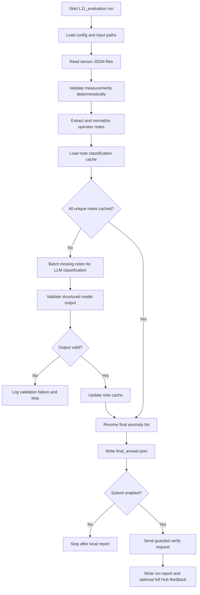

# L11 Evaluation README

## Table Of Contents

- [Purpose](#purpose)
- [Current Status](#current-status)
- [Task Summary](#task-summary)
- [Input Record Format](#input-record-format)
- [Design Direction](#design-direction)
- [Workflow](#workflow)
- [Mermaid Logic Flow](#mermaid-logic-flow)
- [Model Role](#model-role)
- [Evaluation Strategy](#evaluation-strategy)
- [LLM Usage And Reviews](#llm-usage-and-reviews)
- [Configuration](#configuration)
- [Data Layout](#data-layout)
- [Run](#run)
- [Main Modules](#main-modules)
- [Verification](#verification)
- [Assumptions And Risks](#assumptions-and-risks)
- [Open Questions](#open-questions)
- [What This Task Should Teach](#what-this-task-should-teach)

## Purpose

`L11_evaluation` is the application workspace for the AI_devs L11 `evaluation` exercise.

The task is to find all sensor files that contain anomalies. Some anomalies are numeric and structural, so ordinary code should detect them. Other anomalies depend on the meaning of `operator_notes`, so the app may use an LLM only for that narrow language-classification step.

The learning focus is cost-aware evaluation design: use deterministic validation for stable rules, reserve the model for semantic judgment, cache repeated model work, and keep the final answer traceable.

## Current Status

Status: MVP1 workflow is implemented and passed the non-production optimization review. The remaining unexecuted actions are a real OpenAI-backed scan and an explicit Hub submission after approval.

Completed:

- exercise description inspected from `_agent/references/exercises/L11_exercise.md`
- reference index inspected from `_agent/references/INDEX.md`
- L11 observability and eval references inspected
- high-level hybrid design selected: deterministic sensor validation plus cached note classification
- app documentation started
- LLM design checklist passed for MVP1 deterministic sensor scan plus cached note classification
- minimal package skeleton created with `src/apps/L11_evaluation/__init__.py`
- configuration loading implemented in `src/apps/L11_evaluation/config.py`
- sensor data models implemented in `src/apps/L11_evaluation/models.py`
- central sensor rule table implemented in `src/apps/L11_evaluation/sensor_rules.py`
- sensor loader implemented in `src/apps/L11_evaluation/loader.py`
- deterministic validator implemented in `src/apps/L11_evaluation/deterministic_validator.py`
- deterministic scan report writer implemented in `src/apps/L11_evaluation/report_writer.py`
- note normalization and cache implemented in `src/apps/L11_evaluation/note_cache.py`
- curated note-eval fixture implemented in `src/apps/L11_evaluation/note_eval_fixture.py`
- LLM note classifier implemented in `src/apps/L11_evaluation/note_classifier.py`
- final resolver implemented in `src/apps/L11_evaluation/resolver.py`
- final answer writer implemented in `src/apps/L11_evaluation/report_writer.py`
- guarded Hub client implemented in `src/apps/L11_evaluation/hub_client.py`
- CLI workflow implemented in `src/apps/L11_evaluation/main.py`
- post-implementation LLM optimization review completed and recorded

Not executed yet:

- real OpenAI classification run against uncached notes in the local dataset
- real Hub verification request with the final answer payload

Implementation is approved for the reviewed MVP1 boundary: deterministic sensor scan, cached operator-note classifier, final resolver, local reports, explicit guarded Hub submission, and post-implementation optimization review.

## Task Summary

The input directory contains sensor JSON files:

```text
data/L11_evaluation/input/sensors/
```

Every file has the same measurement fields, but only fields matching `sensor_type` should be active. Inactive measurement fields must be exactly `0`.

Known active ranges:

| Sensor Type | Measurement Field | Valid Active Range |
| --- | --- | --- |
| `temperature` | `temperature_K` | `553` to `873` |
| `pressure` | `pressure_bar` | `60` to `160` |
| `water` | `water_level_meters` | `5.0` to `15.0` |
| `voltage` | `voltage_supply_v` | `229.0` to `231.0` |
| `humidity` | `humidity_percent` | `40.0` to `80.0` |

An output file should be marked for recheck when:

- an active measurement is outside its allowed range,
- an inactive measurement field is non-zero,
- the operator note claims the readings are OK but the measurements are invalid,
- the operator note claims there is an error but the measurements are valid.

The final Hub verification payload shape is:

```json
{
  "apikey": "tutaj-twoj-klucz",
  "task": "evaluation",
  "answer": {
    "recheck": ["0001", "0002", "0003"]
  }
}
```

The local `final_answer.json` should store only the non-secret `answer` content or a payload without a real API key. The real `apikey` must be loaded from `.env` only when the guarded Hub request is built.

## Input Record Format

Each sensor JSON file contains one record with all measurement fields present:

```json
{
  "sensor_type": "temperature/voltage",
  "timestamp": 1774064280,
  "temperature_K": 612,
  "pressure_bar": 0,
  "water_level_meters": 0,
  "voltage_supply_v": 230.4,
  "humidity_percent": 0,
  "operator_notes": "Readings look stable and within expected range."
}
```

Field meanings:

| Field | Meaning |
| --- | --- |
| `sensor_type` | Active sensor name or slash-separated sensor combination, such as `temperature` or `temperature/voltage`. |
| `timestamp` | Unix timestamp for the reading. |
| `temperature_K` | Temperature reading in Kelvin. |
| `pressure_bar` | Pressure reading in bars. |
| `water_level_meters` | Water level reading in meters. |
| `voltage_supply_v` | Supply voltage reading in volts. |
| `humidity_percent` | Humidity reading in percent. |
| `operator_notes` | Operator note in English. |

All measurement fields are always present. Fields that do not belong to the active `sensor_type` must be `0`.

## Design Direction

MVP1 should be a local batch workflow, not an agent loop.

The key design split:

| Responsibility | Owner | Reason |
| --- | --- | --- |
| JSON loading and file ID extraction | Deterministic code | File names and JSON structure are stable. |
| Sensor type parsing | Deterministic code | `sensor_type` is a compact string contract. |
| Active range validation | Deterministic code | Numeric bounds are explicit. |
| Inactive field validation | Deterministic code | The rule is exact: inactive fields must be `0`. |
| Operator note meaning | LLM classifier | Notes are natural language and may be short, vague, or misleading. |
| Note deduplication and caching | Deterministic code | Repeated notes should not cause repeated model calls. |
| Final anomaly resolution | Deterministic code | The anomaly rules are explicit once measurement status and note label are known. |
| Hub submission | Deterministic code | Authentication, payload shape, and request limits must stay outside the model. |

The model should not receive all 10,000 files. It should receive unique note texts, grouped into batches, after deterministic validation has already classified the measurements for every file.

## Workflow

MVP1 workflow:

1. Load configuration from environment variables and app constants.
2. Load all sensor JSON files from `data/L11_evaluation/input/sensors/`.
3. Extract `file_id` from the file name.
4. Parse `sensor_type` into active sensor names.
5. Validate each measurement record deterministically.
6. Write deterministic findings to `data/L11_evaluation/output/deterministic_findings.json`.
7. Normalize and hash unique `operator_notes`.
8. Load cached note classifications from `data/L11_evaluation/cache/operator_notes_cache.json`.
9. Classify only missing unique notes with a small OpenAI model.
10. Validate model output against the note classification schema.
11. Persist updated note classifications to cache.
12. Resolve final anomalies by combining measurement status and note classification.
13. Write `data/L11_evaluation/output/final_answer.json`.
14. If explicit submit mode is enabled, send the answer to Hub `/verify`.
15. Write `data/L11_evaluation/output/run_report.json` with artifact paths, masked verify payloads, and full Hub responses when submission occurs.

## Mermaid Logic Flow



## Model Role

The single model step is named `Operator Note Classifier`.

It should receive batches of unique note texts, not full sensor records. Each note should have an internal `note_id` generated by code. The model should return only a compact structured classification:

```json
{
  "items": [
    {
      "note_id": "note_001",
      "label": "claims_ok",
      "confidence": "high"
    }
  ]
}
```

Allowed labels:

| Label | Meaning |
| --- | --- |
| `claims_ok` | The note says or strongly implies that readings are stable, valid, normal, or OK. |
| `claims_error` | The note says or strongly implies that something is wrong, invalid, suspicious, abnormal, or requires recheck. |
| `neutral_or_unclear` | The note does not make a clear correctness claim. |

The model must not receive API keys, Hub endpoints, final answers, or instructions to submit anything. It only classifies language.

## Evaluation Strategy

The workflow itself is an evaluation exercise, but the implementation still needs local checks.

Local checks used in MVP1:

| Area | Check Type | Purpose |
| --- | --- | --- |
| Sensor rule mapping | Deterministic unit tests | Catch wrong field-to-sensor mapping before scanning 10,000 files. |
| Active range validation | Deterministic unit tests | Verify boundary values and out-of-range values. |
| Inactive field validation | Deterministic unit tests | Verify that non-active measurements are rejected when non-zero. |
| Note classifier schema | Deterministic validation | Reject malformed model output before cache writes. |
| Note classifier behavior | Small curated eval set | Check obvious OK, obvious error, and unclear notes before a full run. |
| Final resolver | Deterministic unit tests | Confirm measurement status and note label combine into the right `recheck` decision. |

This is a local non-production app, so a large maintained eval suite is not planned for MVP1. A small curated note-label dataset is enough to protect the expensive semantic step from obvious prompt mistakes.

## LLM Usage And Reviews

| Area | Status | Evidence |
| --- | --- | --- |
| LLM usage | Yes | MVP1 uses one `Operator Note Classifier` model step for semantic classification of unique `operator_notes`. Deterministic code handles JSON parsing, numeric validation, inactive field checks, final anomaly resolution, and Hub submission. |
| Design review | Passed | `_agent/instructions/llm_design_checklist.md`; 2026-06-11; scope: MVP1 deterministic sensor scan plus cached operator-note classifier; mode: non-production; result: PASS; boundary: implement deterministic scan, unique-note cache, `Operator Note Classifier`, schema validation, final resolver, local reports, and explicit guarded Hub submission only. |
| Optimization review | Passed | `_agent/instructions/llm_optimization_checklist.md`; 2026-06-12; scope: full MVP1 workflow including CLI, cache, resolver, and guarded Hub submission; mode: non-production; result: PASS; follow-up: run one approved live OpenAI classification before treating the local answer as submission-ready semantic output. |

## Configuration

Required environment variables:

| Variable | Purpose |
| --- | --- |
| `OPENAI_API_KEY` | Authenticates OpenAI calls for the `Operator Note Classifier`. |
| `AI_DEVS_API_KEY` | Authenticates Hub verification requests. |
| `HUB_VERIFY_URL` | Hub verification endpoint, expected to point at `/verify`. |

Regular app constants live in `config.py`, not `.env`:

| Constant | Value | Purpose |
| --- | --- | --- |
| `TASK_NAME` | `evaluation` | Hub task identifier. |
| `NOTE_CLASSIFIER_MODEL` | `gpt-5-mini` | Model for semantic note classification in MVP1. Cheaper alternatives can be tested later as an optimization experiment. |
| `REASONING_EFFORT` | `low` | Keeps the short note-classification step lightweight. |
| `NOTE_BATCH_SIZE` | `100` | Limits prompt size and failure blast radius. |
| `MAX_NOTE_CLASSIFICATION_CALLS` | `200` | Guard against accidental runaway model calls. |
| `MAX_VERIFY_REQUESTS` | `3` | Guard against repeated Hub submissions. |
| `REQUEST_TIMEOUT_SECONDS` | `30` | Network timeout for future OpenAI and Hub calls. |
| `INPUT_SENSORS_DIR` | `data/L11_evaluation/input/sensors/` | Sensor JSON input directory. |

Secrets must live in `.env`. Do not put real secret values in source code, documentation, commit messages, reports, logs, or app data files.

## Data Layout

Runtime artifacts should live outside source code:

| Path | Intended Use |
| --- | --- |
| `data/L11_evaluation/input/sensors/` | Provided input sensor JSON files. |
| `data/L11_evaluation/references/operator_note_eval_fixture.json` | Curated local eval fixture for note-label sanity checks before a full classification run. |
| `data/L11_evaluation/cache/operator_notes_cache.json` | Local cache from normalized note hashes to model classifications. |
| `data/L11_evaluation/output/deterministic_findings.json` | Non-secret measurement validation summary. |
| `data/L11_evaluation/output/final_answer.json` | Final local answer payload without API key. |
| `data/L11_evaluation/output/run_report.json` | Secret-safe workflow summary with artifact paths, masked verify payloads, and full Hub responses when `--submit` runs. |
| `data/L11_evaluation/logs/` | Reserved runtime directory for future replay files or extra ignored logs. |

Source code and app documentation belong under `src/apps/L11_evaluation/`.

Ignored runtime data under `data/L11_evaluation/` may contain extracted classifications, final answers, run reports, raw FLAGS, and full course API responses when useful for debugging. It must not contain API keys or private operational endpoints.

## Run

Local scan command:

```powershell
.\venv\Scripts\python.exe -m src.apps.L11_evaluation.main --scan
```

Guarded submission command:

```powershell
.\venv\Scripts\python.exe -m src.apps.L11_evaluation.main --submit
```

Optional secret-safe config preview:

```powershell
.\venv\Scripts\python.exe -m src.apps.L11_evaluation.main --scan --print-config
```

Submission should remain explicit. Running a local scan should never submit to Hub by accident.

## Main Modules

Current module responsibilities:

| Module | Status | Responsibility |
| --- | --- | --- |
| `__init__.py` | Implemented | Marks `src.apps.L11_evaluation` as an importable Python package. |
| `config.py` | Implemented | Loads environment variables, app constants, model settings, guard limits, and data paths. |
| `models.py` | Implemented | Defines plain data structures for sensor records, validation findings, note labels, and final results. |
| `loader.py` | Implemented | Discovers sensor JSON files, extracts `file_id`, loads JSON objects, and reports malformed files cleanly. |
| `sensor_rules.py` | Implemented | Stores sensor-to-field mapping, measurement fields, valid ranges, and sensor type parsing helpers. |
| `deterministic_validator.py` | Implemented | Validates missing required fields, unknown sensor types, active range errors, and inactive non-zero fields without any model call. |
| `note_cache.py` | Implemented | Normalizes operator notes, builds stable note hashes, loads and saves cache entries, and identifies uncached unique notes. |
| `note_eval_fixture.py` | Implemented | Loads the curated note-eval fixture and scores predicted labels against expected labels before a full classifier run. |
| `note_classifier.py` | Implemented | Batches unique notes, calls the OpenAI model through an injectable client, validates structured output, and returns cache-ready classifications. |
| `resolver.py` | Implemented | Combines deterministic findings and note labels into final `recheck` decisions without guessing missing classifications. |
| `report_writer.py` | Implemented | Writes deterministic findings and local `final_answer.json` payloads as stable JSON artifacts without secrets. |
| `hub_client.py` | Implemented | Builds real verify payloads in memory, masks request secrets for storage, returns full Hub responses for ignored runtime artifacts, and enforces bounded submit attempts. |
| `main.py` | Implemented | Orchestrates `--scan` and guarded `--submit`, writes local artifacts, persists a run report, and prints a compact JSON summary. |

## Verification

Current verification:

- package import passed after Step 2,
- config smoke check passed after Step 3 with masked secret status only,
- sensor input path resolved to `data/L11_evaluation/input/sensors/`,
- `tests.L11_evaluation.test_sensor_rules` passed after Step 4 with 9 local tests,
- `tests.L11_evaluation.test_loader` passed after Step 5 with 6 local tests,
- loader smoke check read the current local sensor directory and returned `9999` records with `0` malformed-file issues,
- `tests.L11_evaluation.test_deterministic_validator` passed after Step 6 with 7 local tests,
- deterministic validation smoke check processed `9999` records and found `46` invalid records: `24` inactive-field leaks and `22` active-range violations,
- `tests.L11_evaluation.test_report_writer` passed after Step 7 with 2 local tests,
- deterministic scan report was written to `data/L11_evaluation/output/deterministic_findings.json` with `9999` findings and `46` total issues,
- `tests.L11_evaluation.test_note_cache` passed after Step 8 with 3 local tests,
- note-cache smoke check found `2032` unique normalized notes across `9999` records and wrote an empty initial cache file to `data/L11_evaluation/cache/operator_notes_cache.json`,
- `tests.L11_evaluation.test_note_eval_fixture` passed after Step 9 with 3 local tests,
- note-eval fixture smoke check loaded `9` curated examples with balanced label coverage and achieved `1.0` accuracy under perfect predictions,
- `tests.L11_evaluation.test_note_classifier` passed after Step 10 with 7 local tests,
- fake-client classifier smoke check achieved `1.0` accuracy on the curated fixture and processed a 5-note real-data sample without any OpenAI network call,
- `tests.L11_evaluation.test_resolver` passed after Step 11 with 7 local tests,
- resolver smoke check with all notes forced to `neutral_or_unclear` produced `46` `recheck` IDs, matching the deterministic anomaly count,
- `tests.L11_evaluation.test_report_writer` passed after Step 12 with 4 local tests,
- local `final_answer.json` was written to `data/L11_evaluation/output/final_answer.json` with task `evaluation` and `46` `recheck` IDs while still omitting any API key,
- `tests.L11_evaluation.test_hub_client` passed after Step 13 with 5 local tests,
- dry Hub-client smoke check built a real verify payload with a fake key, masked that key to `***REDACTED***` for storage, and preserved full fake Hub feedback for runtime logging without any real network call,
- `tests.L11_evaluation.test_main` passed after Step 14 with 3 local tests,
- fake-classifier scan smoke check on the real dataset processed `9999` records, saw `2032` unique normalized notes, produced `46` `recheck` IDs, and wrote `data/L11_evaluation/output/run_report.json` without any OpenAI or Hub network call.

Suggested live verification sequence:

1. Run unit tests for `deterministic_validator.py`.
2. Run a local deterministic scan without OpenAI or Hub calls.
3. Inspect unique note count and cache hit behavior.
4. Run the curated note-classification eval set.
5. Run full local scan and write `final_answer.json`.
6. Submit to Hub only after explicit approval for the external call.
7. If Hub rejects the answer, inspect `data/L11_evaluation/output/run_report.json` before changing prompt or rules.

## Assumptions And Risks

Current assumptions:

- Sensor file IDs are derived from JSON file names such as `0001.json`.
- `sensor_type` values are slash-separated combinations of known sensor names.
- Numeric fields are present in every file.
- `operator_notes` are in English, as stated in the task.
- Many operator notes repeat or are near-duplicates, so caching unique notes should reduce cost; the current local dataset reduces `9999` records to `2032` unique normalized notes with exact normalization only.

Current risks:

- Some notes may be sarcastic, vague, or domain-specific, making classification ambiguous.
- Near-duplicate notes may not hash to the same key unless normalization is chosen carefully.
- A too-large batch can make one malformed model response affect many notes.
- A too-small batch can increase cost and latency through excessive calls.
- The exercise text says `10,000` files, but the current local input directory loads `9,999` JSON records; if this mismatch matters, final verification may need an explicit check before Hub submission.
- The current deterministic scan found only numeric/structural anomalies so far; semantic contradictions in `operator_notes` still require the later note-classification step before the final `recheck` list is trustworthy.
- Exact normalization reduced the dataset to `2032` unique notes, which is helpful but still large enough that batch size and cache invalidation rules will matter in the classifier step.
- The curated fixture is intentionally small and obvious; it protects against silly prompt regressions, not against every ambiguous real-world note phrasing in the full dataset.
- The classifier code and validation path are implemented, but no real OpenAI call has been executed yet, so prompt quality on the full dataset is still an implementation risk until an approved live run happens.
- The resolver now requires one note classification per file and refuses to guess a missing label, so workflow ordering matters: classification must run before final answer generation.
- The local `final_answer.json` currently reflects a neutral-note smoke scenario unless a real classification run updates the cache; do not confuse "valid file shape" with "submission-ready semantic content."
- The Hub client can now build a real submission payload and keep full Hub feedback in ignored runtime logs, but no real Hub request has been sent yet; live submit still needs explicit approval because it uses secrets and external network state.
- The CLI now wires the full workflow together, but a real `--scan` still needs approved OpenAI usage when uncached notes exist, and a real `--submit` still needs explicit approval because it uses both secrets and external network state.
- If the final answer includes every numeric anomaly plus semantic contradiction incorrectly, Hub verification will fail without telling us exactly which file caused the mismatch.

## Open Questions

- Should `neutral_or_unclear` notes ever create an anomaly by themselves, or only avoid semantic contradiction checks?
- Should note normalization use exact normalized text only, or also a near-duplicate grouping pass?
- Which OpenAI model is cheapest while still reliable enough for short English note classification?
- Should the first implementation include a manual review report for low-confidence note labels?

## What This Task Should Teach

This task should teach that model calls are not a default analysis engine. Numeric rules, file contracts, inactive sensor checks, schema validation, caching, and Hub payload construction belong in deterministic code. The model earns its keep only where the input is natural language and the judgment is semantic.
