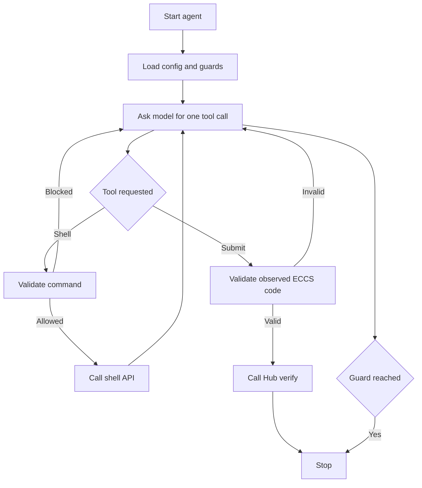

# L12 Firmware Agent

## Table Of Contents

- [Purpose](#purpose)
- [Workflow](#workflow)
- [Mermaid Logic Flow](#mermaid-logic-flow)
- [LLM Usage And Reviews](#llm-usage-and-reviews)
- [Safety And Cost Limits](#safety-and-cost-limits)
- [Configuration](#configuration)
- [Run](#run)
- [Main Modules](#main-modules)
- [Verification](#verification)
- [What This Task Should Teach](#what-this-task-should-teach)

## Purpose

`L12_firmware` is a small, non-production agent for the AI_devs `firmware` task. It inspects a restricted virtual machine, repairs the firmware configuration, runs the allowed binary, and submits a grounded `ECCS-...` confirmation code.

The model will plan and adapt. Deterministic application code will enforce permissions, budgets, command validation, and submission rules.

## Workflow

1. Load secrets and fixed runtime limits.
2. Start one bounded OpenAI Responses API loop.
3. Let the model call `run_shell_command` sequentially.
4. Validate every command before sending it to the shell API.
5. Parse command history and derive one grounded firmware password candidate.
6. Build a deterministic repair plan from the current `settings.ini` snapshot and the known lock-file state.
7. Allow `submit_answer` only for a confirmation code observed in shell output.
8. Return each structured tool result through `previous_response_id`.
9. Stop after Hub acceptance or when any guard limit is reached.

## Mermaid Logic Flow



## LLM Usage And Reviews

| Area | Status | Evidence |
| --- | --- | --- |
| LLM usage | Yes | One tool-using agent will adapt its next command to shell API results. |
| Design review | Passed | `_agent/instructions/llm_design_checklist.md`; 2026-06-13; scope: deterministic repair planner with projected post-edit settings state and final guard-limit increase; result: PASS; boundary: unchanged tool count, exact `cooler-is-blocked.lock` removal only, reread still required before another edit, projected settings may guide only planner state, and current reviewed limits are 30 model calls, 20 shell calls, and 150,000 total reported tokens. |
| Optimization review | Passed | `_agent/instructions/llm_optimization_checklist.md`; 2026-06-13; scope: full bounded workbench workflow after post-edit planner repair and final guard-limit increase; result: PASS; evidence: 72 local tests passed and a live `--live --submit` run solved the task in 13 model calls and 13 tool calls. |

The agent uses `gpt-5.5` with `medium` reasoning effort. A strong model is intentional because the task requires adaptive reasoning and mistakes can reset or temporarily block the VM.

## Safety And Cost Limits

Hard limits:

| Guard | Limit |
| --- | ---: |
| Model calls | 30 |
| Shell API calls | 20 |
| Hub submissions | 1 |
| Output tokens per model call | 2,000 |
| Total reported tokens | 150,000 |
| Command length | 300 characters |
| Shell result passed to model | 6,000 characters |

The command guard blocks forbidden paths, `find`, shell metacharacters, arbitrary binary execution, and writes outside `/opt/firmware/cooler/settings.ini`. Only `/opt/firmware/cooler/cooler.bin` may be executed. It requires exactly one password argument. That exact safe literal must appear at least twice as the sole argument of the same binary in previously read command history.

`rm` stays blocked except for one exact path: `/opt/firmware/cooler/cooler-is-blocked.lock`, and only after the file was observed in the latest listed firmware directory state.

Directory access must be discovered sequentially. A discovered `.gitignore` must be read before deeper access, and ignored paths remain blocked. Every `editline` call requires a fresh `settings.ini` snapshot and a valid existing line number.

The model receives only the tools allowed by the current mode: shell access always, and Hub submission only with `--submit`. The loop requires one tool call per turn, disables parallel calls, and reads cumulative usage from `response.usage`. An OpenAI response stopped by `max_output_tokens` is reported explicitly instead of being mislabeled as a missing tool call.

The prompt also carries verified non-secret runtime facts, but the main repair decisions come from deterministic planner state built in code: grounded password candidates, current lock-file presence, exact `settings.ini` edits with line numbers, and a projected post-edit settings state. That projected state lets the planner move straight to binary execution after the final successful edit, while the guard still requires a real reread before any additional edit.

## Configuration

| Variable | Purpose |
| --- | --- |
| `OPENAI_API_KEY` | Authenticates OpenAI calls. |
| `AI_DEVS_API_KEY` | Authenticates shell and Hub calls. |
| `FIRMWARE_SHELL_URL` | Restricted VM shell endpoint. |
| `HUB_VERIFY_URL` | Hub verification endpoint. |

The model name and guard limits are regular constants in `config.py`. Secrets and operational endpoints remain in `.env`.

## Run

Check configuration without external calls:

```powershell
.\venv\Scripts\python.exe -m src.apps.L12_firmware.main --check-config
```

Run the agent with OpenAI and shell access, but without Hub submission:

```powershell
.\venv\Scripts\python.exe -m src.apps.L12_firmware.main --live
```

Allow the full run including one guarded Hub submission:

```powershell
.\venv\Scripts\python.exe -m src.apps.L12_firmware.main --live --submit
```

`--submit` is rejected unless `--live` is also present. `--print-config` may be added to a live run to print a secret-safe configuration summary first.

Runtime reports live under `data/L12_firmware/output/`. They preserve full course responses, including confirmation codes and Hub feedback, for local human inspection. API keys remain masked.

On this machine, live OpenAI and course API calls may require the repository CA bundle described in `TROUBLESHOOTING.md`:

```powershell
$bundle=(Resolve-Path .\data\L6_categorize\cache\requests_ca_bundle.pem).Path
$env:REQUESTS_CA_BUNDLE=$bundle
$env:SSL_CERT_FILE=$bundle
.\venv\Scripts\python.exe -m src.apps.L12_firmware.main --live --submit
```

## Main Modules

| Module | Purpose |
| --- | --- |
| `config.py` | Configuration, runtime paths, and fixed limits. |
| `http_client.py`, `shell_client.py`, `hub_client.py` | Bounded external API access. |
| `guards.py` | Deterministic command, path, write, and submission policy. |
| `repair_planner.py` | Deterministic repair phases, exact settings edits, and narrow lock-file removal planning. |
| `tools.py` | Strict schemas, dispatch, state updates, and API-key masking. |
| `agent.py` | Sequential Responses API loop and model/token stop conditions. |
| `report_writer.py` | Full ignored runtime report persistence. |
| `main.py` | Explicit local-check, live-run, and submission CLI modes. |

## Verification

```powershell
.\venv\Scripts\python.exe -m unittest discover -s tests\L12_firmware -p "test_*.py"
```

The suite uses fake model, shell, and Hub clients. It does not spend OpenAI budget or call course APIs.

Successful live verification:

| Date | Result | Notes |
| --- | --- | --- |
| 2026-06-13 | PASS | A live `--live --submit` run solved the task after the post-edit planner repair; the full confirmation and Hub response remain only in ignored runtime data under `data/L12_firmware/output/`. |

## What This Task Should Teach

- Use an LLM for adaptive planning, not permission enforcement.
- Put cost, command, and submission guards in deterministic code.
- Prefer a stronger model with a shorter bounded loop when weak reasoning would cause repeated calls.
