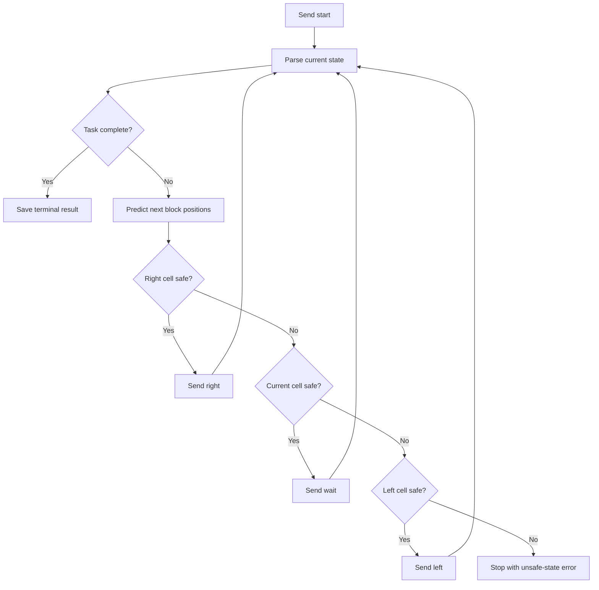

# L13 Reactor

## Table Of Contents

- [Purpose](#purpose)
- [Workflow](#workflow)
- [Mermaid Logic Flow](#mermaid-logic-flow)
- [LLM Usage And Reviews](#llm-usage-and-reviews)
- [Configuration](#configuration)
- [Run](#run)
- [Main Modules](#main-modules)
- [Runtime Data](#runtime-data)
- [Verification](#verification)
- [What This Task Should Teach](#what-this-task-should-teach)

## Purpose

This app solves the `reactor` course task by moving a robot from the first to
the seventh column while avoiding vertically moving reactor blocks.

The controller is deterministic. It reads the current board returned by the Hub
after every command, predicts whether the robot's current and next cells remain
safe during the next transition, and chooses one command: `right`, `wait`, or
`left`.

## Workflow

1. Load the Hub endpoint and API key from environment variables.
2. Send the required `start` command.
3. Parse the returned board, robot position, block positions, and block movement
   directions.
4. Predict the board state after the next command.
5. Move right when the destination cell is safe.
6. Wait when moving right is unsafe but the current cell remains safe.
7. Move left when both moving right and waiting are unsafe.
8. Stop when the Hub confirms success or the command guard reaches its limit.
9. Store each masked request and full Hub response in ignored runtime logs.

## Mermaid Logic Flow



## LLM Usage And Reviews

| Area | Status | Evidence |
| --- | --- | --- |
| LLM usage | No | The board is small, structured, and governed by deterministic movement rules. |
| Design review | N/A | No model call, prompt, agent loop, or AI-assisted reasoning is used. |
| Optimization review | N/A | No LLM workflow exists to optimize. |

## Configuration

| Name | Purpose |
| --- | --- |
| `AI_DEVS_API_KEY` | Secret API key sent only in Hub requests. |
| `HUB_VERIFY_URL` | Operational Hub endpoint expected to point to `/verify`. |

The app-level constants define the task name, board dimensions, request timeout,
and maximum number of commands. These are regular configuration values, not
secrets.

## Run

```powershell
.\venv\Scripts\python.exe -m src.apps.L13_reactor.main
```

The command performs real Hub calls. Run it only after explicit approval.

## Main Modules

| Module | Responsibility |
| --- | --- |
| `config.py` | Loads environment configuration, paths, and hard limits. |
| `models.py` | Defines validated reactor state and movement data. |
| `state_parser.py` | Converts Hub responses into the internal board state. |
| `strategy.py` | Predicts hazards and selects the next robot command. |
| `hub_client.py` | Sends one guarded command and preserves the response. |
| `run_log.py` | Stores secret-safe requests and full course responses in runtime data. |
| `workflow.py` | Owns the bounded command loop and completion rules. |
| `main.py` | Provides the command-line entrypoint. |

## Runtime Data

Runtime artifacts live under `data/L13_reactor/`:

| Path | Contents |
| --- | --- |
| `data/L13_reactor/logs/` | JSONL command history with masked requests and Hub responses. |

The directory is ignored by Git. Raw Hub responses and course FLAGS must never
be copied into source code or documentation.

## Verification

Run local tests without external requests:

```powershell
.\venv\Scripts\python.exe -m unittest discover -s tests/L13_reactor -v
```

The tests cover response parsing, block position prediction, command selection,
guard exhaustion, and successful workflow termination.

Live verification completed on 2026-06-14. The Hub accepted the task after nine
commands:

```text
start, wait, right, right, wait, right, right, right, right
```

The successful terminal response contains a status code and course FLAG but no
board state. The workflow therefore checks for terminal success before parsing
the response as another intermediate board snapshot.

## What This Task Should Teach

- Prefer deterministic code when the environment has explicit state and rules.
- Re-evaluate volatile state after every side effect instead of planning a long
  command sequence from one snapshot.
- Separate parsing, decision logic, transport, and orchestration so each part
  can be tested without a live API.
- Put hard limits around autonomous loops, even when every individual action
  looks harmless.
- Treat API response shape and transition order as facts to inspect, not details
  to invent.
