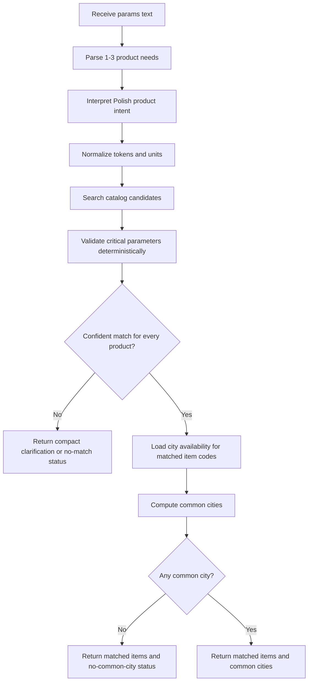

# L14 Negotiations Tool Service

## Table Of Contents

- [Purpose](#purpose)
- [Current Status](#current-status)
- [Workflow](#workflow)
- [Mermaid Logic Flow](#mermaid-logic-flow)
- [Tool Strategy](#tool-strategy)
- [Natural Language Matching Strategy](#natural-language-matching-strategy)
- [LLM Interpreter Design](#llm-interpreter-design)
- [HTTP Contract](#http-contract)
- [LLM Usage And Reviews](#llm-usage-and-reviews)
- [Configuration](#configuration)
- [Run](#run)
- [Public Exposure](#public-exposure)
- [Main Modules](#main-modules)
- [Verification](#verification)
- [Assumptions And Limits](#assumptions-and-limits)
- [What This Task Should Teach](#what-this-task-should-teach)

## Purpose

`L14_negotiations` will expose one public HTTP tool for the AI_devs `negotiations` task.
The tool will help the external course agent find cities that offer all requested products at the same time.

The key design choice is simple: the service should do the hard part itself.
The external agent has only 10 steps, so it should not be forced to discover product codes, compute set intersections, or resolve ambiguous catalog variants on its own.

## Current Status

This app is in design phase only.
The initial high-level concept has been revised after re-reading the task requirement that the external agent may pass Polish natural-language product descriptions such as `potrzebuje kabla dlugosci 10 metrow`.
Source implementation has not started yet.
The LLM design review has passed for a narrow Polish query interpreter only.

Current design boundary:

- one public tool endpoint instead of two separate endpoints;
- one request may contain one to three product descriptions in natural language;
- deterministic-only product matching is not accepted as the final design because Polish free-form requests are an explicit task requirement;
- the approved direction is a hybrid design: LLM-based Polish query interpretation followed by deterministic catalog validation and city intersection;
- the tool should return compact, Polish, agent-usable output under the 500-byte task limit;
- the service should explicitly distinguish between no match, matched-but-unavailable, and matched-with-common-cities cases.

## Workflow

1. Load local catalog data from `data/L14_negotiations/input/`.
2. Receive one natural-language request in the required `{"params": "..."}` format.
3. Interpret the Polish request into one to three structured product needs.
4. Normalize product type, language variants, units, and numeric tokens such as `48V`, `3000W`, `150Ah`, `10 metrow`, or `3 mm`.
5. Search catalog candidates using the interpreted product needs.
6. Validate candidate matches deterministically against critical parameters.
7. Select one best match per requested product when the confidence is high enough.
8. Resolve city availability from `connections.csv`.
9. Compute the intersection of cities that sell all matched products.
10. Return one compact Polish `{"output": "..."}` response for the external agent.

## Mermaid Logic Flow



## Tool Strategy

One tool is enough and is the current recommended design.

Why this is the right level:

- the data model is small enough to load locally without a search index;
- the task allows at most two tools, but the step budget strongly favors one endpoint that performs both matching and aggregation;
- deterministic validation and set intersection should stay inside the service because those parts are stable and testable;
- the external agent should receive the final set of candidate cities, not raw intermediate data.

Planned tool responsibility:

| Tool | Responsibility |
| --- | --- |
| `find_common_cities` | Accept one natural-language request with one to three product needs, map each need to one catalog item, and return cities that sell all matched items. |

## Natural Language Matching Strategy

The task description explicitly warns that the external agent may send Polish natural-language descriptions instead of exact catalog names.
That means `potrzebuje kabla dlugosci 10 metrow` must be treated as a first-class input shape, not as an edge case.

The recommended design is hybrid:

1. Interpret the request semantically.
2. Convert Polish free-form text into structured product needs.
3. Search catalog candidates from local CSV data.
4. Validate the final match deterministically against critical parameters.

The semantic interpreter will use an LLM with a strict structured output schema.
The deterministic layer must still own final acceptance because the service cannot let a soft semantic guess silently choose the wrong catalog item.

Critical validation examples:

| Input signal | Validation rule |
| --- | --- |
| `48V` | Do not accept a `24V` candidate. |
| `3000W` | Prefer exact wattage and penalize conflicting wattage. |
| `10 metrow` | Normalize to `10m` before searching or validating. |
| `kabel`, `kabla`, `przewodu` | Treat common Polish variants and synonyms as candidate-generation signals. |

## LLM Interpreter Design

The only approved LLM step is `query_interpreter`.
Its job is to convert the incoming Polish `params` string into one to three structured product needs.
It must not select final catalog item codes, city codes, city names, availability, or the final `output` string.

Planned model call:

| Setting | Value |
| --- | --- |
| API | Responses API |
| Model | `gpt-5.4-mini` |
| Reasoning effort | `none` |
| Tools | None |
| Max input length | 1,000 characters of `params` |
| Max output tokens | 600 |
| Retries | One retry only when schema parsing fails or required fields are incomplete. |
| Cache | In-memory cache by exact normalized `params` string for one process lifetime. |

Model selection policy:

- Start with `gpt-5.4-mini` because this is a narrow extraction step, not a broad reasoning task.
- Promote to `gpt-5.5` only if local interpreter tests show repeated failures on Polish paraphrases, missing-detail handling, or schema-following that cannot be fixed with prompt/schema changes.
- Keep the same output schema and deterministic validation when promoting models.

Structured output:

```json
{
  "items": [
    {
      "raw_request_fragment": "akumulatora 48V 150Ah",
      "normalized_product_type": "akumulator",
      "aliases": ["bateria"],
      "attributes": [
        {"name": "voltage", "value": "48", "unit": "V"},
        {"name": "capacity", "value": "150", "unit": "Ah"}
      ],
      "required_terms": ["akumulator"],
      "optional_terms": ["agm"],
      "missing_details": [],
      "confidence": "high"
    }
  ],
  "needs_clarification": false,
  "clarification_reason": ""
}
```

Schema rules:

- `items` must contain 1-3 entries.
- `confidence` must be one of `high`, `medium`, or `low`.
- `needs_clarification` must be `true` when the request is empty, contains more than three product needs, or lacks enough product identity to search safely.
- `missing_details` must list required facts the model could not infer from the text.
- The model must preserve uncertainty instead of inventing missing numbers, units, product families, or catalog names.

Prompt boundary:

- Interpret Polish product intent only.
- Preserve numbers and units exactly when present, then add normalized equivalents.
- Do not use or invent `itemCode`, `cityCode`, city names, prices, availability, or final answers.
- Do not decide whether a city sells an item.
- Do not silently fill missing product details.

## HTTP Contract

The course backend expects a public POST endpoint.
The service should expose one route with this input and output contract:

Request:

```json
{
  "params": "Potrzebuje inwertera 48V 3000W, akumulatora 48V 150Ah i turbiny wiatrowej 400W 48V."
}
```

Response shape:

```json
{
  "output": "Dopasowano: Inwerter DC/AC 48V 3000W; Akumulator AGM 48V 150Ah; Turbina wiatrowa 400W 48V. Miasta: Skolwin, Domatowo."
}
```

Planned response behavior:

| Situation | Response goal |
| --- | --- |
| Strong match and common cities exist | Return matched catalog names and common city names in Polish. |
| Strong match but no common cities | Return matched catalog names and say in Polish that there is no common city. |
| Catalog item exists but has no city availability | Return the matched catalog name and say in Polish that it is unavailable. |
| No confident match | Return a short Polish clarification-style message that names the unresolved product. |

The response must stay between 4 and 500 bytes, so the final string should avoid verbose explanations.
All values inside `output` should be Polish except original catalog item names and city names.

## LLM Usage And Reviews

| Area | Status | Evidence |
| --- | --- | --- |
| LLM usage | Yes | Planned scope is a narrow LLM-based Polish query interpreter followed by deterministic catalog validation and city intersection. |
| Design review | Passed | `_agent/instructions/llm_design_checklist.md`; 2026-06-16; scope: Batch 0 LLM-based Polish query interpreter plus deterministic validation; result: PASS; boundary: implement one no-tool `gpt-5.4-mini` interpreter call with strict structured output, one retry, 1,000-character input cap, 600 output-token cap, exact-input in-memory cache, deterministic catalog validation before any answer, and promote to `gpt-5.5` only after failed interpreter tests justify it. |
| Optimization review | N/A | No LLM workflow has been implemented or approved yet. |

The approved LLM scope is only the interpreter described above.
Any broader LLM use, tool-using model step, model-selected catalog item, or model-written final answer requires a new design review.

## Configuration

Expected configuration depends on the final matching design.
The public tool endpoint and verification helper need course configuration; the approved interpreter also needs OpenAI configuration.

| Variable | Purpose |
| --- | --- |
| `HOST` | Local bind host for the HTTP server. |
| `PORT` | Local bind port for the HTTP server. |
| `PUBLIC_BASE_URL` | Public URL used when registering the tool with `/verify`. |
| `AI_DEVS_API_KEY` | Course API key used only by the separate registration or verification flow, not by the tool endpoint itself. |
| `HUB_VERIFY_URL` | Verification endpoint used by the registration helper flow. |
| `OPENAI_API_KEY` | Authenticates the approved Polish query interpreter call. |

Model name, prompt text, schema name, token limits, retry limits, and cache policy are regular app constants.
Secrets remain in `.env`.

## Run

There is no runnable entrypoint yet because the app is still in design phase.

Planned local entrypoint after implementation:

```powershell
.\venv\Scripts\python.exe -m src.apps.L14_negotiations.main
```

Planned public exposure options:

- run locally and expose the endpoint through a short-lived tunnel such as `pinggy`;
- deploy to any public server if a longer-lived endpoint is needed.

## Public Exposure

`L3_proxy` already used the pattern we need here: keep the app as a local HTTP server, expose it briefly through `pinggy` for Hub verification, and submit the public URL through a helper script.
`L14_negotiations` should reuse that operational shape, but not the exact Hub payload.

Reusable parts from `L3_proxy`:

| Area | L14 decision |
| --- | --- |
| HTTP server | Use a thin local JSON POST server, likely based on `ThreadingHTTPServer`. |
| Request limit | Reject oversized request bodies before JSON parsing. |
| Public tunnel | Use short-lived `pinggy` exposure for final verification. |
| Submission helper | Add a helper similar to `submit_verification.py`, but adapted to `negotiations`. |
| Secret handling | Keep `AI_DEVS_API_KEY`, `HUB_VERIFY_URL`, and real public URLs out of docs and source. |

Important difference:

- `L3_proxy` submits one public `url` plus a `sessionID`.
- `L14_negotiations` must submit an `answer.tools` array with one tool URL and description.
- `L14_negotiations` verification is asynchronous, so the helper should support both registration and `action: "check"`.

Planned final registration payload shape:

```json
{
  "apikey": "<AI_DEVS_API_KEY>",
  "task": "negotiations",
  "answer": {
    "tools": [
      {
        "URL": "<PUBLIC_TOOL_URL>",
        "description": "Polskie narzedzie: przekaz w params opis 1-3 produktow. Zwraca po polsku miasta, ktore maja wszystkie dopasowane produkty."
      }
    ]
  }
}
```

Planned async check payload:

```json
{
  "apikey": "<AI_DEVS_API_KEY>",
  "task": "negotiations",
  "answer": {
    "action": "check"
  }
}
```

## Main Modules

These modules are planned, not implemented yet.

| Module | Purpose |
| --- | --- |
| `config.py` | Runtime paths, server settings, and small deterministic limits. |
| `catalog_loader.py` | Load and validate `cities.csv`, `items.csv`, and `connections.csv`. |
| `query_interpreter.py` | Convert Polish natural-language product descriptions into structured product needs using the approved no-tool LLM call. |
| `normalization.py` | Normalize text, units, numeric tokens, and simple Polish or English product phrasing. |
| `matcher.py` | Catalog candidate search, deterministic validation, and best-match selection. |
| `availability.py` | Resolve city availability and compute common-city intersections. |
| `schemas.py` | Request and response validation. |
| `server.py` | Minimal HTTP API surface for the public tool endpoint. |
| `register.py` | Optional helper for `/verify` registration and async status checks. |

## Verification

Implementation has not started, so there is no runnable verification command yet.

Planned verification layers:

1. Unit tests for normalization and candidate scoring.
2. Interpreter contract tests for Polish paraphrases, missing details, invalid schema recovery, and cache behavior.
3. Integration tests for end-to-end requests against the local HTTP endpoint.
4. Manual dry runs with compact Polish responses under the 500-byte limit.
5. Final course verification by registering the public tool URL and checking the async result.

## Assumptions And Limits

- The service is optimized for the known task shape: up to three requested products.
- The knowledge base is local and static enough that direct in-memory lookup is simpler than a search index.
- Natural Polish phrasing is an expected input shape because it appears in the task description.
- Matching confidence should favor precision over recall because one wrong catalog match can poison the final city intersection.
- Deterministic-only matching is risky for Polish paraphrases, inflection, and implied units.
- The endpoint should be stateless across requests.
- The tool response should return human-readable city names, not city codes, because the external agent needs final city names.
- The tool response should be written in Polish because the external agent communicates with the tool in Polish.
- The endpoint itself should not expose debugging details by default because the response budget is tiny.

## What This Task Should Teach

- Put complex but deterministic work inside the tool when the calling agent has a small step budget.
- Treat examples in the task description as requirements, especially when they reveal natural-language input shape.
- Separate the real problem from the fake one: here interpreting Polish product descriptions matters more than set intersection.
- Prefer a narrow, testable contract over a clever multi-tool design that shifts complexity onto the agent.
