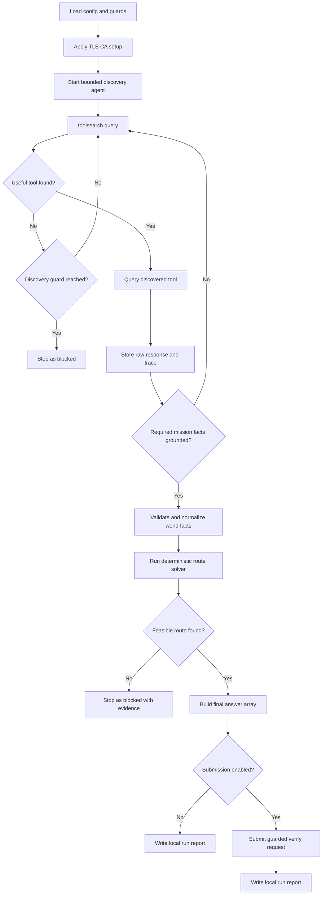

# L15 Savethem

## Table Of Contents

- [Purpose](#purpose)
- [Current Status](#current-status)
- [Workflow](#workflow)
- [Mermaid Logic Flow](#mermaid-logic-flow)
- [LLM Usage And Reviews](#llm-usage-and-reviews)
- [Configuration](#configuration)
- [Runtime Data](#runtime-data)
- [Run](#run)
- [Main Modules](#main-modules)
- [Verification](#verification)
- [What This Task Should Teach](#what-this-task-should-teach)

## Purpose

`L15_savethem` is a learning app for the AI_devs `savethem` exercise.
The app should use one bounded agent to discover an initially unknown API
surface, collect the map and movement rules needed for the mission, compute a
resource-feasible route to Skolwin, and optionally submit the final answer to
the Hub.

The learning focus is controlled environment discovery.
The model should decide what to ask, which discovered endpoint to inspect next,
and when the explored evidence is sufficient.
Deterministic code should still own validation, route solving, and final answer
submission.

## Current Status

Current state: implemented, live-verified, and solved on 2026-06-18.
The app now runs one bounded OpenAI-driven discovery loop, validates the
observed API facts deterministically, computes the route in code, writes
detailed runtime logs, and can submit the final answer to the Hub.

Completed so far:

- performed bounded manual API exploration against `toolsearch`, `maps`,
  `wehicles`, and `books`,
- stored raw exploration artifacts under `data/L15_savethem/cache/`,
- documented the real API behavior in DEV NOTES,
- chose the target architecture: one bounded discovery agent plus a
  deterministic route solver,
- verified the implemented workflow with a real OpenAI run and a real Hub
  submission,
- confirmed a successful route with `Hub accepted` status and runtime artifacts
  stored under `data/L15_savethem/`.

Current follow-up items:

- harden a small command-keyword parser edge case where one note currently
  produces `and horse` instead of `horse` in a non-critical metadata list,
- keep the exploration prompt and tool hints tight so the agent does not waste
  turns on descriptive queries against exact-match endpoints.

## Workflow

The intended workflow is:

1. Load OpenAI, Hub, and runtime guard configuration.
2. Apply the repository TLS/CA setup before any real OpenAI or Hub call.
3. Start one bounded `Savethem Explorer` loop with only narrow discovery tools.
4. Let the model search for tools through `toolsearch`.
5. Let the model query discovered endpoints with focused English requests.
6. Validate and normalize the gathered facts into a local mission model.
7. Stop exploration only after the required map, travel modes, resource rules,
   and movement constraints are grounded in observed API responses.
8. Run a deterministic solver over route state that includes position, current
   mode, remaining fuel, and remaining food.
9. If the model gathered enough evidence but failed to stop cleanly, run a
   deterministic recovery check before declaring the exploration blocked.
10. Build the final `answer` array from the chosen initial mode, movement
    steps, and any required `dismount` transition.
11. If submission mode is enabled, send the guarded verify request and preserve
    the masked request plus raw course feedback only in ignored runtime data.

## Mermaid Logic Flow



## LLM Usage And Reviews

| Area | Status | Evidence |
| --- | --- | --- |
| LLM usage | Yes | One bounded `Savethem Explorer` loop uses an OpenAI model to discover tools, choose focused endpoint queries, and decide when the evidence is sufficient. Deterministic code still owns validation, route solving, and guarded submission. |
| Design review | Passed | `_agent/instructions/llm_design_checklist.md`; 2026-06-18; scope: bounded API discovery loop plus deterministic fact validation and route solving for the non-production workbench; result: PASS; boundary: implement one explorer agent only, expose only `search_tools`, `query_tool`, and `finish_exploration`, keep strict iteration and tool-call guards, keep structured finish output, and keep route planning plus submission deterministic. |
| Optimization review | Passed | `_agent/instructions/llm_optimization_checklist.md`; 2026-06-18; scope: full `L15_savethem` workbench workflow after live OpenAI and Hub verification; mode: non-production; result: PASS; follow-up: no blocking changes, one accepted workbench limitation remains in non-critical command-note parsing. |

## Configuration

| Variable | Purpose |
| --- | --- |
| `OPENAI_API_KEY` | Authenticates OpenAI Responses API calls for the bounded discovery agent. |
| `AI_DEVS_API_KEY` | Authenticates `toolsearch`, discovered task endpoints, and guarded Hub verification requests. |
| `HUB_VERIFY_URL` | Verification endpoint used only in explicit submit mode. |

Secrets must live in `.env`.
Do not place real keys, raw FLAGS, or raw Hub feedback in source code or docs.

Regular app constants in `config.py` should define:

- model name and reasoning effort,
- maximum discovery iterations,
- maximum model calls,
- maximum tool calls,
- request timeout,
- route solver guard values.

## Runtime Data

Runtime artifacts should live under `data/L15_savethem/`:

| Path | Intended Use |
| --- | --- |
| `data/L15_savethem/cache/` | Raw tool discovery and endpoint responses captured during exploration. |
| `data/L15_savethem/logs/` | JSONL traces for model turns, tool calls, and guarded verify requests. |
| `data/L15_savethem/output/` | Normalized world facts, chosen route, run reports, verify payloads, and raw course feedback when needed for local debugging. |

The directory is ignored by Git.
Course API feedback and FLAGS may live there for learning and debugging, but
must not be copied into source docs or commits.

## Run

Local exploration run:

```powershell
.\venv\Scripts\python.exe -m src.apps.L15_savethem.main
```

Guarded verification run:

```powershell
.\venv\Scripts\python.exe -m src.apps.L15_savethem.main --submit
```

The verified submit path uses the repository TLS/CA setup before real API
calls. A successful guarded submit was executed on 2026-06-18.

## Main Modules

Implemented modules:

| Module | Responsibility |
| --- | --- |
| `config.py` | Loads environment configuration, runtime guards, repository paths, and TLS/CA setup. |
| `models.py` | Defines validated tool, trace, fact, and route result models. |
| `api_client.py` | Sends guarded requests to `toolsearch`, discovered endpoints, and `/verify`. |
| `tools.py` | Exposes narrow discovery tools to the model and validates structured finish payloads. |
| `agent.py` | Runs the bounded OpenAI-driven discovery loop and preserves turn-by-turn traces. |
| `knowledge.py` | Validates the exploration summary against observed API responses and builds normalized mission facts. |
| `solver.py` | Computes feasible and optimal routes under mode, terrain, fuel, food, and `dismount` constraints. |
| `report_writer.py` | Stores run traces, normalized facts, and final route artifacts under runtime data. |
| `workflow.py` | Orchestrates exploration, deterministic parsing, route solving, and optional guarded verification. |
| `main.py` | CLI entrypoint for local exploration and optional guarded submit mode. |

## Verification

Current verification completed before source work:

- bounded manual exploration confirmed the real contracts of `toolsearch`,
  `maps`, `wehicles`, and `books`,
- the Skolwin map and all four vehicle records were retrieved successfully,
- useful movement and terrain rules were grounded in `books` results,
- DEV NOTES now record both happy-path and failure-path behavior.

Current implementation verification:

- `.\venv\Scripts\python.exe -c "import src.apps.L15_savethem.main; print('import ok')"` passed locally;
- `.\venv\Scripts\python.exe -m unittest discover -s tests\L15_savethem -v` passed locally;
- the mocked end-to-end test covered bounded discovery, observation logging, knowledge normalization, route solving, and report writing;
- one guarded live run against real OpenAI and the course API completed successfully on 2026-06-18;
- the accepted route used `rocket` first, then `dismount`, then walking for the final water segment;
- the final runtime report recorded `status: solved`, `exploration_status: ready`, `model_calls_used: 17`, `tool_calls_used: 17`, and a Hub response with `code: 0`.

## What This Task Should Teach

- A useful agent does not need all tools injected up front if it can discover
  them progressively.
- Environment discovery is easier to debug when the model chooses queries but
  deterministic code validates the resulting facts.
- Logs are not optional in agentic workflows; without traces, every failure
  turns into interpretive dance.
- Exact API behavior matters more than task prose when the two do not align
  perfectly.
- Route optimization belongs in deterministic code even when discovery belongs
  in an agent loop.
