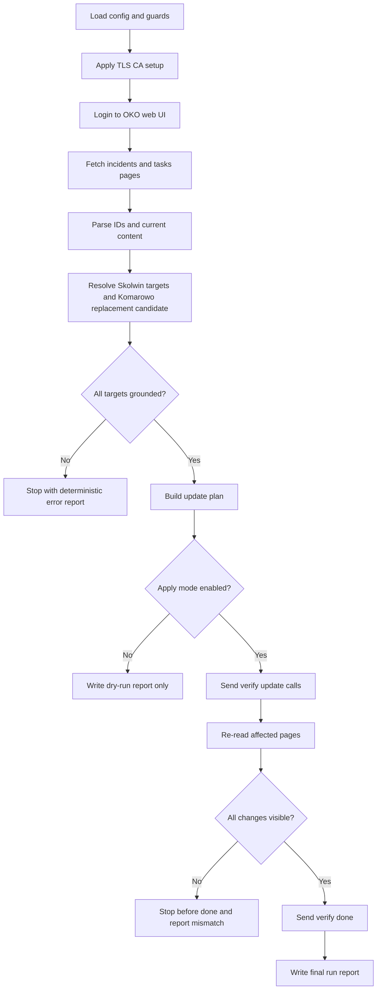

# L16 Okoeditor

## Table Of Contents

- [Purpose](#purpose)
- [Current Status](#current-status)
- [Workflow](#workflow)
- [Mermaid Logic Flow](#mermaid-logic-flow)
- [LLM Usage And Reviews](#llm-usage-and-reviews)
- [Configuration](#configuration)
- [Runtime Data](#runtime-data)
- [Run](#run)
- [Main Modules](#main-modules)
- [Verification](#verification)
- [What This Task Should Teach](#what-this-task-should-teach)

## Purpose

`L16_okoeditor` is a learning app for the AI_devs `okoeditor` exercise.
The app should read the current OKO control-center state through the authenticated
web interface, resolve the records that must be changed, perform the required
mutations only through the central `verify` API, re-read the affected pages, and
submit the final `done` action only after deterministic verification passes.

The web interface is read-only for this task.
It may be used only to inspect the current state and gather record identifiers.
No manual edits, no UI form submissions, and no browser-driven content changes
are allowed there under any circumstances.

The final runtime should stay deterministic.
Although the course often pushes toward LLM-based workflows, we already built
similar exploration-heavy apps in earlier lessons.
Repeating another near-identical runtime discovery loop would add little
learning value here, so the implementation should consume grounded exploration
findings in code instead of delegating normal operation to a model.

## Current Status

Current state: implemented, live-verified, and solved on 2026-06-20.

Current implementation outcome:

- the `verify` API is a write-oriented surface with `help`, `update`, and
  `done`, not a full read/write CRUD interface;
- the current OKO state is readable through the authenticated web interface,
  so the app needs a hybrid workflow: web read plus API write;
- the web interface must remain strictly read-only and cannot be used for any
  manual or scripted content mutation;
- record IDs are discoverable from page links and should be resolved at runtime
  instead of hardcoded in source;
- the `Komarowo` requirement cannot be implemented as a true create operation
  because the explored API exposed no creation action, so one existing incident
  must be repurposed;
- invalid `update` attempts can ban the API key until the ban is cleared
  through the web interface, so dry-run guards and strong preflight validation
  are mandatory.
- the final implementation solved the task only after correcting the incident
  ticket codes to match the coding note exposed in the OKO notes section;
- runtime artifacts are sanitized so logs and reports do not preserve raw API
  keys or raw FLAG values in ordinary working files.

## Workflow

The implemented workflow is:

1. Load configuration for the OKO web session, the central `verify` API, and
   runtime guard settings.
2. Apply the repository TLS/CA setup before any real external request.
3. Open an authenticated web session and fetch the current `incydenty`,
   `zadania`, and optional supporting pages.
4. Parse list pages and detail pages to build a deterministic local snapshot of
   titles, summaries, statuses, and record IDs.
5. Resolve the required targets:
   - the Skolwin incident that currently frames the signal as human or vehicle
     activity;
   - the Skolwin task that must be marked as done and rewritten to mention
     animals such as beavers;
   - one unrelated active incident that can be safely repurposed into a
     `Komarowo` human-movement report.
6. Build an update plan in code and validate it before any write:
   - every target ID must exist;
   - every required field must be present;
   - page-specific rules must be satisfied;
   - the web layer must not expose or execute any edit action;
   - no update may run in default mode without explicit `--apply`.
7. Send the required `update` calls through the central API only.
8. Re-read the affected pages through the web interface and verify that the
   intended text and task state are now visible.
9. Call `done` only if all three required content changes are confirmed.
10. Write local runtime artifacts with the observed targets, planned payloads,
    masked request metadata, post-write verification summary, and a sanitized
    final response record.

## Mermaid Logic Flow



## LLM Usage And Reviews

| Area | Status | Evidence |
| --- | --- | --- |
| LLM usage | No | The planned app should stay deterministic at runtime. Design-time exploration was performed with LLM assistance, but the final workflow reads HTML, resolves targets, validates payloads, and sends updates without model calls. |
| Design review | N/A | `_agent/instructions/llm_design_gate.md` is not required because the accepted app boundary is deterministic. |
| Optimization review | N/A | `_agent/instructions/llm_optimization_checklist.md` is not required for a deterministic app. |

## Configuration

Secrets must live in `.env`.
Do not place real credentials, raw API responses, or operational endpoints in
source files or docs.

Required environment variables:

| Variable | Purpose |
| --- | --- |
| `AI_DEVS_API_KEY` | Authenticates the OKO access-key login step and the central `verify` API writes. |
| `HUB_VERIFY_URL` | Required central write endpoint used for `help`, `update`, and `done`. |
| `OKO_BASE_URL` | Required base URL of the authenticated OKO web interface. |
| `OKO_OPERATOR_LOGIN` | Required OKO operator login used for the read session. |
| `OKO_OPERATOR_PASSWORD` | Required OKO operator password used for the read session. |

Regular app constants in `config.py` should define:

- request timeout;
- TLS bundle resolution;
- default dry-run mode;
- maximum number of page fetches per run;
- maximum number of planned writes;
- deterministic text templates for the Skolwin and Komarowo edits.

## Runtime Data

Runtime artifacts should live under `data/L16_okoeditor/`:

| Path | Intended Use |
| --- | --- |
| `data/L16_okoeditor/cache/` | Cached HTML snapshots and parsed page summaries gathered during the read phase. |
| `data/L16_okoeditor/logs/` | JSONL traces for HTTP requests, masked verify payload metadata, verification steps, and final completion metadata. |
| `data/L16_okoeditor/output/` | Dry-run plans, resolved target summaries, post-write verification reports, sanitized final task status artifacts, and completion summaries. |

The directory is ignored by Git.
During implementation, runtime artifacts were sanitized so ordinary working
files no longer preserve raw API keys or raw FLAG values.

## Run

Local dry-run command:

```powershell
.\venv\Scripts\python.exe -m src.apps.L16_okoeditor.main
```

Live apply command:

```powershell
.\venv\Scripts\python.exe -m src.apps.L16_okoeditor.main --apply
```

The live apply path keeps write mode opt-in.
It refuses to call `done` unless post-write verification succeeds.

## Main Modules

Implemented modules:

| Module | Responsibility |
| --- | --- |
| `config.py` | Loads environment variables, runtime guards, repository paths, and TLS/CA setup. |
| `models.py` | Defines validated page, record, update-plan, and run-report models. |
| `oko_session.py` | Handles authenticated web-session login and guarded page fetching. |
| `snapshot_parser.py` | Extracts record IDs, titles, summaries, statuses, and detail content from OKO HTML pages. |
| `target_resolution.py` | Finds the Skolwin incident, the Skolwin task, and a safe replacement incident for Komarowo. |
| `payloads.py` | Builds deterministic `update` and `done` payloads and validates page-specific rules. |
| `verify_client.py` | Sends central `verify` API requests and normalizes response handling. |
| `workflow.py` | Orchestrates read, planning, apply, re-read verification, and final completion. |
| `report_writer.py` | Persists dry-run plans, masked write metadata, sanitized snapshots, and verification summaries under runtime data. |
| `main.py` | CLI entrypoint for dry-run and explicit apply mode. |

## Verification

Implementation and live verification completed:

- `.\venv\Scripts\python.exe -c "import src.apps.L16_okoeditor.main; print('import ok')"` passed locally;
- `.\venv\Scripts\python.exe -m unittest tests.L16_okoeditor.test_workflow -v` passed locally;
- real dry-run against the OKO web interface succeeded and produced a stable
  three-update plan;
- the first live apply attempt exposed a real contract nuance: the incident
  ticket code in the title had to match the coding note from the OKO notes page;
- after correcting the codes to `MOVE04` for the Skolwin animals incident and
  `MOVE01` for the Komarowo human-movement incident, the final live run solved
  the task on 2026-06-20;
- runtime artifacts were then sanitized so ordinary files do not preserve raw
  API keys or raw FLAG values.

## What This Task Should Teach

- Not every course task needs another runtime LLM loop when deterministic code
  can carry the real operational burden more safely.
- API exploration matters because task prose can hide a hybrid contract instead
  of a neat single interface.
- A write-only API is not enough to solve a content-editing task unless the app
  also owns a reliable read path.
- Dry-run mode is not optional when one malformed write can ban the key needed
  for the real run.
- The safest deterministic solution often starts by refusing to hardcode
  unstable IDs discovered in someone else's HTML.
- When a system exposes hidden coding rules through side notes instead of the
  main API contract, ignoring those rules is how you earn yourself a fake
  success and a very real error at the final gate.
