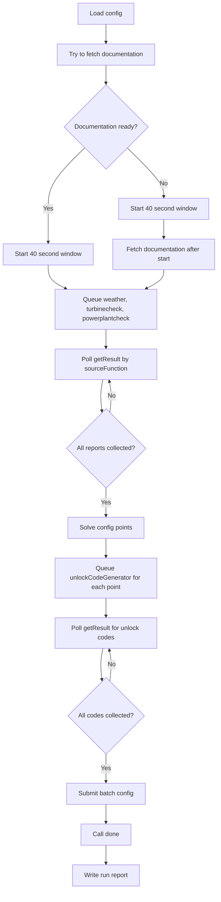

# L17 Windpower README

## Table Of Contents

- [Purpose](#purpose)
- [Workflow](#workflow)
- [Mermaid Logic Flow](#mermaid-logic-flow)
- [LLM Usage And Reviews](#llm-usage-and-reviews)
- [Configuration](#configuration)
- [Run](#run)
- [Main Modules](#main-modules)
- [Runtime Data](#runtime-data)
- [Verification](#verification)
- [What This Task Should Teach](#what-this-task-should-teach)

## Purpose

`L17_windpower` solves the `windpower` course task. The app schedules a wind turbine so it protects itself during storms and produces enough power at one suitable forecast point.

The main challenge is not reasoning. It is timing. The Hub gives only a 40-second service window after `start`, while several API actions are asynchronous and must be collected through `getResult`.

## Workflow

1. Load configuration from `.env`.
2. Fetch turbine documentation before opening the timed service window when the Hub allows it.
3. Call `start`.
4. If documentation was rejected because an old service window timed out, fetch documentation again after `start`.
5. Queue `weather`, `turbinecheck`, and `powerplantcheck` immediately.
6. Poll `getResult` until all three source reports are collected.
7. Build deterministic schedule points:
   - storm shutdown points for every wind speed above the safety cutoff;
   - one production point that can cover the power deficit, considering pitch `0` and `45`.
8. Queue `unlockCodeGenerator` for every schedule point.
9. Poll `getResult` until every schedule point has a matching unlock code.
10. Submit all points as one batch `config`.
11. Call `done` and store the final runtime response under `data/L17_windpower/...`.

## Mermaid Logic Flow



## LLM Usage And Reviews

| Area | Status | Evidence |
| --- | --- | --- |
| LLM usage | No | The task is solved by deterministic API orchestration, JSON parsing, and numeric scheduling logic. |
| Design review | N/A | No model call, prompt, tool-using model step, model output schema, or AI-assisted reasoning component is planned. |
| Optimization review | N/A | No LLM workflow exists to optimize. |

## Configuration

| Variable | Purpose |
| --- | --- |
| `AI_DEVS_API_KEY` | Authenticates Hub requests. |
| `HUB_VERIFY_URL` | Hub verification endpoint. If omitted, the app uses the default Hub `/verify` URL. |

## Run

Print a secret-safe config summary:

```powershell
.\venv\Scripts\python.exe -m src.apps.L17_windpower.main --check-config
```

Run the real timed workflow:

```powershell
.\venv\Scripts\python.exe -m src.apps.L17_windpower.main --submit
```

`--submit` makes real external API calls and may complete the course task.

## Main Modules

| Module | Responsibility |
| --- | --- |
| `config.py` | Loads environment configuration, app paths, runtime limits, and TLS settings. |
| `api_client.py` | Sends Hub requests, masks secrets in stored requests, and normalizes responses. |
| `models.py` | Defines small data objects shared between the client, solver, and workflow. |
| `solver.py` | Converts documentation and live reports into schedule points. |
| `workflow.py` | Orchestrates the timed queueing, polling, unlock generation, config submission, and final `done`. |
| `run_log.py` | Writes masked JSONL runtime events. |
| `main.py` | Provides the CLI entrypoint. |

## Runtime Data

| Path | Purpose |
| --- | --- |
| `data/L17_windpower/logs/` | JSONL runtime events with request secrets masked. |
| `data/L17_windpower/output/` | Run reports and final Hub responses from live runs. |

Raw Hub responses, including flags, belong only under `data/L17_windpower/...`.

## Verification

Run deterministic tests:

```powershell
.\venv\Scripts\python.exe -m unittest tests.L17_windpower.test_api_client tests.L17_windpower.test_solver tests.L17_windpower.test_workflow
```

The tests use fake API clients and do not call the real Hub.

Latest live verification:

| Date | Result |
| --- | --- |
| 2026-06-21 | Hub accepted the batch configuration in `26.23` seconds; `flag_found: true`. |

## What This Task Should Teach

This task teaches why agentic-looking problems often need boring deterministic orchestration. The hard part is not inventing a clever answer; it is queueing independent work early, collecting one-time async results safely, and keeping enough time for signed writes before the service window closes.
