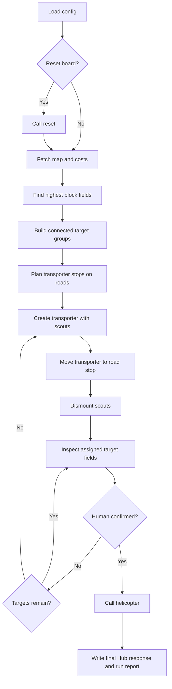

# L18 Domatowo README

## Purpose

`L18_domatowo` solves the `domatowo` course task. The app controls transporters and scouts on the Domatowo map, searches the highest apartment blocks, and calls the evacuation helicopter after a scout confirms the survivor.

The useful lesson here is simple: this looks like an agent task, but it is really a small graph-search and cost-control problem. Let the code do the boring arithmetic. The boring arithmetic wins.

## Workflow

1. Load Hub configuration from `.env`.
2. Optionally reset the board to a clean run.
3. Fetch the map and action-cost contract from the Hub.
4. Find the highest `blockN` terrain in the map and group those fields into connected components.
5. Assign small scout teams to transporters and move each transporter to a nearby road tile.
6. Dismount scouts, move them through their assigned high-block fields, and inspect each field.
7. After every inspection, read logs and detect whether a human was confirmed.
8. Call `callHelicopter` for the confirmed field.
9. Store masked requests, full Hub responses, run logs, and final status under `data/L18_domatowo/...`.

## Mermaid Logic Flow



## LLM Usage And Reviews

| Area | Status | Evidence |
| --- | --- | --- |
| LLM usage | No | The task is solved by deterministic map parsing, graph search, action-cost budgeting, and Hub orchestration. |
| Design review | N/A | No model call, prompt, tool-using model step, model output schema, or AI-assisted reasoning component is planned. |
| Optimization review | N/A | No LLM workflow exists to optimize. |

## Configuration

| Variable | Purpose |
| --- | --- |
| `AI_DEVS_API_KEY` | Authenticates Hub requests. |
| `HUB_VERIFY_URL` | Hub verification endpoint. Defaults to the public Hub `/verify` endpoint when omitted. |

## Run

Print a secret-safe config summary:

```powershell
.\venv\Scripts\python.exe -m src.apps.L18_domatowo.main --check-config
```

Run the real Hub workflow:

```powershell
.\venv\Scripts\python.exe -m src.apps.L18_domatowo.main --submit
```

Use `--no-reset` only when you intentionally want to continue an already-started board state.

## Main Modules

| Module | Responsibility |
| --- | --- |
| `config.py` | Loads environment settings, app paths, runtime limits, and TLS-related environment setup. |
| `api_client.py` | Sends Hub actions, masks request secrets, and normalizes JSON/text responses. |
| `models.py` | Defines shared data objects for map fields, units, exchanges, and workflow results. |
| `planner.py` | Parses the map, finds high-block targets, groups them, and builds transporter plans. |
| `workflow.py` | Orchestrates the live Hub run and stops as soon as the survivor is confirmed. |
| `run_log.py` | Writes JSONL runtime events with secrets masked. |
| `main.py` | Provides the CLI entrypoint. |

## Runtime Data

| Path | Purpose |
| --- | --- |
| `data/L18_domatowo/logs/` | JSONL event traces for live runs. |
| `data/L18_domatowo/output/` | Run reports and full Hub responses, including the final response with a FLAG when the task is solved. |

Raw Hub responses and FLAGS belong only under `data/L18_domatowo/...`.

## Verification

Run deterministic local tests:

```powershell
.\venv\Scripts\python.exe -m unittest tests.L18_domatowo.test_planner tests.L18_domatowo.test_workflow
```

Run a secret-safe import/config check:

```powershell
.\venv\Scripts\python.exe -m src.apps.L18_domatowo.main --check-config
```

Latest live verification:

| Date | Result |
| --- | --- |
| 2026-06-23 | Hub accepted evacuation at `H11`; `flag_found: true`; 170 action points used and 130 left. |

## What This Task Should Teach

This task teaches that a good autonomous workflow is often a small state machine wrapped around deterministic planning.
