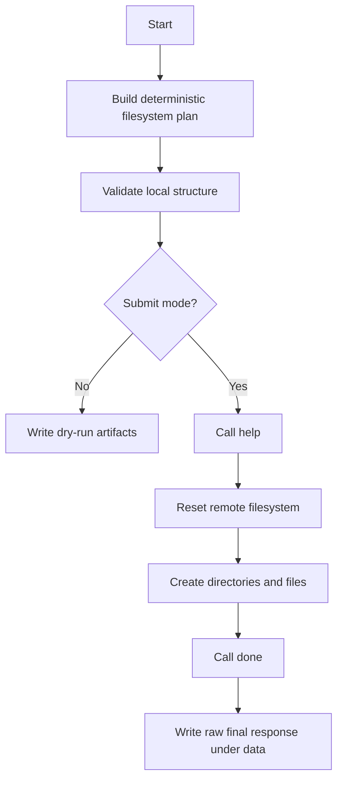

# L19 Filesystem

## Table Of Contents

- [Purpose](#purpose)
- [Data Preparation](#data-preparation)
- [Workflow](#workflow)
- [Mermaid Logic Flow](#mermaid-logic-flow)
- [LLM Usage And Reviews](#llm-usage-and-reviews)
- [Configuration](#configuration)
- [Run](#run)
- [Main Modules](#main-modules)
- [Verification](#verification)
- [Submission Status](#submission-status)
- [What This Task Should Teach](#what-this-task-should-teach)

## Purpose

This app solves the `filesystem` exercise by turning Natan Rams' local notes into
a virtual filesystem expected by the Hub verification API.

The runtime task is deterministic: the app does not infer facts from free text
when it runs. The notes were read and normalized during implementation, then the
checked result was encoded in `payloads.py`.

## Data Preparation

The source notes are fixed local input files under
`data/L19_filesystem/input/natan_notes/`. They were interpreted once while
building the solution:

| Source file | What was extracted |
| --- | --- |
| `ogłoszenia.txt` | City demand: goods and amounts needed by each city. |
| `rozmowy.txt` | Trade contacts: which person manages trade for each city. |
| `transakcje.txt` | Sellers: which city offered each good for sale. |

That prepared answer is stored as explicit Python data in `payloads.py`. At
runtime the app validates the prepared structure, builds virtual filesystem
operations, and submits them to the Hub. It does not contain a parser that can
solve new note sets automatically.

One small human judgment is documented in the data: Brudzewo has "Kisiel" in
one note and "Rafal" in another, so the prepared contact is `Rafal Kisiel`.

## Workflow

1. Load the static normalized answer from the app payload module.
2. Validate city JSON content, person markdown links, and goods markdown links.
3. In dry-run mode, write the planned operations to runtime output.
4. In submit mode, call the Hub `help` action for contract visibility.
5. Reset the remote task filesystem.
6. Create `/miasta`, `/osoby`, and `/towary`.
7. Create all city, person, and goods files.
8. Submit `done` and preserve the raw final Hub response under runtime data.

## Mermaid Logic Flow



## LLM Usage And Reviews

| Area | Status | Evidence |
| --- | --- | --- |
| LLM usage | No | The answer is a deterministic normalization of local notes. |
| Design review | N/A | No prompt, model call, agent behavior, or model output schema is used. |
| Optimization review | N/A | No LLM workflow exists to optimize. |

## Configuration

| Name | Purpose |
| --- | --- |
| `AI_DEVS_API_KEY` | Secret API key used only in Hub requests. |
| `HUB_VERIFY_URL` | Required Hub verification endpoint loaded from `.env`. |

Stable runtime settings, such as request timeout and request guard limits, live
in `src/apps/L19_filesystem/config.py`.

## Run

Dry-run:

```powershell
.\venv\Scripts\python.exe -m src.apps.L19_filesystem.main
```

Submit to Hub:

```powershell
.\venv\Scripts\python.exe -m src.apps.L19_filesystem.main --submit
```

## Main Modules

| Module | Responsibility |
| --- | --- |
| `config.py` | Loads paths, guarded Hub config, runtime constants, and TLS settings. |
| `payloads.py` | Stores and validates the deterministic filesystem answer. |
| `verify_client.py` | Sends guarded Hub requests and masks request secrets for storage. |
| `main.py` | Runs dry-run or submit mode and writes runtime artifacts. |

## Verification

The smallest local check is:

```powershell
.\venv\Scripts\python.exe -m src.apps.L19_filesystem.main
```

It validates the planned filesystem and writes the planned operations to
`data/L19_filesystem/output/`.

Live Hub submission was also verified. The accepted run report is stored under
`data/L19_filesystem/output/`, with `flag_found: true`. The raw final Hub
response stays in runtime data only.

## Submission Status

| Item | Status |
| --- | --- |
| Local dry-run validation | Passed |
| Hub `help` contract inspection | Passed |
| Remote filesystem reset and batch creation | Passed |
| Final Hub `done` validation | Accepted |
| Raw Hub response storage | `data/L19_filesystem/output/` only |

## What This Task Should Teach

This task is a clean example of choosing deterministic code over an LLM. The
hard part is not "reasoning" in a model; it is normalizing plural Polish goods,
keeping lowercase filesystem paths consistent with markdown links, and preserving
raw Hub feedback only in ignored runtime data.
