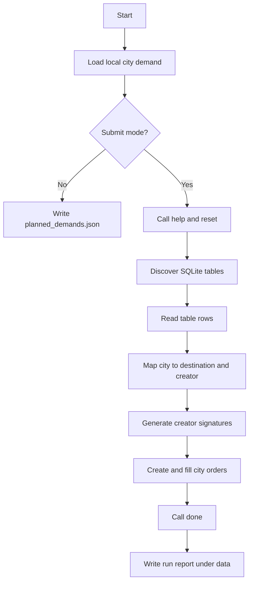

# L20 Foodwarehouse

## Table Of Contents

- [Purpose](#purpose)
- [Workflow](#workflow)
- [Mermaid Logic Flow](#mermaid-logic-flow)
- [LLM Usage And Reviews](#llm-usage-and-reviews)
- [Configuration](#configuration)
- [Run](#run)
- [Main Modules](#main-modules)
- [Verification](#verification)
- [Remote Inspection](#remote-inspection)
- [Submission Status](#submission-status)
- [What This Task Should Teach](#what-this-task-should-teach)

## Purpose

This app solves the `foodwarehouse` exercise. It reads local city demand from
`data/L20_foodwarehouse/food4cities.json`, discovers destination and creator
data through the task SQLite API, asks the task signature generator for each
creator signature, creates one order per city, appends exact item quantities,
and calls final Hub validation.

The runtime design is deterministic. The app uses no model call because the
exercise is about data mapping, guardrails, and stateful API sequencing, not
about language reasoning.

## Workflow

1. Load and validate `food4cities.json`.
2. In dry-run mode, write the validated demand plan to runtime output.
3. In submit mode, call Hub `help` for contract visibility.
4. Reset remote orders to avoid stale task state.
5. Query SQLite table names and read all discovered tables.
6. Match each city to a database record with a destination code.
7. Extract the city creator id and full creator record.
8. Generate one SHA1 signature per creator through `signatureGenerator`.
9. Create one order per city and append the exact item object in batch mode.
10. Fetch current orders for diagnostics, then call `done`.
11. Store raw Hub responses only under `data/L20_foodwarehouse/output/`.

## Mermaid Logic Flow



## LLM Usage And Reviews

| Area | Status | Evidence |
| --- | --- | --- |
| LLM usage | No | The workflow is deterministic JSON parsing, SQLite API discovery, signature generation, and order API calls. |
| Design review | N/A | No prompt, model call, agent behavior, or model output schema is used. |
| Optimization review | N/A | No LLM workflow exists to optimize. |

## Configuration

| Name | Purpose |
| --- | --- |
| `AI_DEVS_API_KEY` | Secret API key used only in Hub requests. |
| `HUB_VERIFY_URL` | Optional Hub verification endpoint override. |

Stable runtime settings, such as request timeout and request guard limits, live
in `src/apps/L20_foodwarehouse/config.py`.

## Run

Dry-run:

```powershell
.\venv\Scripts\python.exe -m src.apps.L20_foodwarehouse.main
```

Submit to Hub:

```powershell
.\venv\Scripts\python.exe -m src.apps.L20_foodwarehouse.main --submit
```

Submit mode makes real external API calls and changes remote task order state.
It should be run only after explicit approval for live Hub calls.

## Main Modules

| Module | Responsibility |
| --- | --- |
| `config.py` | Loads paths, guarded Hub config, runtime constants, and TLS settings. |
| `models.py` | Defines shared response, exchange, demand, and order plan models. |
| `verify_client.py` | Sends guarded Hub requests and masks request secrets for storage. |
| `workflow.py` | Loads demand, discovers database records, builds order plans, submits orders, and writes reports. |
| `main.py` | Runs dry-run or submit mode and prints a compact JSON summary. |

## Verification

The smallest local check is:

```powershell
.\venv\Scripts\python.exe -m src.apps.L20_foodwarehouse.main
```

It validates the local city demand file and writes
`data/L20_foodwarehouse/output/planned_demands.json`.

## Remote Inspection

Read the live task contract and SQLite tables without changing remote orders:

```powershell
.\venv\Scripts\python.exe -m src.apps.L20_foodwarehouse.main --inspect-remote
```

This mode writes a timestamped `remote_inspection_*.json` file under
`data/L20_foodwarehouse/output/`.

Live verification requires approval for external Hub calls:

```powershell
.\venv\Scripts\python.exe -m src.apps.L20_foodwarehouse.main --submit
```

## Submission Status

| Item | Status |
| --- | --- |
| Local dry-run validation | Passed |
| Hub contract inspection | Passed |
| Remote order creation | Passed |
| Final Hub `done` validation | Accepted |
| Raw Hub response storage | `data/L20_foodwarehouse/output/` only |

## What This Task Should Teach

This task teaches why an agent should separate planning, validation, and side
effects. The local JSON gives the exact demand, the database gives authorization
metadata, the signature generator signs creator data, and the order API changes
remote state. Mixing those steps into one vague "ask the model what to do" blob
would be slower, harder to debug, and much easier to break.
