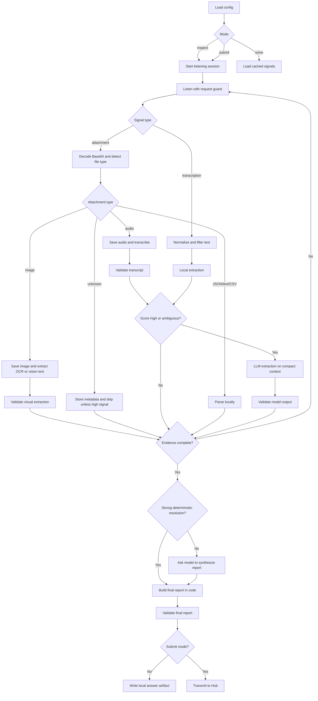

# L21 Radiomonitoring

## Table Of Contents

- [Purpose](#purpose)
- [Current Status](#current-status)
- [Inspection Findings](#inspection-findings)
- [Implementation Findings](#implementation-findings)
- [Workflow](#workflow)
- [Mermaid Logic Flow](#mermaid-logic-flow)
- [LLM Usage And Reviews](#llm-usage-and-reviews)
- [LLM Design Checklist Review](#llm-design-checklist-review)
- [Model Role](#model-role)
- [Data Flow](#data-flow)
- [Configuration](#configuration)
- [Run](#run)
- [Main Modules](#main-modules)
- [Verification](#verification)
- [Submission Status](#submission-status)
- [What This Task Should Teach](#what-this-task-should-teach)

## Purpose

`L21_radiomonitoring` is planned to solve the `radiomonitoring` course task.
The app will start a Hub listening session, collect noisy radio materials,
decode and classify text or Base64 attachments, extract useful evidence, and
send one final report with the real city name, city area, warehouse count, and
contact phone number.

The main learning goal is routing. The app must decide what ordinary code can
parse cheaply, what should be ignored as noise, and what small evidence slices
deserve an LLM call. Raw Base64 payloads must not be sent to a model.

## Current Status

This README records the implemented application and the evidence-backed solution
path. Application source modules are implemented and the final Hub `transmit`
call has returned a flag.

The LLM design gate has passed for the MVP scope described below. The design was
updated after a small live listening inspection confirmed that the task returns
both text transcriptions and image attachments.

Future source changes should stay inside the recorded boundary unless a new LLM
design review is run.

## Inspection Findings

A bounded live inspection was run on 2026-07-05 with one `start` call and five
`listen` calls. No `transmit` call was made.

Raw inspection data is stored under:

| Artifact | Path |
| --- | --- |
| Masked Hub exchanges and response summaries | `data/L21_radiomonitoring/output/listen_inspection_20260705T115510Z.json` |
| Decoded image attachment | `data/L21_radiomonitoring/cache/attachments/15a5baf091cc4411.png` |

Observed response shapes:

| Action | Shape | Notes |
| --- | --- | --- |
| `start` | `action`, `code`, `message` | Hub returned a ready-to-listen control response. |
| `listen` text | `code`, `message`, `transcription` | Several responses were plain text transcriptions, including noisy radio fragments and likely decoy logistics chatter. |
| `listen` image | `code`, `message`, `meta`, `attachment`, `filesize` | One response contained a Base64 `image/png` attachment, 600x480 after decoding. |

Design consequences:

- The router must handle real image attachments, not only text and JSON.
- Image attachments must be decoded and saved first; raw Base64 still must not
  be placed in a text prompt.
- A handwritten note in the sampled PNG contained task-relevant wording and a
  phone-like value, so images need OCR or vision extraction.
- Text transcriptions may be useful, noisy, or deliberate decoys. Keyword and
  regex scoring should decide whether a fragment deserves model analysis, not
  whether it is final truth.
- The evidence store must preserve provenance because a single high-signal
  artifact can provide one field while other required fields may appear later.

## Implementation Findings

The first full implementation attempt proved that the initial router was still
too optimistic. It decoded text, JSON, CSV, and images, but ignored the MP3
attachment. That caused the final synthesis model to choose a wrong city and
miss the warehouse count.

The working implementation adds:

- `audio` routing for `audio/mpeg` attachments;
- OpenAI audio transcription through `llm_gateway.py`;
- structured city-record extraction from the JSON city list, including
  `occupiedArea`;
- deterministic Morse decoding during analysis, which revealed a hidden
  `/deeper` endpoint;
- deterministic final resolution for the strongest cross-source clue:
  "W Skarszewach ... wybudować dwunasty magazyn" means the real city is
  Skarszewy and the current warehouse count is 11.

The `/deeper` endpoint is a separate mini-puzzle. It returned its own flag, but
the course task was considered solved only after the final `transmit` report
returned a flag.

## Workflow

1. Load Hub configuration from `.env`.
2. Apply repository TLS/CA setup before any real external API call.
3. In `inspect` mode, call Hub `start`, then repeatedly call `listen` with a
   hard request guard.
4. Store masked request metadata and raw Hub responses under
   `data/L21_radiomonitoring/output/`.
5. For text transcriptions, normalize text, reject obvious noise, and run local
   extraction heuristics.
6. For Base64 attachments, decode locally, hash the bytes, save the file, detect
   the media type, and route it to a format-specific parser.
7. Parse JSON, text, CSV, and other simple structured formats with ordinary
   Python code.
8. For image attachments, inspect dimensions and file metadata, then use OCR or
   a vision-capable OpenAI model on the saved image file reference.
9. For audio attachments, transcribe the saved audio file and feed only the
   transcript into downstream extraction.
10. Send only compact, task-relevant text snippets, image references, audio
   transcripts, or unresolved evidence candidates to the LLM gateway.
11. Validate every model-produced candidate before it can affect the final
   answer.
12. Merge evidence with provenance and resolve conflicts.
13. Prefer deterministic final resolution when cross-source evidence is strong
    enough to avoid model arbitration.
14. Validate the final report shape:
    `cityName`, `cityArea`, `warehousesCount`, and `phoneNumber`.
15. In `submit` mode only, send the final `transmit` payload to Hub.

## Mermaid Logic Flow



## LLM Usage And Reviews

| Area | Status | Evidence |
| --- | --- | --- |
| LLM usage | Yes | The planned app may use an LLM for compact text evidence extraction, image evidence extraction, and conflict resolution after deterministic routing. |
| Design review | Passed | `_agent/instructions/llm_design_checklist.md`; 2026-07-05; mode: non-production; scope: L21 radiomonitoring MVP routed text/image/audio extraction, deterministic evidence resolution, and final report synthesis; result: PASS; boundary: implement the planned pipeline, router, media handling, evidence validation, deterministic resolver, and LLM gateway only. |
| Optimization review | Passed | `_agent/instructions/llm_optimization_checklist.md`; 2026-07-05; scope: implemented L21 radiomonitoring workflow with text, image, audio, deterministic evidence resolution, and final Hub submit; mode: non-production; result: PASS; follow-up: before production, replace puzzle-specific final resolver with a more general evidence-linking rule set. |

## LLM Design Checklist Review

Review mode: `non-production`.

Scope: L21 radiomonitoring MVP routed text/image/audio extraction,
deterministic evidence resolution, and final report synthesis.

Result: PASS. There are no blocking `NO` items for this design scope.

### Scope And Workflow

| Item | Status | Design note |
| --- | --- | --- |
| The application has a clearly defined goal and expected output. | YES | The final output is the Hub `transmit` report with `cityName`, `cityArea`, `warehousesCount`, and `phoneNumber`. |
| The workflow is split into small steps when one model call would mix multiple responsibilities. | YES | Capture, attachment routing, local parsing, image extraction, audio transcription, LLM extraction, deterministic evidence resolution, validation, and Hub transmit are separate steps. |
| Deterministic code is planned for stable logic, and LLM calls are reserved for language or reasoning tasks. | YES | Base64 decoding, MIME detection, image and audio file inspection, JSON parsing, regex extraction, Morse decoding, rounding, and payload validation are ordinary code responsibilities. |
| Each planned workflow step has a clear purpose. | YES | Each module has one job: collect signals, route artifacts, extract candidates, validate evidence, or submit the answer. |

### Model And Prompt Plan

| Item | Status | Design note |
| --- | --- | --- |
| Each LLM step has a reason for using a model instead of ordinary code. | YES | The LLM is reserved for ambiguous natural-language evidence, handwritten image evidence when local OCR is insufficient, audio transcription, and fallback conflict resolution that local parsers cannot safely decide. |
| The selected model for each step matches the expected difficulty of that step. | YES | The planned default is a small OpenAI model for text extraction, a vision-capable OpenAI model for saved image references, OpenAI audio transcription for MP3-like attachments, and escalation only for conflicting evidence. |
| Prompts are planned to be short, focused, and limited to the current step. | YES | Prompts receive only one compact text bundle, one image reference plus extraction instruction, one audio file for transcription, or one evidence bundle. |
| Token usage is intentionally limited for both model input and model output. | YES | The router forbids raw Base64 model input, trims text snippets, sends image/audio files through media API boundaries, and requests short structured JSON output. |
| Structured outputs are planned wherever code will consume the result. | YES | Model output will be parsed as typed evidence candidates with value, field name, confidence, and source reference. |

### Context And Tools

| Item | Status | Design note |
| --- | --- | --- |
| The design limits context to only what the current step needs. | YES | The LLM gateway receives compact snippets, saved image/audio references, or unresolved candidate bundles, not the full listening history. |
| The design limits tool exposure to only the tools needed for the current step. | YES | The model has no direct Hub, filesystem, or network tools; code owns decode, storage, validation, and submission. |
| The design avoids passing full history, full datasets, or irrelevant examples by default. | YES | Full raw signals stay in runtime data; the model sees only task-relevant excerpts selected by the router. |
| The workflow includes batching, caching, or persisted intermediate results where repeated or long-running calls are likely. | YES | Raw signals, decoded attachments, image metadata, audio transcripts, extracted text, and evidence candidates are persisted under `data/L21_radiomonitoring/...`. |

### Runtime Performance And Task Lifecycle

| Item | Status | Design note |
| --- | --- | --- |
| Production-only: Long-running LLM, tool, media generation, or agent tasks have a planned progress or heartbeat mechanism. | N/A | Non-production local CLI exercise; no production UI heartbeat is planned. |
| Production-only: The user can understand what is happening while waiting for slow model, tool, media generation, or agent work. | N/A | Non-production local CLI exercise; compact terminal summaries and run reports are sufficient. |
| Production-only: Long-running work can continue safely if the user closes the browser, loses connection, or leaves the application. | N/A | Non-production local CLI exercise; there is no browser session or deployed task runner. |
| Production-only: The workflow defines how task state, intermediate outputs, and final results are persisted. | N/A | Production guarantee is out of scope, but the MVP still persists signals, attachments, evidence, and final reports locally. |
| Production-only: The design supports pausing and resuming tasks when waiting for user approval, tool results, retries, or agent completion. | N/A | Non-production local CLI exercise; manual reruns from cached artifacts are enough for the MVP. |
| Production-only: User interaction during long-running work is planned, such as message queueing, cancellation, or opening a separate thread. | N/A | Non-production local CLI exercise; no interactive UI queue is planned. |
| Production-only: UI state is not tightly coupled to backend execution state for long-running tasks. | N/A | Non-production local CLI exercise; no UI state exists. |
| Production-only: Event-driven or job-based orchestration is considered where a synchronous request/response flow would be fragile. | N/A | Non-production local CLI exercise; bounded synchronous CLI execution is acceptable. |

### Validation And Safety

| Item | Status | Design note |
| --- | --- | --- |
| The design includes validation before model output is used downstream. | YES | Evidence candidates are schema-validated and final fields are value-validated before report assembly. |
| The design treats model output as untrusted until validation passes. | YES | The solver rejects malformed fields, unsupported report keys, invalid phone values, and unrounded city area values. |
| The design keeps authorization, permissions, and risky actions outside the model. | YES | Only code can call Hub `start`, `listen`, or `transmit`; the model cannot trigger external API actions. |
| The workflow handles missing required inputs without guessing important values. | YES | If any required final field lacks validated evidence, `solve` writes an incomplete evidence report and `submit` must stop. |

## Model Role

The model is an extraction helper, not the workflow owner.

Allowed model responsibilities:

- extract candidate city facts from short Polish text snippets;
- extract text and task-relevant fields from saved image attachments when local
  OCR is unavailable or unreliable;
- transcribe saved audio attachments through the OpenAI audio endpoint;
- classify whether a compact snippet contains relevant evidence;
- compare conflicting candidate facts after local evidence collection when
  deterministic evidence is not strong enough.

Forbidden model responsibilities:

- decode Base64;
- receive raw Base64 as text context;
- parse JSON, CSV, or simple structured files;
- receive raw binary payloads;
- perform mathematical rounding;
- call Hub;
- decide final authorization or submission;
- decide whether secrets may be stored or shown.

## Data Flow

| Path | Purpose |
| --- | --- |
| `data/L21_radiomonitoring/cache/raw_signals/` | Cached raw listening responses with request secrets masked. |
| `data/L21_radiomonitoring/cache/attachments/` | Decoded attachment files named by hash or sequence. |
| `data/L21_radiomonitoring/cache/extracted/` | Locally extracted text, image metadata, OCR or vision output, audio transcripts, and parsed structured content. |
| `data/L21_radiomonitoring/output/` | Evidence reports, final answer artifacts, run reports, and final Hub response. |
| `data/L21_radiomonitoring/logs/` | Optional JSONL execution trace for debugging and learning. |

Runtime data may include Hub responses and course artifacts, but must not store
raw secrets. Requests saved to disk must mask `AI_DEVS_API_KEY`.

## Configuration

| Name | Purpose |
| --- | --- |
| `AI_DEVS_API_KEY` | Secret API key used only in Hub requests. |
| `HUB_VERIFY_URL` | Hub verification endpoint loaded from `.env`; logs should refer to the variable name, not the raw value. |

Stable app settings should live in `config.py`, not in `.env`:

| Setting | Planned purpose |
| --- | --- |
| `TASK_NAME` | `radiomonitoring`. |
| `MAX_LISTEN_REQUESTS` | Hard guard for the listening loop. |
| `MAX_MODEL_REQUESTS` | Hard guard for LLM calls in one run. |
| `MAX_MODEL_INPUT_CHARS` | Snippet cap before a model call. |
| `MAX_IMAGE_PIXELS` | Guard for image attachments before OCR or vision analysis. |
| `MIN_RELEVANCE_SCORE_FOR_MODEL` | Router threshold for sending ambiguous text evidence to the LLM gateway. |
| `REQUEST_TIMEOUT_SECONDS` | Hub request timeout. |
| `EXTRACTION_MODEL` | Default OpenAI model for compact extraction. |
| `VISION_EXTRACTION_MODEL` | OpenAI model used for image attachments when OCR or visual understanding is needed. |
| `L21_RADIOMONITORING_AUDIO_MODEL` | Optional OpenAI audio transcription model override for MP3-like attachments. |
| `RESOLUTION_MODEL` | Optional stronger OpenAI model for conflict resolution. |

## Run

Planned local inspection mode:

```powershell
.\venv\Scripts\python.exe -m src.apps.L21_radiomonitoring.main --inspect
```

Planned local solve mode from cached artifacts:

```powershell
.\venv\Scripts\python.exe -m src.apps.L21_radiomonitoring.main --solve
```

Planned live submission mode:

```powershell
.\venv\Scripts\python.exe -m src.apps.L21_radiomonitoring.main --submit
```

`--inspect` and `--submit` make real external Hub calls and require explicit
approval before execution. Any mode that makes real OpenAI calls must apply the
repository TLS/CA setup first.

## Main Modules

| Module | Responsibility |
| --- | --- |
| `config.py` | Load paths, Hub config, model names, runtime guard limits, and TLS settings. |
| `models.py` | Define signal, attachment, evidence, final report, and logged exchange objects. |
| `verify_client.py` | Send guarded Hub `start`, `listen`, and `transmit` requests with masked logging. |
| `capture.py` | Own the listening session and persist raw signal artifacts. |
| `attachment_router.py` | Decode Base64, detect type, save attachments, and choose local parser or model path. |
| `extractors.py` | Extract obvious facts using deterministic text, JSON, CSV, and regex logic. |
| `llm_gateway.py` | Run compact OpenAI text extraction, image extraction, audio transcription, and fallback conflict-resolution calls behind one boundary. |
| `solver.py` | Derive strong cross-source facts, build and validate the final report, including exact `cityArea` formatting. |
| `workflow.py` | Coordinate inspect, solve, and submit modes. |
| `main.py` | Provide the CLI entrypoint. |

## Verification

Planned smallest checks before live Hub submission:

1. Run unit tests for attachment routing, image metadata handling, local
   extractors, final report validation, and secret masking.
2. Run `--solve` against cached fixture signals without external calls.
3. Confirm the evidence report contains provenance for all four final fields.
4. Confirm `cityArea` has exactly two decimal places and uses mathematical
   rounding.
5. Confirm image-derived evidence references the saved image artifact, not raw
   Base64.
6. Run live `--submit` only after explicit approval for external Hub and OpenAI
   calls.

Latest verification:

| Date | Command | Result |
| --- | --- | --- |
| 2026-07-05 | `.\venv\Scripts\python.exe -m src.apps.L21_radiomonitoring.main --submit --from-cache` | Hub accepted the final report; `flag_found: true`. |

## Submission Status

| Item | Status |
| --- | --- |
| Live listening capture | Completed |
| Text/image/audio extraction | Completed |
| Hidden `/deeper` clue inspection | Completed |
| Deterministic final report validation | Passed |
| Final Hub `transmit` validation | Accepted |
| Raw Hub responses and flags | Stored only under `data/L21_radiomonitoring/...` |

## What This Task Should Teach

This task teaches that good AI apps spend most of their intelligence before the
model call. The final solution showed why: the stream contained noisy
transcriptions, plausible decoys, a useful handwritten image, a useful MP3
message, structured city data, and a Morse clue pointing to a hidden endpoint.
Local decoding, parsing, filtering, media routing, validation, caching,
provenance, and deterministic evidence linking gave the model a smaller and
cleaner job. A giant prompt full of Base64 would be expensive, slow, and silly.
