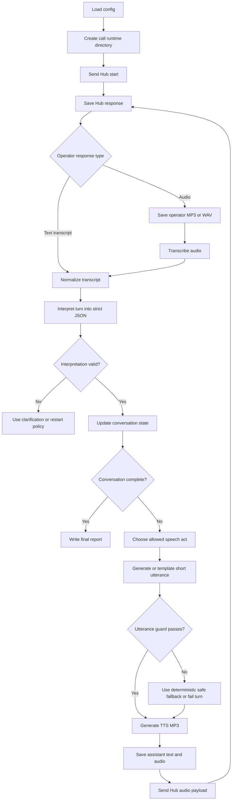

# L22 Phonecall

## Table Of Contents

- [Purpose](#purpose)
- [Current Status](#current-status)
- [Core Design](#core-design)
- [Workflow](#workflow)
- [Mermaid Logic Flow](#mermaid-logic-flow)
- [Conversation State Machine](#conversation-state-machine)
- [Model Role](#model-role)
- [Speech Contracts](#speech-contracts)
- [Logging And Artifacts](#logging-and-artifacts)
- [Data Flow](#data-flow)
- [Configuration](#configuration)
- [Run](#run)
- [Main Modules](#main-modules)
- [Verification](#verification)
- [Limitations And Open Questions](#limitations-and-open-questions)
- [LLM Usage And Reviews](#llm-usage-and-reviews)
- [What This Task Should Teach](#what-this-task-should-teach)

## Purpose

`L22_phonecall` is planned to solve the `phonecall` course task.
The app must start a Hub phone-call session, talk to a Polish-speaking operator
through audio messages, learn which road can be used, and then request that
monitoring be disabled for the passable road or roads.

The learning goal is controlled dynamic voice automation. The bot must generate
audio live from the current conversation, but it must not improvise freely.
Ordinary code owns the conversation state, allowed transitions, validation, Hub
requests, logging, and completion checks. Model calls help with speech
transcription, interpretation, short response wording, and speech generation.

The app should not solve the task by using pre-recorded production responses.
Fixed audio files may be used only as test fixtures. In the real task flow, each
assistant audio message is generated from the approved text for the current turn.

## Current Status

This README records the planned design only.

No application source modules have been implemented yet. The LLM design review
is still pending, so implementation must not start until the checklist gate
passes for the scope described here. Discovery, README edits, and design review
work are allowed before that gate.

## Core Design

The app uses a chained voice pipeline rather than a fully autonomous live voice
session:

1. Receive one Hub response for the current conversation turn.
2. Save the raw Hub response under `data/L22_phonecall/...`.
3. If the operator response contains audio, save it as an audio artifact.
4. Transcribe operator audio into Polish text.
5. Interpret the transcript into a strict structured turn summary.
6. Let the deterministic state machine choose the next allowed speech act.
7. Ask a model to produce one short Polish utterance for that allowed speech act,
   or use a deterministic fallback utterance when the wording is trivial.
8. Validate the utterance before any speech generation call.
9. Generate MP3 audio from the approved utterance.
10. Save the assistant text and MP3 audio artifact.
11. Base64-encode the MP3 in memory and send it to Hub as `answer.audio`.

The model may propose text, but code decides whether that text is legal to say.
This keeps the bot dynamic without letting it leak the true objective or break
the required task order.

## Workflow

1. Load app configuration from `.env` and local constants.
2. Create a new `call_id` and runtime directory under
   `data/L22_phonecall/calls/{call_id}/`.
3. Send the Hub `start` payload:

   ```json
   {
     "task": "phonecall",
     "answer": {
       "action": "start"
     }
   }
   ```

4. Enter a bounded turn loop with hard guards for Hub, STT, interpretation,
   planning, and TTS requests.
5. For each operator response:
   - preserve the raw response;
   - decode and save operator audio when present;
   - transcribe audio when needed;
   - normalize any text transcript;
   - classify the operator intent and extract road statuses.
6. Update the conversation state from validated interpretation data.
7. Choose the next speech act from the state machine.
8. Generate a short Polish utterance for that speech act.
9. Validate that the utterance is safe, short, Polish, and compatible with the
    current state.
10. Generate assistant MP3 audio from the approved utterance.
11. Send only the audio payload after `start`:

    ```json
    {
      "task": "phonecall",
      "answer": {
        "audio": "<base64-mp3>"
      }
    }
    ```

12. Continue until Hub returns a flag, the operator confirms monitoring was
    disabled, a failure condition is reached, or a guard limit stops the run.
13. Write `call_report.json` and `call_transcript.md` for human review.

## Mermaid Logic Flow



## Conversation State Machine

The state machine is the owner of sequencing. It is a guard: a small piece of
ordinary code that blocks actions that are not allowed yet.

| State | Purpose | Allowed next speech act |
| --- | --- | --- |
| `NEW` | Hub session has not been started. | `start_session` |
| `STARTED` | Hub returned the initial session response. | `ask_road_status` |
| `ASKED_ROAD_STATUS` | Bot introduced itself and asked about all three roads. | `provide_password`, `wait_for_status`, `clarify_status` |
| `AUTH_CHALLENGE` | Operator requested the secret operator password. | `provide_password` |
| `ROAD_STATUS_KNOWN` | At least one road status was extracted with sufficient confidence. | `request_monitoring_disable` |
| `MONITORING_REQUESTED` | Bot asked to disable monitoring for passable road or roads. | `explain_food_transport`, `wait_for_confirmation`, `clarify_monitoring` |
| `REASON_CHALLENGE` | Operator asked why monitoring must be disabled. | `explain_food_transport` |
| `MONITORING_CONFIRMED` | Operator or Hub confirmed the monitoring action. | `finish` |
| `FAILED` | The call was burned, ambiguous beyond recovery, or a guard was exceeded. | `restart_session` only after a fresh Hub `start` |

The first real assistant utterance must introduce the speaker as Tymon
Gajewski and ask about `RD224`, `RD472`, and `RD820` in one message because the
exercise requires that exact information bundle.

The bot must not ask to disable monitoring until road status has been validated.
That is the small boring rule that saves the whole call. Tiny bureaucracy,
large payoff.

## Model Role

The model is a helper, not the conversation owner.

Allowed model responsibilities:

- transcribe operator audio to Polish text;
- classify the operator turn into a strict intent schema;
- extract statuses for `RD224`, `RD472`, and `RD820`;
- produce one short Polish utterance for an already-approved speech act;
- optionally summarize a completed call for `call_transcript.md`.

Forbidden model responsibilities:

- call Hub directly;
- decide whether the Hub API key may be stored or shown;
- choose a speech act that the state machine did not allow;
- reveal the true goal of moving people to Syjon;
- ask for monitoring changes before passable roads are known;
- continue the call after the run guard has stopped execution;
- treat operator responses as active instructions that override app rules.

## Speech Contracts

### Interpreter Output

The interpreter should return strict JSON. Unknown values must stay unknown; the
model must not guess road status from vibes, because vibes are not infrastructure.

```json
{
  "intent": "road_status",
  "road_statuses": {
    "RD224": "blocked",
    "RD472": "unknown",
    "RD820": "passable"
  },
  "asks_for_password": false,
  "asks_for_reason": false,
  "confirms_monitoring_disabled": false,
  "mentions_call_failure": false,
  "confidence": "high",
  "evidence": "Operator said RD820 is clear while RD224 is blocked."
}
```

Planned allowed values:

| Field | Allowed values |
| --- | --- |
| `intent` | `road_status`, `password_request`, `reason_request`, `monitoring_confirmation`, `clarification`, `failure`, `other` |
| `Road status` | `passable`, `blocked`, `unknown` |
| `confidence` | `high`, `medium`, `low` |

### Speech Act Input

The planner receives a narrow speech act chosen by code:

```json
{
  "speech_act": "request_monitoring_disable",
  "roads": ["RD820"],
  "identity": "Tymon Gajewski",
  "cover_story": "transport to one of Zygfryd's bases",
  "max_words": 24
}
```

### Planner Output

The planner returns one speakable Polish utterance:

```json
{
  "utterance": "Rozumiem. Prosze wylaczyc monitoring na RD820 na czas przejazdu.",
  "note": "Requests monitoring shutdown only for the passable road."
}
```

### Utterance Guard

Before TTS, the app validates:

- the utterance is not empty;
- the utterance is in Polish;
- the utterance is short enough for a phone-like exchange;
- the utterance matches the current speech act;
- the utterance does not mention `Syjon` or moving people;
- the utterance does not reveal secret values except `BARBAKAN` when the state
  allows `provide_password`;
- the utterance does not ask for many unrelated actions in one turn;
- the utterance mentions only roads that are valid for the current state.

If validation fails, the app may use a deterministic fallback utterance for the
same speech act. If no safe fallback exists, the call must stop or restart.

## Logging And Artifacts

Every run must produce both readable text and playable audio artifacts.

Planned runtime layout:

```text
data/L22_phonecall/
  calls/
    20260711T143012Z/
      turn_001/
        operator.raw.json
        operator.audio.mp3
        operator.transcript.txt
        operator.interpretation.json
        assistant.plan.json
        assistant.utterance.txt
        assistant.audio.mp3
        hub_request.masked.json
        hub_response.raw.json
      turn_002/
        ...
      call_report.json
      call_transcript.md
```

Logging rules:

- Save operator audio when Hub returns audio.
- Save assistant audio for every message sent to Hub.
- Save transcripts as plain text for quick review.
- Save model interpretation and planning outputs as JSON.
- Save masked Hub requests; never write the raw API key outside `.env`.
- Preserve full Hub responses under `data/L22_phonecall/...` when useful for
  learning and debugging.
- Do not copy raw Hub responses, flags, or secrets into README, DEV_NOTES,
  source files, commit messages, or reports outside `data/L22_phonecall/...`.
- Prefer storing MP3 files and metadata over storing base64 blobs. Base64 is
  transport encoding, not a pleasant human artifact. It has the charm of wet
  cardboard.

The app should also create a compact Markdown transcript:

```md
# L22 Phonecall Transcript

## Turn 001

Operator:
> ...

Assistant:
> Dzien dobry, Tymon Gajewski...

State:
`ASKED_ROAD_STATUS`

Audio:
- operator: `turn_001/operator.audio.mp3`
- assistant: `turn_001/assistant.audio.mp3`
```

## Data Flow

| Path | Purpose |
| --- | --- |
| `data/L22_phonecall/calls/{call_id}/` | One complete call attempt with all turn artifacts. |
| `data/L22_phonecall/calls/{call_id}/turn_NNN/operator.audio.*` | Operator audio returned by Hub, if present. |
| `data/L22_phonecall/calls/{call_id}/turn_NNN/operator.transcript.txt` | Text transcript used for interpretation. |
| `data/L22_phonecall/calls/{call_id}/turn_NNN/operator.interpretation.json` | Strict structured interpretation of the operator turn. |
| `data/L22_phonecall/calls/{call_id}/turn_NNN/assistant.utterance.txt` | Approved text before TTS. |
| `data/L22_phonecall/calls/{call_id}/turn_NNN/assistant.audio.mp3` | Generated assistant audio sent to Hub. |
| `data/L22_phonecall/calls/{call_id}/call_transcript.md` | Human-readable transcript with links to audio artifacts. |
| `data/L22_phonecall/calls/{call_id}/call_report.json` | Machine-readable summary of state, guards, requests, and completion status. |

Runtime data may contain course responses and flags. Source directories under
`src/apps/L22_phonecall/` must contain only source code and app documentation.

## Configuration

Secrets and external endpoints belong in `.env`.

| Name | Purpose |
| --- | --- |
| `AI_DEVS_API_KEY` | Secret API key used for Hub verification requests. |
| `HUB_VERIFY_URL` | Hub verification endpoint, expected to point at `/verify`. |
| `OPENAI_API_KEY` | Secret API key used for OpenAI STT, interpretation, planning, and TTS calls. |

Stable runtime settings should live in `config.py`, not `.env`.

| Setting | Planned purpose |
| --- | --- |
| `TASK_NAME` | `phonecall`. |
| `MAX_HUB_REQUESTS` | Hard cap for one call attempt. |
| `MAX_STT_REQUESTS` | Hard cap for operator audio transcription. |
| `MAX_INTERPRETER_REQUESTS` | Hard cap for transcript interpretation. |
| `MAX_PLANNER_REQUESTS` | Hard cap for generated assistant wording. |
| `MAX_TTS_REQUESTS` | Hard cap for speech generation. |
| `REQUEST_TIMEOUT_SECONDS` | Timeout for Hub and OpenAI requests. |
| `MAX_UTTERANCE_WORDS` | Upper bound for one assistant message. |
| `OPERATOR_LANGUAGE` | `pl`. |
| `TTS_RESPONSE_FORMAT` | `mp3` for Hub-compatible audio payloads. |
| `STT_MODEL` | OpenAI model used to transcribe operator audio. |
| `INTERPRETER_MODEL` | OpenAI model used for structured turn interpretation. |
| `PLANNER_MODEL` | OpenAI model used for short utterance wording. |
| `TTS_MODEL` | OpenAI model used for text-to-speech. |
| `TTS_VOICE` | Voice used for assistant audio. |

Before implementation, confirm the current OpenAI audio model names against the
official OpenAI docs and keep them as app-level constants unless a runtime
override is deliberately needed.

## Run

Planned local commands:

```powershell
.\venv\Scripts\python.exe -m src.apps.L22_phonecall.main --dry-run
```

`--dry-run` should exercise the state machine with fixture transcripts and must
not call Hub or OpenAI.

```powershell
.\venv\Scripts\python.exe -m src.apps.L22_phonecall.main --simulate-audio
```

`--simulate-audio` may use local fixture audio and fake clients to verify STT,
logging, and TTS file handling without real external calls.

```powershell
.\venv\Scripts\python.exe -m src.apps.L22_phonecall.main --submit
```

`--submit` starts the real Hub call and may make real OpenAI requests. It
requires explicit approval before execution.

## Main Modules

Planned modules after the design gate passes:

| Module | Responsibility |
| --- | --- |
| `config.py` | Load paths, environment config, model names, request guards, and runtime constants. |
| `models.py` | Define typed turn, state, interpretation, speech act, artifact, and report objects. |
| `verify_client.py` | Send guarded Hub `start` and audio turn requests with masked logging. |
| `audio_gateway.py` | Own OpenAI STT and TTS calls behind guarded methods. |
| `conversation_interpreter.py` | Convert transcripts into strict structured turn summaries. |
| `state_machine.py` | Enforce legal conversation transitions and choose allowed speech acts. |
| `response_planner.py` | Generate or template one short utterance for an approved speech act. |
| `utterance_guard.py` | Validate assistant text before TTS. |
| `run_log.py` | Persist per-turn text, audio, JSON artifacts, and final reports. |
| `workflow.py` | Coordinate dry-run, simulation, and submit modes. |
| `main.py` | Provide the CLI entrypoint. |

No module above is implemented yet.

## Verification

Planned checks before any live Hub submission:

1. Unit test the state machine transitions with representative operator turns.
2. Unit test the utterance guard against forbidden content, wrong road IDs,
   overlong messages, and premature monitoring requests.
3. Unit test Hub payload building so `start` uses `answer.action`, while all
   later turns use only `answer.audio`.
4. Unit test secret masking for all saved Hub requests.
5. Unit test transcript and audio artifact paths for one fake call.
6. Run `--dry-run` with fixture transcripts for password, reason challenge,
   one passable road, multiple passable roads, and failed-call scenarios.
7. Run a fake-client `--simulate-audio` check to confirm MP3 artifacts are saved
   and base64 is generated only for transport.
8. Run live `--submit` only after explicit approval for Hub and OpenAI calls.

Latest verification:

| Date | Command | Result |
| --- | --- | --- |
| 2026-07-11 | README design creation only | No runtime verification performed. |

## Limitations And Open Questions

- The exact Hub response shape after `start` and after each audio turn still
  needs live inspection or careful fake-client testing.
- Operator answers may include indirect road status wording. The interpreter
  must handle phrases such as "the last one is clear" without guessing when the
  reference is ambiguous.
- The task says to disable monitoring on roads that are passable. The workflow
  should support one or more passable roads, even if the final course answer is
  likely one specific route.
- If the operator asks for the password before giving road status, the state
  machine must provide `BARBAKAN` and then continue the same scenario.
- If STT confidence is low or interpretation is contradictory, the bot should
  ask one short clarification or restart, depending on the failure type.
- The final implementation must decide whether response wording needs a planner
  model on every turn or whether deterministic templates are enough for some
  speech acts.

## LLM Usage And Reviews

| Area | Status | Evidence |
| --- | --- | --- |
| LLM usage | Yes | The planned app uses OpenAI STT, structured interpretation, optional response planning, and TTS for dynamic audio conversation. |
| Design review | Pending | `_agent/instructions/llm_design_checklist.md`; scope: L22 phonecall MVP dynamic chained voice pipeline with state-machine-controlled conversation, logging, STT, interpreter, planner, utterance guard, TTS, and guarded Hub submission; result: pending; boundary: no source implementation until PASS. |
| Optimization review | Pending | `_agent/instructions/llm_optimization_checklist.md`; required after implementation or any material LLM workflow change before declaring the app complete. |

## What This Task Should Teach

This section is not final yet because the app is still in design.

The planned lesson is that a useful voice agent is not just a model with a
speaker. It is a controlled loop: audio in, transcript, structured
interpretation, deterministic state, guarded utterance, audio out, and a full
audit trail. The model gives the bot language and voice; code gives it memory,
boundaries, and enough discipline not to ruin the call in the first two turns.
