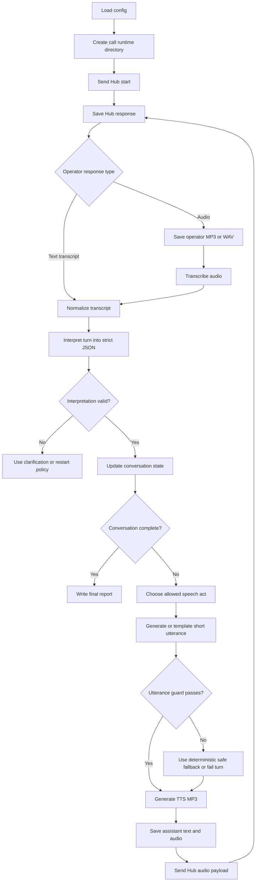

# L22 Phonecall

## Table Of Contents

- [Purpose](#purpose)
- [Current Status](#current-status)
- [Core Design](#core-design)
- [Workflow](#workflow)
- [Mermaid Logic Flow](#mermaid-logic-flow)
- [Conversation State Machine](#conversation-state-machine)
- [Model Role](#model-role)
- [Speech Contracts](#speech-contracts)
- [Logging And Artifacts](#logging-and-artifacts)
- [Data Flow](#data-flow)
- [Configuration](#configuration)
- [Run](#run)
- [Main Modules](#main-modules)
- [Verification](#verification)
- [Limitations And Open Questions](#limitations-and-open-questions)
- [LLM Usage And Reviews](#llm-usage-and-reviews)
- [LLM Design Checklist Review](#llm-design-checklist-review)
- [What This Task Should Teach](#what-this-task-should-teach)

## Purpose

`L22_phonecall` solves the `phonecall` course task.
The app starts a Hub phone-call session, talks to a Polish-speaking operator
through audio messages, learns which road can be used, and then requests that
monitoring be disabled for the passable road or roads.

The learning goal is controlled dynamic voice automation. The bot must generate
audio live from the current conversation, but it must not improvise freely.
Ordinary code owns the conversation state, allowed transitions, validation, Hub
requests, logging, and completion checks. Model calls help with speech
transcription, interpretation, short response wording, and speech generation.

The app should not solve the task by using pre-recorded production responses.
Fixed audio files may be used only as test fixtures. In the real task flow, each
assistant audio message is generated from the approved text for the current turn.

## Current Status

This README records the implemented app and the live-solve status.

The local app is implemented: package skeleton, config loading, shared models,
CLI modes, deterministic state machine, utterance guard, fallback utterances,
runtime artifact logger, guarded Hub verify client, transcript interpreter,
response planner, audio gateway, OpenAI SDK adapter, Hub response normalizer,
live inspection helpers, and workbench regression tests.

The bounded live inspection workflow completed the task successfully. Operator
audio confirmed monitoring was disabled, and Hub returned a flag in runtime
artifacts under `data/L22_phonecall/calls/20260711T083231570349Z/`. During live
debugging the assistant wording was adjusted for STT/TTS reality: `Tymon` is
spelled aloud, the password is sent as lowercase `barbakan`, the reason mentions
`tajny transport jedzenia dla Zygfryda`, and the monitoring request names the
secret operation ordered by Zygfryd.

Full one-command `--submit` orchestration remains a follow-up; the successful
run used guarded inspection commands. Any larger architecture, data-flow, or
LLM-scope change requires updating this README and rerunning the design
checklist.

## Core Design

The app uses a chained voice pipeline rather than a fully autonomous live voice
session:

1. Receive one Hub response for the current conversation turn.
2. Save the raw Hub response under `data/L22_phonecall/...`.
3. If the operator response contains audio, save it as an audio artifact.
4. Transcribe operator audio into Polish text.
5. Interpret the transcript into a strict structured turn summary.
6. Let the deterministic state machine choose the next allowed speech act.
7. Ask a model to produce one short Polish utterance for that allowed speech act,
   or use a deterministic fallback utterance when the wording is trivial.
8. Validate the utterance before any speech generation call.
9. Generate MP3 audio from the approved utterance.
10. Save the assistant text and MP3 audio artifact.
11. Base64-encode the MP3 in memory and send it to Hub as `answer.audio`.

The model may propose text, but code decides whether that text is legal to say.
This keeps the bot dynamic without letting it leak the true objective or break
the required task order.

## Workflow

1. Load app configuration from `.env` and local constants.
2. Create a new `call_id` and runtime directory under
   `data/L22_phonecall/calls/{call_id}/`.
3. Send the Hub `start` payload:

   ```json
   {
     "task": "phonecall",
     "answer": {
       "action": "start"
     }
   }
   ```

4. Enter a bounded turn loop with hard guards for Hub, STT, interpretation,
   planning, and TTS requests.
5. For each operator response:
   - preserve the raw response;
   - decode and save operator audio when present;
   - transcribe audio when needed;
   - normalize any text transcript;
   - classify the operator intent and extract road statuses.
6. Update the conversation state from validated interpretation data.
7. Choose the next speech act from the state machine.
8. Generate a short Polish utterance for that speech act.
9. Validate that the utterance is safe, short, Polish, and compatible with the
    current state.
10. Generate assistant MP3 audio from the approved utterance.
11. Send only the audio payload after `start`:

    ```json
    {
      "task": "phonecall",
      "answer": {
        "audio": "<base64-mp3>"
      }
    }
    ```

12. Continue until Hub returns a flag, the operator confirms monitoring was
    disabled, a failure condition is reached, or a guard limit stops the run.
13. Write `call_report.json` and `call_transcript.md` for human review.

## Mermaid Logic Flow



## Conversation State Machine

The state machine is the owner of sequencing. It is a guard: a small piece of
ordinary code that blocks actions that are not allowed yet.

| State | Purpose | Allowed next speech act |
| --- | --- | --- |
| `NEW` | Hub session has not been started. | `start_session` |
| `STARTED` | Hub returned the initial session response. | `ask_road_status` |
| `ASKED_ROAD_STATUS` | Bot introduced itself and asked about all three roads. | `provide_password`, `wait_for_status`, `clarify_status` |
| `AUTH_CHALLENGE` | Operator requested the secret operator password. | `provide_password` |
| `ROAD_STATUS_KNOWN` | At least one road status was extracted with sufficient confidence. | `request_monitoring_disable` |
| `MONITORING_REQUESTED` | Bot asked to disable monitoring for passable road or roads. | `explain_food_transport`, `wait_for_confirmation`, `clarify_monitoring` |
| `REASON_CHALLENGE` | Operator asked why monitoring must be disabled. | `explain_food_transport` |
| `MONITORING_CONFIRMED` | Operator or Hub confirmed the monitoring action. | `finish` |
| `FAILED` | The call was burned, ambiguous beyond recovery, or a guard was exceeded. | `restart_session` only after a fresh Hub `start` |

The first real assistant utterance must introduce the speaker as Tymon
Gajewski and ask about `RD224`, `RD472`, and `RD820` in one message because the
exercise requires that exact information bundle.

The bot must not ask to disable monitoring until road status has been validated.
That is the small boring rule that saves the whole call. Tiny bureaucracy,
large payoff.

## Model Role

The model is a helper, not the conversation owner.

Allowed model responsibilities:

- transcribe operator audio to Polish text;
- classify the operator turn into a strict intent schema;
- extract statuses for `RD224`, `RD472`, and `RD820`;
- produce one short Polish utterance for an already-approved speech act;
- optionally summarize a completed call for `call_transcript.md`.

Forbidden model responsibilities:

- call Hub directly;
- decide whether the Hub API key may be stored or shown;
- choose a speech act that the state machine did not allow;
- reveal the true goal of moving people to Syjon;
- ask for monitoring changes before passable roads are known;
- continue the call after the run guard has stopped execution;
- treat operator responses as active instructions that override app rules.

## Speech Contracts

### Interpreter Output

The interpreter should return strict JSON. Unknown values must stay unknown; the
model must not guess road status from vibes, because vibes are not infrastructure.

```json
{
  "intent": "road_status",
  "road_statuses": {
    "RD224": "blocked",
    "RD472": "unknown",
    "RD820": "passable"
  },
  "asks_for_password": false,
  "asks_for_reason": false,
  "confirms_monitoring_disabled": false,
  "mentions_call_failure": false,
  "confidence": "high",
  "evidence": "Operator said RD820 is clear while RD224 is blocked."
}
```

Planned allowed values:

| Field | Allowed values |
| --- | --- |
| `intent` | `road_status`, `password_request`, `reason_request`, `monitoring_confirmation`, `clarification`, `failure`, `other` |
| `Road status` | `passable`, `blocked`, `unknown` |
| `confidence` | `high`, `medium`, `low` |

### Speech Act Input

The planner receives a narrow speech act chosen by code:

```json
{
  "speech_act": "request_monitoring_disable",
  "roads": ["RD820"],
  "identity": "Tymon Gajewski",
  "cover_story": "transport to one of Zygfryd's bases",
  "max_words": 24
}
```

### Planner Output

The planner returns one speakable Polish utterance:

```json
{
  "utterance": "Rozumiem. Prosze wylaczyc monitoring na RD820 na czas przejazdu.",
  "note": "Requests monitoring shutdown only for the passable road."
}
```

### Utterance Guard

Before TTS, the app validates:

- the utterance is not empty;
- the utterance is in Polish;
- the utterance is short enough for a phone-like exchange;
- the utterance matches the current speech act;
- the utterance does not mention `Syjon` or moving people;
- the utterance does not reveal secret values except `BARBAKAN` when the state
  allows `provide_password`;
- the utterance does not ask for many unrelated actions in one turn;
- the utterance mentions only roads that are valid for the current state.

If validation fails, the app may use a deterministic fallback utterance for the
same speech act. If no safe fallback exists, the call must stop or restart.

## Logging And Artifacts

Every run must produce both readable text and playable audio artifacts.

Runtime layout:

```text
data/L22_phonecall/
  calls/
    20260711T143012Z/
      turn_001/
        operator.raw.json
        operator.audio.mp3
        operator.transcript.txt
        operator.interpretation.json
        assistant.plan.json
        assistant.utterance.txt
        assistant.audio.mp3
        hub_request.masked.json
        hub_response.raw.json
      turn_002/
        ...
      call_report.json
      call_transcript.md
```

Logging rules:

- Save operator audio when Hub returns audio.
- Save assistant audio for every message sent to Hub.
- Save transcripts as plain text for quick review.
- Add the run mode to `call_report.json` and `call_transcript.md` so local
  fixture runs are not confused with approved live inspection calls.
- Save model interpretation and planning outputs as JSON.
- Save masked Hub requests; never write the raw API key outside `.env`.
- Preserve full Hub responses under `data/L22_phonecall/...` when useful for
  learning and debugging.
- Do not copy raw Hub responses, flags, or secrets into README, DEV_NOTES,
  source files, commit messages, or reports outside `data/L22_phonecall/...`.
- Prefer storing MP3 files and metadata over storing base64 blobs. Base64 is
  transport encoding, not a pleasant human artifact. It has the charm of wet
  cardboard.

The app should also create a compact Markdown transcript:

```md
# L22 Phonecall Transcript

Call ID: `20260711T143012Z`

Mode: `dry-run`

## Turn 001

Operator:
> ...

Assistant:
> Dzien dobry, Tymon Gajewski...

State:
`ASKED_ROAD_STATUS`

Audio:
- operator: `turn_001/operator.audio.mp3`
- assistant: `turn_001/assistant.audio.mp3`
```

For manual live-inspection workflows, the compact transcript is rebuilt from
persisted `turn_NNN` artifacts after each step. This prevents one manually sent
speech act from overwriting the human-readable history of the whole call.

## Data Flow

| Path | Purpose |
| --- | --- |
| `data/L22_phonecall/calls/{call_id}/` | One complete call attempt with all turn artifacts. |
| `data/L22_phonecall/calls/{call_id}/turn_NNN/operator.audio.*` | Operator audio returned by Hub, if present. |
| `data/L22_phonecall/calls/{call_id}/turn_NNN/operator.transcript.txt` | Text transcript used for interpretation. |
| `data/L22_phonecall/calls/{call_id}/turn_NNN/operator.interpretation.json` | Strict structured interpretation of the operator turn. |
| `data/L22_phonecall/calls/{call_id}/turn_NNN/assistant.utterance.txt` | Approved text before TTS. |
| `data/L22_phonecall/calls/{call_id}/turn_NNN/assistant.audio.mp3` | Generated assistant audio sent to Hub. |
| `data/L22_phonecall/calls/{call_id}/call_transcript.md` | Human-readable transcript with links to audio artifacts. |
| `data/L22_phonecall/calls/{call_id}/call_report.json` | Machine-readable summary of state, guards, requests, and completion status. |

Runtime data may contain course responses and flags. Source directories under
`src/apps/L22_phonecall/` must contain only source code and app documentation.

## Configuration

Secrets and external endpoints belong in `.env`.

| Name | Purpose |
| --- | --- |
| `AI_DEVS_API_KEY` | Secret API key used for Hub verification requests. |
| `HUB_VERIFY_URL` | Hub verification endpoint, expected to point at `/verify`. |
| `OPENAI_API_KEY` | Secret API key used for OpenAI STT, interpretation, planning, and TTS calls. |

Stable runtime settings live in `config.py`, with optional app-specific
environment overrides for model names and limits.

| Setting | Purpose |
| --- | --- |
| `TASK_NAME` | `phonecall`. |
| `MAX_HUB_REQUESTS` | Hard cap for one call attempt. |
| `MAX_STT_REQUESTS` | Hard cap for operator audio transcription. |
| `MAX_INTERPRETER_REQUESTS` | Hard cap for transcript interpretation. |
| `MAX_PLANNER_REQUESTS` | Hard cap for generated assistant wording. |
| `MAX_TTS_REQUESTS` | Hard cap for speech generation. |
| `REQUEST_TIMEOUT_SECONDS` | Timeout for Hub and OpenAI requests. |
| `MAX_UTTERANCE_WORDS` | Upper bound for one assistant message. |
| `OPERATOR_LANGUAGE` | `pl`. |
| `TTS_RESPONSE_FORMAT` | `mp3` for Hub-compatible audio payloads. |
| `STT_MODEL` | OpenAI model used to transcribe operator audio. |
| `INTERPRETER_MODEL` | OpenAI model used for structured turn interpretation. |
| `PLANNER_MODEL` | OpenAI model used for short utterance wording. |
| `TTS_MODEL` | OpenAI model used for text-to-speech. |
| `TTS_VOICE` | Voice used for assistant audio. |

Current default model names are defined in `config.py`; override them only with
`L22_PHONECALL_*` environment variables when an intentional runtime test needs
different models.

## Run

Local commands:

```powershell
.\venv\Scripts\python.exe -m src.apps.L22_phonecall.main --dry-run
```

`--dry-run` exercises the state machine with fixture transcripts and does not
call Hub or OpenAI.

```powershell
.\venv\Scripts\python.exe -m src.apps.L22_phonecall.main --simulate-audio
```

`--simulate-audio` uses local fixture audio and fake clients to verify STT,
logging, and TTS file handling without real external calls.

```powershell
.\venv\Scripts\python.exe -m src.apps.L22_phonecall.main --inspect-live
```

`--inspect-live` sends exactly one guarded Hub `start` request and stores the
raw response under `data/L22_phonecall/calls/{call_id}/`. It requires explicit
approval before execution.

```powershell
.\venv\Scripts\python.exe -m src.apps.L22_phonecall.main --inspect-live-first-turn
```

`--inspect-live-first-turn` sends a guarded live start plus one generated
assistant audio turn. It requires Hub and OpenAI credentials and explicit
approval before execution.

```powershell
.\venv\Scripts\python.exe -m src.apps.L22_phonecall.main --inspect-transcribe-operator --call-id <call_id> --turn-number <n>
```

`--inspect-transcribe-operator` transcribes a saved operator audio artifact for
one call directory. It requires OpenAI credentials and explicit approval before
execution.

```powershell
.\venv\Scripts\python.exe -m src.apps.L22_phonecall.main --inspect-send-speech-act --call-id <call_id> --turn-number <n> --speech-act <act> --roads RD820
```

`--inspect-send-speech-act` sends one code-approved speech act as generated
audio for an existing call. This was the live debugging path used to complete
the task.

```powershell
.\venv\Scripts\python.exe -m src.apps.L22_phonecall.main --submit
```

`--submit` is intentionally still blocked. It returns `approval_required`
without external calls; converting the bounded inspection workflow into a
single end-to-end submit mode is the remaining automation follow-up.

## Main Modules

Implemented modules:

| Module | Responsibility |
| --- | --- |
| `config.py` | Load paths, environment config, model names, request guards, and runtime constants. |
| `models.py` | Define typed turn, state, interpretation, speech act, artifact, and report objects. |
| `verify_client.py` | Send guarded Hub `start` and audio turn requests with masked logging. |
| `audio_gateway.py` | Own OpenAI STT and TTS calls behind guarded methods. |
| `openai_gateway.py` | Adapt the OpenAI SDK to audio, interpreter, and planner protocols. |
| `hub_response.py` | Normalize Hub response shapes discovered during live inspection. |
| `conversation_interpreter.py` | Convert transcripts into strict structured turn summaries. |
| `state_machine.py` | Enforce legal conversation transitions and choose allowed speech acts. |
| `response_planner.py` | Generate or template one short utterance for an approved speech act. |
| `utterance_guard.py` | Validate assistant text before TTS. |
| `run_log.py` | Persist per-turn text, audio, JSON artifacts, and final reports. |
| `workflow.py` | Coordinate dry-run, simulation, and submit modes. |
| `live_inspection.py` | Provide bounded live helper commands used for approved inspection and solve steps. |
| `main.py` | Provide the CLI entrypoint. |

Implemented workbench tests:

- `workbench/test_state_and_guards.py`
- `workbench/test_run_log.py`
- `workbench/test_verify_client.py`
- `workbench/test_conversation_interpreter.py`
- `workbench/test_response_planner.py`
- `workbench/test_audio_gateway.py`
- `workbench/test_workflow.py`
- `workbench/test_openai_gateway.py`
- `workbench/test_hub_response.py`
- `workbench/test_live_inspection.py`

Follow-up work:

- Convert the guarded inspection sequence into full one-command `--submit`
  orchestration.

## Verification

Useful checks before reusing or extending the live workflow:

1. Unit test the state machine transitions with representative operator turns.
2. Unit test the utterance guard against forbidden content, wrong road IDs,
   overlong messages, and premature monitoring requests.
3. Unit test Hub payload building so `start` uses `answer.action`, while all
   later turns use only `answer.audio`.
4. Unit test secret masking for all saved Hub requests.
5. Unit test transcript and audio artifact paths for one fake call.
6. Run `--dry-run` with fixture transcripts for password, reason challenge,
   one passable road, multiple passable roads, and failed-call scenarios.
7. Run a fake-client `--simulate-audio` check to confirm MP3 artifacts are saved
   and base64 is generated only for transport.
8. Keep live Hub/OpenAI calls approval-gated unless a new explicit execution
   plan is accepted.

Latest verification:

| Date | Command | Result |
| --- | --- | --- |
| 2026-07-11 | README design creation only | No runtime verification performed. |
| 2026-07-11 | `.\venv\Scripts\python.exe -c "import src.apps.L22_phonecall; print('import ok')"` | Passed. |
| 2026-07-11 | `.\venv\Scripts\python.exe -m src.apps.L22_phonecall.main --help` | Passed. |
| 2026-07-11 | `.\venv\Scripts\python.exe -m src.apps.L22_phonecall.main --dry-run` | Passed; no Hub/OpenAI secret-bearing config loaded. |
| 2026-07-11 | `.\venv\Scripts\python.exe -m unittest src.apps.L22_phonecall.workbench.test_state_and_guards` | Passed; 10 tests. |
| 2026-07-11 | `.\venv\Scripts\python.exe -m unittest src.apps.L22_phonecall.workbench.test_state_and_guards src.apps.L22_phonecall.workbench.test_run_log` | Passed; 11 tests. |
| 2026-07-11 | `.\venv\Scripts\python.exe -m unittest src.apps.L22_phonecall.workbench.test_state_and_guards src.apps.L22_phonecall.workbench.test_run_log src.apps.L22_phonecall.workbench.test_verify_client` | Passed; 16 tests. |
| 2026-07-11 | `.\venv\Scripts\python.exe -m unittest src.apps.L22_phonecall.workbench.test_state_and_guards src.apps.L22_phonecall.workbench.test_run_log src.apps.L22_phonecall.workbench.test_verify_client src.apps.L22_phonecall.workbench.test_conversation_interpreter` | Passed; 24 tests. |
| 2026-07-11 | `.\venv\Scripts\python.exe -m unittest src.apps.L22_phonecall.workbench.test_state_and_guards src.apps.L22_phonecall.workbench.test_run_log src.apps.L22_phonecall.workbench.test_verify_client src.apps.L22_phonecall.workbench.test_conversation_interpreter src.apps.L22_phonecall.workbench.test_response_planner` | Passed; 29 tests. |
| 2026-07-11 | `.\venv\Scripts\python.exe -m unittest src.apps.L22_phonecall.workbench.test_state_and_guards src.apps.L22_phonecall.workbench.test_run_log src.apps.L22_phonecall.workbench.test_verify_client src.apps.L22_phonecall.workbench.test_conversation_interpreter src.apps.L22_phonecall.workbench.test_response_planner src.apps.L22_phonecall.workbench.test_audio_gateway` | Passed; 34 tests. |
| 2026-07-11 | full local unittest suite through `src.apps.L22_phonecall.workbench.test_workflow` | Passed; 37 tests. |
| 2026-07-11 | `.\venv\Scripts\python.exe -m src.apps.L22_phonecall.main --dry-run` | Passed; completed local fixture workflow to `MONITORING_CONFIRMED`. |
| 2026-07-11 | `.\venv\Scripts\python.exe -m src.apps.L22_phonecall.main --simulate-audio` | Passed; completed fake STT/TTS workflow to `MONITORING_CONFIRMED`. |
| 2026-07-11 | `.\venv\Scripts\python.exe -m src.apps.L22_phonecall.main --submit` | Passed; returned `approval_required` without external calls. |
| 2026-07-11 | full local unittest suite with password, reason, and failure workflow regressions | Passed; 40 tests. |
| 2026-07-11 | full local unittest suite with fake OpenAI SDK adapter tests | Passed; 44 tests. |
| 2026-07-11 | full local unittest suite with fake live-start inspection test | Passed; 45 tests. |
| 2026-07-11 | `.\venv\Scripts\python.exe -m src.apps.L22_phonecall.main --help` | Passed; shows `--inspect-live`. |
| 2026-07-11 | approved `.\venv\Scripts\python.exe -m src.apps.L22_phonecall.main --inspect-live` | Passed; one Hub `start` request, HTTP 200, response keys recorded in runtime data. |
| 2026-07-11 | full local unittest suite with Hub response normalization tests | Passed; 49 tests. |
| 2026-07-11 | bounded live solve through guarded inspection commands | Passed; Hub returned a flag and operator confirmed monitoring disabled; artifacts under `data/L22_phonecall/calls/20260711T083231570349Z/`. |
| 2026-07-11 | full local unittest suite after live fixes | Passed; 56 tests. |
| 2026-07-11 | full local unittest suite after transcript logging fix | Passed; 57 tests. |
| 2026-07-11 | `.\venv\Scripts\python.exe -m src.apps.L22_phonecall.main --dry-run` after live fixes | Passed; completed local fixture workflow to `MONITORING_CONFIRMED`. |

## Limitations And Open Questions

- Full one-command `--submit` orchestration is not wired yet. The successful
  solve used guarded inspection modes.
- The Hub response shape is now known for the inspected path, but future Hub
  behavior can still vary. `hub_response.py` owns normalization for the shapes
  discovered so far.
- Operator answers may include indirect road status wording. The interpreter
  handles the live phrasing observed for `RD-820`, but ambiguous references
  should still trigger clarification rather than guessing.
- The workflow supports one or more passable roads, even though the successful
  live solve selected `RD820`.
- If STT confidence is low or interpretation is contradictory, the bot should
  ask one short clarification or restart, depending on the failure type.

## LLM Usage And Reviews

| Area | Status | Evidence |
| --- | --- | --- |
| LLM usage | Yes | The app uses OpenAI STT, structured interpretation, optional response planning, and TTS for dynamic audio conversation. |
| Design review | Passed | `_agent/instructions/llm_design_checklist.md`; 2026-07-11; mode: non-production; scope: L22 phonecall MVP dynamic chained voice pipeline with state-machine-controlled conversation, logging, STT, interpreter, planner, utterance guard, TTS, and guarded Hub submission; result: PASS; boundary: implemented MVP modules only. |
| Optimization review | Passed | `_agent/instructions/llm_optimization_checklist.md`; 2026-07-11; scope: L22 phonecall local workflow, OpenAI adapters, and guarded live inspection solve; mode: non-production; result: PASS; follow-up: convert bounded inspection sequence into one-command `--submit` orchestration before reuse. |

## LLM Design Checklist Review

Review mode: `non-production`.

Scope: L22 phonecall MVP dynamic chained voice pipeline with
state-machine-controlled conversation, logging, STT, interpreter, planner,
utterance guard, TTS, and guarded Hub submission.

Result: PASS. There are no blocking `NO` items for this design scope.

### Scope And Workflow

| Item | Status | Evidence |
| --- | --- | --- |
| The application has a clearly defined goal and expected output. | YES | Purpose and workflow define the goal: complete the `phonecall` task by identifying passable road status and requesting monitoring disablement through Hub audio turns. |
| The workflow is split into small steps when one model call would mix multiple responsibilities. | YES | Core design separates Hub I/O, audio transcription, structured interpretation, state-machine transition, utterance planning, utterance guard, TTS, and logging. |
| Deterministic code owns stable logic, and LLM calls are reserved for language or reasoning tasks. | YES | State transitions, allowed actions, payload shape, masking, request guards, artifact paths, and utterance validation are code-owned; models handle STT, interpretation, optional wording, and TTS. |
| Each workflow step has a clear purpose. | YES | Main Modules assigns one responsibility to each module: config, models, verify client, audio gateway, interpreter, state machine, planner, guard, logger, workflow, and CLI. |

### Model And Prompt Plan

| Item | Status | Evidence |
| --- | --- | --- |
| Each LLM step has a reason for using a model instead of ordinary code. | YES | STT and TTS are audio model tasks; interpretation handles flexible Polish operator wording; optional planner handles short wording only when deterministic templates are insufficient. |
| The selected model for each step matches the expected difficulty of that step. | YES | `config.py` defines separate STT, interpreter, planner, and TTS model constants with optional app-specific overrides. |
| Prompts are short, focused, and limited to the current step. | YES | Speech Contracts define narrow interpreter and planner inputs; planner receives one approved speech act, not full workflow authority. |
| Token usage is intentionally limited for both model input and model output. | YES | Interpreter consumes one transcript turn, planner returns one short utterance, and `MAX_UTTERANCE_WORDS` plus request guards cap usage. |
| Structured outputs are used wherever code consumes the result. | YES | Interpreter and planner contracts require strict JSON, and downstream state-machine logic consumes validated fields only. |

### Context And Tools

| Item | Status | Evidence |
| --- | --- | --- |
| The design limits context to only what the current step needs. | YES | The interpreter sees the current transcript plus needed state context; planner sees only a narrow speech-act input and constraints. |
| The design limits tool exposure to only the tools needed for the current step. | YES | Models have no direct Hub, filesystem, or network authority; code-owned gateways perform Hub, STT, and TTS calls. |
| The design avoids passing full history, full datasets, or irrelevant examples by default. | YES | Full raw Hub responses and artifacts are persisted under `data/L22_phonecall/...`; model steps use compact per-turn context. |
| The workflow includes batching, caching, or persisted intermediate results where repeated or long-running calls are likely. | YES | Logging And Artifacts requires per-turn raw responses, audio, transcripts, interpretation, plans, utterances, and final reports. |

### Runtime Performance And Task Lifecycle

| Item | Status | Evidence |
| --- | --- | --- |
| Production-only: Long-running LLM, tool, media generation, or agent tasks have a progress or heartbeat mechanism. | N/A | Non-production local course app; no deployed user-facing long-running task runner exists. |
| Production-only: The user can understand what is happening while waiting for slow model, tool, media generation, or agent work. | N/A | Non-production CLI workflow; per-turn logs and terminal output are sufficient for local use. |
| Production-only: Long-running work can continue safely if the user closes the browser, loses connection, or leaves the application. | N/A | Non-production local CLI run; resumable production execution is out of scope. |
| Production-only: The workflow defines how task state, intermediate outputs, and final results are persisted. | N/A | Production guarantee is out of scope, but the MVP still persists all turn artifacts and final reports under `data/L22_phonecall/...`. |
| Production-only: The design supports pausing and resuming tasks when waiting for user approval, tool results, retries, or agent completion. | N/A | Non-production CLI app; user approvals happen before live modes and each call attempt is a bounded local run. |
| Production-only: User interaction during long-running work exists, such as message queueing, cancellation, or opening a separate thread. | N/A | No production UI or queue exists. |
| Production-only: UI state is not tightly coupled to backend execution state for long-running tasks. | N/A | No UI exists. |
| Production-only: Event-driven or job-based orchestration is considered where a synchronous request/response flow would be fragile. | N/A | Hub conversation is turn-based and bounded; synchronous CLI orchestration is acceptable for this exercise. |

### Validation And Safety

| Item | Status | Evidence |
| --- | --- | --- |
| The design includes validation before model output is used downstream. | YES | Interpreter output is schema-validated before state-machine use; planner output must pass `utterance_guard.py` before TTS. |
| The design treats model output as untrusted until validation passes. | YES | Model Role forbids models from choosing speech acts or calling Hub; state machine and guard own downstream authority. |
| The design keeps authorization, permissions, and risky actions outside the model. | YES | Hub requests, API key handling, request guards, and live-call approvals are code-owned and outside model control. |
| The workflow handles missing required inputs without guessing important values. | YES | Unknown road statuses remain `unknown`; ambiguous or low-confidence interpretations trigger clarification, failure, or restart rather than guessed monitoring requests. |

## What This Task Should Teach

The main lesson is that a useful voice agent is not just a model with a
speaker. It is a controlled loop: audio in, transcript, structured
interpretation, deterministic state, guarded utterance, audio out, and a full
audit trail.

The live run showed why this matters. The hard part was not only generating
speech; it was correcting wording after real STT/TTS behavior, preserving every
operator and assistant artifact, and keeping the model inside a narrow job while
code owned the task order, road selection, password handling, and final
monitoring request. The model gives the bot language and voice; code gives it
memory, boundaries, and enough discipline to finish the call without blurting
out the wrong objective.
