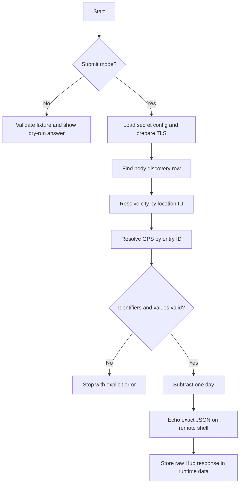

# L23 Shell Access

## Table Of Contents

- [Purpose](#purpose)
- [AI-Assisted Exploration And Human Approval](#ai-assisted-exploration-and-human-approval)
- [Workflow](#workflow)
- [Mermaid Logic Flow](#mermaid-logic-flow)
- [LLM Usage And Reviews](#llm-usage-and-reviews)
- [Configuration](#configuration)
- [Run](#run)
- [Main Modules](#main-modules)
- [Verification](#verification)
- [Submission Status](#submission-status)
- [What This Task Should Teach](#what-this-task-should-teach)

## Purpose

This completed app solves the `shellaccess` exercise. The Hub accepted the live
submission and returned a course flag. The app uses the Hub as a guarded remote
shell, finds when Rafał's body was discovered, resolves the related city and GPS
record, moves the date back by one day, and submits exactly the required JSON.

The runtime is deterministic. It uses narrow Linux commands and validates every
join locally instead of asking an LLM to interpret the files.

## AI-Assisted Exploration And Human Approval

Before implementation, AI was used for a small read-only exploration of the
remote `/data` directory. That exploration established the file schemas, BusyBox
limitations, the Hub output-size limit, and the relationship between timeline,
location, and GPS identifiers.

The AI-produced findings and proposed deterministic design were reviewed and
approved by a human before application code was written. AI assisted discovery
and design, but it is not part of the runtime workflow.

## Workflow

1. Load the Hub API key and verification endpoint from `.env` only in submit mode.
2. Apply the repository TLS CA configuration before the first external call.
3. Find the unique timeline row describing the body being found.
4. Parse its date, `location` identifier, and `place` identifier.
5. Resolve the city through `locations.json` using `jq -r`.
6. Resolve coordinates through `gps.json` using `jq -r` and tab-separated text.
7. Verify that timeline and GPS identifiers agree.
8. Subtract one calendar day and build the exact four-field JSON answer.
9. Execute one final `echo` command and store the full Hub response only under
   `data/L23_shellaccess/output/`.

## Mermaid Logic Flow



## LLM Usage And Reviews

| Area | Status | Evidence |
| --- | --- | --- |
| LLM usage | No | Runtime parsing, joins, date arithmetic, and validation are deterministic. |
| Design review | N/A | AI-assisted exploration happened before implementation and was human-approved; no model call exists in the app. |
| Optimization review | N/A | There is no LLM workflow to optimize. |

## Configuration

| Name | Purpose |
| --- | --- |
| `AI_DEVS_API_KEY` | Secret API key used only in live Hub requests. |
| `HUB_VERIFY_URL` | Hub verification endpoint loaded from `.env`. |

Timeouts and the maximum request count are regular constants in `config.py`.
The application never writes secret values to reports.

## Run

Local dry-run:

```powershell
.\venv\Scripts\python.exe -m src.apps.L23_shellaccess.main
```

Live exploration and submission:

```powershell
.\venv\Scripts\python.exe -m src.apps.L23_shellaccess.main --submit
```

## Main Modules

| Module | Responsibility |
| --- | --- |
| `config.py` | Loads paths, secret Hub settings, stable guards, and TLS configuration. |
| `solver.py` | Parses remote text, validates joins, calculates the date, and builds the shell command. |
| `verify_client.py` | Executes guarded Hub requests and detects a returned flag. |
| `main.py` | Coordinates dry-run or live mode and writes runtime reports. |

## Verification

Run unit tests:

```powershell
.\venv\Scripts\python.exe -m unittest discover -s tests\L23_shellaccess -v
```

The local unit tests and dry-run passed. A live `--submit` run was also completed:
the Hub accepted the answer, `flag_found` was `true`, and the workflow used four
requests. The raw response is stored only under `data/L23_shellaccess/output/`.

## Submission Status

| Item | Status |
| --- | --- |
| Overall task status | Solved |
| AI-assisted preliminary exploration | Completed and human-approved |
| Deterministic design | Human-approved |
| Unit tests | Passed |
| Hub submission | Accepted; `flag_found: true` |
| Live request count | 4 of the configured maximum 6 |
| Raw Hub response | Stored only under `data/L23_shellaccess/output/` |

## What This Task Should Teach

Remote shell access is an API contract, not an invitation to spray arbitrary
commands at a server. Keep commands narrow, bound request and output sizes,
validate identifiers between files, and use an LLM for discovery only when plain
code is the more reliable runtime solution.
