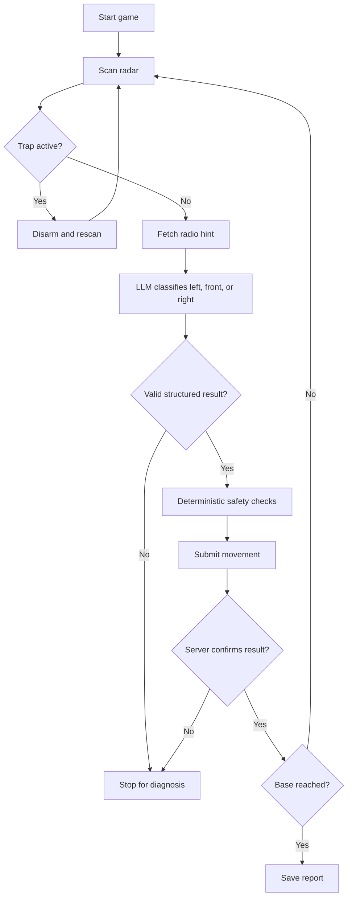

# L24 Going There

LLM-assisted solution for the AI_devs `goingthere` task. A language model
interprets radio hints, while ordinary Python owns movement safety, retry, and
state changes.

## Table Of Contents

- [Purpose](#purpose)
- [Workflow](#workflow)
- [Mermaid Logic Flow](#mermaid-logic-flow)
- [LLM Usage And Reviews](#llm-usage-and-reviews)
- [Configuration](#configuration)
- [Run](#run)
- [Main Modules](#main-modules)
- [Verification](#verification)
- [What This Task Should Teach](#what-this-task-should-teach)

## Purpose

The rocket must cross a 3-by-12 grid, disarm radar traps, interpret indirect
radio warnings, avoid rocks, and reach the target base.

The important design boundary is simple:

- OpenAI classifies one raw hint as `left`, `front`, or `right`;
- deterministic code validates both stages of movement and selects a command;
- the workflow stops instead of guessing when an API or model result is
  unclear.

## Workflow

1. Start a game and store the server-confirmed position, base row, and current
   rock.
2. Scan and, when necessary, disarm the radar trap.
3. Fetch one radio hint and classify its dangerous direction.
4. Reject moves that leave the grid, cross the current rock, or enter the next
   rock.
5. Choose a safe command that keeps the base reachable.
6. Update local state only after the server confirms the movement.
7. Stop on an unexplained result rather than restarting or brute-forcing.

## Mermaid Logic Flow



## LLM Usage And Reviews

| Area | Status | Evidence |
| --- | --- | --- |
| LLM usage | Yes | One model call classifies each radio hint into a strict three-value enum. |
| Design review | Passed | `_agent/instructions/llm_design_checklist.md`; scope: radio classification boundary; mode: non-production; 2026-07-16. |
| Optimization review | Passed | `_agent/instructions/llm_optimization_checklist.md`; scope: complete L24 workflow; mode: non-production; 2026-07-16; no blocking follow-ups. |

The model receives only the current hint. It has no tools, game state, course
credentials, or authority to choose and submit a movement.

## Configuration

| Setting | Purpose |
| --- | --- |
| `AI_DEVS_API_KEY` | Course API authentication. |
| `HUB_VERIFY_URL` | Externally configured verification endpoint. |
| `OPENAI_API_KEY` | Radio-hint classification. |
| `gpt-5.6-luna`, low reasoning | Default semantic classifier. |
| 120 HTTP / 15 model requests | Hard guards for one run. |

Secrets remain in `.env`. Runtime reports are written under
`data/L24_goingthere/`.

## Run

Local dry run:

```powershell
.\venv\Scripts\python.exe -m src.apps.L24_goingthere.main
```

OpenAI-only classifier check:

```powershell
.\venv\Scripts\python.exe -m src.apps.L24_goingthere.main --check-classifier
```

Guarded course run:

```powershell
.\venv\Scripts\python.exe -m src.apps.L24_goingthere.main --submit
```

Before a real OpenAI call, configure `REQUESTS_CA_BUNDLE` and `SSL_CERT_FILE`
as described in the repository `TROUBLESHOOTING.md`.

## Main Modules

| Module | Responsibility |
| --- | --- |
| `api_client.py` | Guarded course HTTP calls, retry, audit, and move reconciliation. |
| `parsing.py` | Damaged scanner recovery and deterministic response validation. |
| `llm_gateway.py` | Prompt, structured output, validation, and model-call guard. |
| `planner.py` | Two-stage collision checks and command selection. |
| `workflow.py` | Coordinates one game without restarts or brute force. |
| `evaluation.py` | Synthetic cases for the OpenAI-only semantic check. |
| `main.py` | Dry-run, classifier-check, and live entrypoints. |

## Verification

| Check | Result |
| --- | --- |
| Offline tests | 17 passed |
| Novel semantic cases | 9/9 passed |
| Guarded live run | Hub accepted |
| Accepted movements | 11 |
| Model classifications | 11 |
| Unexpected crashes | 0 |
| Flag stored publicly | No; only `flag_found: true` is documented |

Ignored diagnostic artifacts:

- `data/L24_goingthere/output/classifier_eval_20260716T165421Z.json`;
- `data/L24_goingthere/output/run_report_20260716T165741Z.json`;
- `data/L24_goingthere/logs/exchanges_20260716T165741Z.json`.

Offline verification:

```powershell
.\venv\Scripts\python.exe -m unittest discover -s tests\L24_goingthere -v
```

## What This Task Should Teach

- Fast AI implementation is useful, but its assumptions still require active
  human review.
- When complexity grows faster than the problem warrants, stop execution and
  recheck the domain model.
- Repository structure, approval boundaries, and reporting are part of
  correctness, not administrative trivia.
- Stable safety rules belong in deterministic code; an LLM is valuable at the
  narrow language boundary.
- A strong human-AI workflow includes challenge, correction, and independent
  verification—not merely task delegation.
