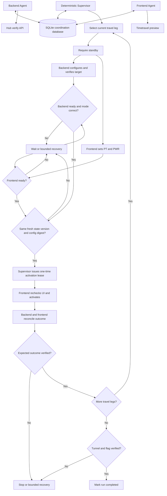

# L25 Timetravel

Autonomous solution for the AI_devs `timetravel` task. Two separate AI agents
operate the Hub API and the browser preview, while ordinary Python owns
workflow state, safety rules, calculations, and permission to activate the
time machine.

The application completed API and UI discovery, offline simulation, bounded
model evaluation, and one guarded live run on July 18, 2026. The live workflow
finished all three travel legs with exactly one activation per leg and the Hub
accepted the result (`flag_found: true`).

## Table Of Contents

- [Purpose](#purpose)
- [Current Status](#current-status)
- [Architecture](#architecture)
- [Agent Responsibilities](#agent-responsibilities)
- [Workflow](#workflow)
- [Mermaid Logic Flow](#mermaid-logic-flow)
- [Travel Plan](#travel-plan)
- [API Exploration Results](#api-exploration-results)
- [UI Exploration Results](#ui-exploration-results)
- [Deterministic Safety Boundary](#deterministic-safety-boundary)
- [SQLite Coordination](#sqlite-coordination)
- [Browser Automation](#browser-automation)
- [LLM Usage And Reviews](#llm-usage-and-reviews)
- [Configuration](#configuration)
- [Runtime Data](#runtime-data)
- [Run](#run)
- [Main Modules](#main-modules)
- [Verification](#verification)
- [Limitations And Follow-Ups](#limitations-and-follow-ups)
- [Completion Record](#completion-record)
- [What This Task Should Teach](#what-this-task-should-teach)

## Purpose

The task requires three consequential operations on one shared time machine:

1. Jump to November 5, 2238 and receive replacement batteries.
2. Return to the present date.
3. Open a tunnel to November 12, 2024.

The Hub API can configure only `day`, `month`, `year`, `syncRatio`, and
`stabilization`. The browser preview owns `PT-A`, `PT-B`, `PWR`, the
`standby`/`active` switch, and the activation sphere. Successful automation
therefore requires coordinated control of both surfaces.

The goal is to complete the entire task without operator involvement after
the required credentials and runtime dependencies have been prepared.

The machine documentation at
`data/L25_timetravel/input/timetravel.md` is the domain source of truth.

## Current Status

| Area | Status | Notes |
| --- | --- | --- |
| Architecture | Implemented | Two narrow AI agents plus one deterministic supervisor in a single CLI process. |
| App README | Current | Documents discovery, implementation, verification, and the completed live run. |
| Python source | Complete for the course task | Dry-run, simulation, model check, and explicit live submission modes are available. |
| Hub API exploration | Complete for safe scope | Help, configuration, validation, stabilization, and mode rotation were inspected without activation or reset. |
| Preview UI exploration | Complete for non-activating scope | Authentication, DOM selectors, control persistence, readiness signals, and safe restoration were verified without travel or reset. |
| Offline verification | Passed | The fake machine completed three legs, three activations, and terminal phase `COMPLETED` without network access. |
| Model boundary evaluation | Passed | Four bounded schema cases passed: two stabilization hints and two frontend decisions. |
| Guarded live run | Solved | Run `20260718T113838Z` completed three activations, used 34 Hub requests, and persisted `flag_found: true`. |
| Browser engine | Verified live | Headless Microsoft Edge authenticated, controlled the preview, and captured final evidence. |

The final application operates the preview through standalone Python
Playwright. The in-app Codex browser is not part of the runtime contract.

## Architecture

The application uses a hybrid multi-agent architecture:

- the **Backend Agent** controls the Hub API;
- the **Frontend Agent** controls the browser preview;
- a deterministic **Supervisor** owns the workflow state machine and safety
  checks;
- SQLite is the durable coordination blackboard shared by all three roles.

The implementation uses one CLI process containing two independent agent
boundaries and one supervisor. The agents remain separate
because they have different prompts, histories, permissions, and tool sets.
Separate operating-system processes are unnecessary for this local workflow and
would add avoidable browser lifecycle and OneDrive file-locking complexity.

Agents do not send free-form messages directly to one another. The Supervisor
calls their bounded methods sequentially and persists authoritative phases,
observations, events, and activation leases in SQLite. The current live path
does not use the queued-command and resume helpers already present in the
coordination store. The Supervisor remains the only authority allowed to
advance the workflow or authorize activation.

Live API discovery confirmed that `getConfig` also reports browser-owned
values such as `PTA`, `PTB`, `PWR`, and `mode`. The Backend Agent can therefore
independently observe the frontend result even though it cannot change those
controls. This gives the activation barrier a useful cross-check between the
two agents.

## Agent Responsibilities

### Backend Agent

The Backend Agent may use only typed Hub API tools:

- request API help;
- read the current configuration;
- configure `day`, `month`, `year`, `syncRatio`, and `stabilization`;
- publish validated API observations.

It is responsible for:

- confirming that the machine is in `standby` before configuration writes;
- configuring the full target date;
- obtaining the stabilization hint after the date is complete;
- interpreting the hint into a strict structured value;
- submitting the validated stabilization value;
- verifying the final backend configuration;
- polling for the required `internalMode`;
- reconciling backend state after every activation.

It cannot operate the browser, activate the machine, or execute `reset`
without a supervisor decision.

### Frontend Agent

The Frontend Agent may use only narrow browser tools scoped to the approved
preview and authentication hosts:

- inspect the machine state;
- switch between `standby` and `active`;
- set `PT-A` and `PT-B`;
- set `PWR`;
- inspect readiness indicators;
- activate the machine with a valid one-time lease;
- capture bounded diagnostic evidence.

It is responsible for:

- requesting a deterministic login helper to open a fresh authenticated
  browser context before the agent receives page-control tools;
- applying the manual controls for the current travel leg;
- verifying each control after changing it;
- observing `Flux Density`, device condition, battery state, and activation
  readiness when those values are present in the UI;
- clicking the activation sphere only after supervisor authorization;
- detecting visible travel, battery replacement, tunnel, failure, and flag
  outcomes.

It cannot call the Hub API, navigate outside the approved Hub and Easytools
authentication hosts, execute arbitrary page JavaScript, receive credential
values in model context, or bypass an expired activation lease. A
deterministic helper reads `EASYTOOLS_EMAIL` and `EASYTOOLS_PASSWORD` from
`.env`, selects Easytools password mode, fills the form, and discards the
browser context at shutdown.

### Deterministic Supervisor

The Supervisor is ordinary Python, not a third AI agent. It owns:

- legal workflow transitions;
- target construction and date freezing;
- temporal ratio calculation;
- `PWR` and `internalMode` requirements;
- command creation and expiration;
- state versions and stale-observation rejection;
- activation readiness and one-time leases;
- retry, request, tool-call, and time limits;
- crash recovery and state reconciliation;
- terminal success and failure decisions.

The Supervisor may use model output only after schema and value validation. A
model statement such as `the machine is ready` never changes workflow state by
itself.

## Workflow

1. Start one run and freeze the server-authoritative `currentDate` returned by
   `getConfig`. Use the `Europe/Warsaw` local date only if that field is missing
   or invalid.
2. Load and validate the machine rules required for the three travel target
   years.
3. Request API help and inspect the current backend configuration.
4. Inspect the preview without changing consequential state and reconcile both
   surfaces with the stored run state.
5. Prepare the 2238 jump in `standby`:
   - configure the date through the backend;
   - derive and configure `syncRatio`;
   - obtain `needConfig`, extract its arithmetic instruction, calculate the
     result deterministically, and configure stabilization;
   - set `PT-A = off`, `PT-B = on`, and the required `PWR` in the browser.
6. Switch to `active`, wait for `internalMode = 3`, and require fresh backend
   and frontend readiness observations.
7. Issue a short-lived activation lease, activate once, and verify both the
   arrival and battery replacement.
8. Prepare the return to the frozen present date with `PT-A = on` and
   `PT-B = off`.
9. Wait for the present-date configuration and `internalMode = 2`, activate
   once, and verify the return.
10. Confirm that the replacement batteries still satisfy the tunnel minimum
    of 60 percent.
11. Prepare November 12, 2024 with both `PT-A` and `PT-B` enabled.
12. Wait for full readiness, open the tunnel once, and capture the final Hub or
    UI outcome.
13. Mark the run `completed` only after the tunnel outcome is verified and the
    course flag is found.

Runtime workflow phases:

```text
BOOTSTRAP
PREPARE_2238
WAIT_MODE_3
JUMP_2238
VERIFY_BATTERY_REPLACEMENT
PREPARE_RETURN
WAIT_MODE_2_RETURN
JUMP_TO_PRESENT
VERIFY_PRESENT
PREPARE_2024_TUNNEL
WAIT_MODE_2_TUNNEL
OPEN_TUNNEL
VERIFY_FLAG
COMPLETED | FAILED | BLOCKED
```

## Mermaid Logic Flow



## Travel Plan

The temporal ratio is deterministic:

```text
weighted = day * 8 + month * 12 + year * 7
syncRatio = (weighted modulo 101) / 100
```

For a run started on July 18, 2026, the expected plan is:

| Leg | Target | PT-A | PT-B | PWR | Required mode | Sync ratio | Stabilization | Expected result |
| --- | --- | --- | --- | ---: | ---: | ---: | ---: | --- |
| Battery jump | 2238-11-05 | Off | On | 91 | 3 | 0.82 | 189 | Arrive in 2238 and receive replacement batteries. |
| Return | 2026-07-18 | On | Off | 28 | 2 | 0.68 | Dynamic | Return to the frozen present date. |
| Tunnel | 2024-11-12 | On | On | 19 | 2 | 0.54 | Dynamic | Open the tunnel and obtain the final result. |

The return row is an example for the date observed during design. Production
logic must calculate the return target, `PWR`, mode, and ratio from the present
date frozen at run start. It must not hardcode July 18, 2026.

The observed stabilization hint for November 5, 2238 described the operation
`900 - 711` in Polish natural language, producing the validated value `189`.
Other stabilization values must still be obtained dynamically after their
complete target dates have been configured.

## API Exploration Results

The safe live exploration used 25 guarded Hub requests. It configured the
backend for the first travel target but did not use `reset`, activate the
machine, change browser controls, consume battery, or attempt a tunnel.

### Response Contract

| Operation | HTTP status | Domain code | Observed result |
| --- | ---: | ---: | --- |
| `help` | 200 | 14 | Returns actions, configurable fields, ranges, and the preview location. |
| `getConfig` | 200 | 12 | Returns the complete current machine snapshot. |
| valid `configure` | 200 | 11 | Applies one field and returns the updated snapshot. |
| unsupported parameter | 400 | -950 | Rejects fields outside the five API-editable parameters. |
| day outside `1-31` | 400 | -920 | Rejects the value without changing the previous valid state. |
| ratio inconsistent with the formula | 400 | -780 | Rejects the value without changing the previous valid state. |

The API accepts only:

- `day`: `1-31`;
- `month`: `1-12`;
- `year`: `1500-2499`;
- `syncRatio`: `0-1`, at most two decimal places, matching the documented
  formula;
- `stabilization`: `0-1000`.

`getConfig` returned these fields during discovery:

```text
currentDate, day, month, year, syncRatio, stabilization,
condition, fluxDensity, batteryStatus, PTA, PTB, PWR,
mode, internalMode
```

After a complete date is set, both the final `configure` response and later
`getConfig` responses include `needConfig` until the correct stabilization is
submitted. The observed hint is semantic input, not a ready numeric value.
The model may extract the operands and operation, but ordinary Python must
calculate the result and enforce the `0-1000` range.

### Flux And Internal Mode

For the correctly configured 2238 backend target, discovery observed:

| State | Flux Density | Condition |
| --- | ---: | --- |
| Complete date only | 0% | `unstable` |
| Correct `syncRatio` | 20% | `unstable` |
| Correct stabilization, wrong internal mode | 40% | `stable` |
| Correct stabilization and `internalMode = 3` | 60% | `stable` |

`condition = stable` is therefore necessary but not sufficient for activation.
The supervisor must validate Flux Density and `internalMode` separately.

Twelve timed `getConfig` samples observed the sequence `1 → 2 → 3 → 4`, with
approximately five seconds per mode. A fixed sleep would remain brittle. The
runtime should poll for a fresh matching snapshot and bind it to a short-lived
activation lease.

The complete sanitized exploration summary is stored at
`data/L25_timetravel/output/api_exploration/summary.json`.

## UI Exploration Results

Live UI exploration authenticated successfully and exercised the manual
controls in headless Edge. The test changed only reversible browser-owned
state. It did not click the activation sphere, send a `timeTravel` request,
use `reset`, consume battery, or change the configured target date.

### Authentication Contract

The preview does not accept a fresh unauthenticated browser directly. The
observed login sequence is:

1. Open the approved `TIMETRAVEL_PREVIEW_URL`.
2. Follow the protected-page redirect to `cart.easy.tools/brave/login`.
3. Open the Easytools login link, which continues on `id.easy.tools`.
4. Explicitly select **Hasło**. The default mode is a magic link, even though
   a password field exists in the DOM.
5. Fill the email and password from `.env` and submit.
6. Require the final location to be the approved Hub preview path.

The browser runtime must allow only these main-frame hosts during login:

```text
hub.ag3nts.org
cart.easy.tools
id.easy.tools
```

Every run should use a fresh browser context. Playwright storage state must
not be persisted because it contains reusable authentication material. The
login helper owns credentials; neither the Frontend Agent nor the model sees
their values. Captured artifacts contain cookie names and storage keys only,
never cookie values.

### Stable DOM Contract

Normal operation can use deterministic DOM state. Visual interpretation is
not needed unless the page contract changes.

| Machine value | Selector | Read or write contract |
| --- | --- | --- |
| `PT-A` | `#portA` | Read `aria-checked`; click to toggle. |
| `PT-B` | `#portB` | Read `aria-checked`; click to toggle. |
| `standby` / `active` | `#mainSwitch` | Read `aria-checked`; click to toggle; confirm text through `#switchLabel`. |
| `PWR` | `#pwrSlider` | Read the range value; set it through a normal range interaction; confirm through `#pwrVal`. |
| Target date | `.field-day`, `.field-month`, `.field-year` | Read the three displayed input values. |
| Current location | `#currentDateVal` | Read the server-provided date text. |
| Flux Density | `#fluxPct` | Parse the displayed percentage. |
| Sync Ratio | `#syncPct` | Parse the displayed percentage. |
| Device condition | `#condLabel` | Read text and the `stable` or `unstable` class. |
| `internalMode` | `.imode-dot.lit` | Read the active dot's `data-m` value. |
| Battery | `#batteryIndicator` | Read `level-N` or `dead` and count `.battery-cell.charged`. |
| Activation sphere | `#orb` | Ready only when `powered` is present and `danger` is absent. |
| Same-date warning | `#sameDateMsg` | Inspect the `visible` class. |
| Transient error | `#deviceToast` | Inspect the `visible` class and text. |
| Final flag | `#flagOverlay`, `#flagText` | Require a visible overlay and non-empty flag text. |

The preview polls `/timetravel_backend` every two seconds in a visible tab and
every eight seconds in a hidden tab. Manual control changes use `POST
/timetravel_backend`; activation alone uses `POST /verify` with the
`timeTravel` action. Recently changed controls remain locally protected from
poll overwrites for four seconds, so the Frontend Agent must verify both the
immediate DOM update and the server-persisted value after a later poll or
reload.

### Reversible Live Test

The safe live test started with the backend already configured for November
5, 2238 and the browser controls restored to `PT-A = off`, `PT-B = off`,
`PWR = 0`, and `standby`.

The test then observed:

| State | PT-A | PT-B | PWR | Mode | Internal mode | Flux | Sphere |
| --- | --- | --- | ---: | --- | ---: | ---: | --- |
| Initial safe state | Off | Off | 0 | Standby | 2 | 40% | `danger`, not powered |
| Prepared battery jump | Off | On | 91 | Standby | 3 | 100% | Not dangerous, not powered |
| Activation-ready observation | Off | On | 91 | Active | 3 | 100% | `powered`, not `danger` |
| Restored state | Off | Off | 0 | Standby | 4 | 40% | `danger`, not powered |

`PT-B = on` and `PWR = 91` persisted after a full preview reload. The active
state produced the expected ready sphere, but the sphere was deliberately not
clicked. Network evidence contained no `POST /verify`. The final safe state
also survived a reload.

The page contract shows how consequential outcomes will appear without
requiring a discovery activation:

- successful travel returns domain code `13`, applies the returned config,
  and clears the target-date inputs;
- the current location is rendered through `#currentDateVal`;
- battery replacement is reflected by `#batteryIndicator`;
- errors appear in `#deviceToast`;
- a final flag is rendered in `#flagOverlay` and `#flagText`.

The guarded end-to-end run later confirmed this contract for arrival, battery
replacement, return, tunnel completion, and flag delivery. All three
activations returned domain code `13`. A timeout after a sphere click remains
ambiguous and must never trigger a blind second click.

The sanitized discovery summary is stored at
`data/L25_timetravel/output/ui_exploration/summary.json`.

## Deterministic Safety Boundary

### Activation Barrier

Activation uses a two-sided readiness barrier:

1. The Backend Agent publishes a fresh snapshot confirming the complete date,
   `syncRatio`, stabilization, and required `internalMode`.
2. The Frontend Agent publishes a fresh snapshot confirming `PT-A`, `PT-B`,
   `PWR`, `active`, `Flux Density = 100%`, excellent device condition, and a
   ready activation sphere when the UI exposes those signals.
3. The Supervisor verifies that both snapshots belong to the current state
   version and expected configuration digest.
4. The Supervisor creates a short-lived, one-time activation lease.
5. The Frontend Agent rechecks visible readiness and consumes the lease while
   activating.
6. An expired or already consumed lease cannot be reused.

Discovery observed roughly five seconds per `internalMode` and a two-second
foreground UI poll. Runtime constants therefore limit snapshot age to 1.25
seconds and the one-time activation lease to 1.5 seconds. The activation tool
re-reads the DOM immediately before clicking; neither value is model-controlled.

### Non-Idempotent Activation

Activation must never be retried blindly. If a click or response times out,
the run is persisted as `BLOCKED`. The current implementation does not issue a
second lease automatically, even if later inspection suggests that travel did
not occur.

### Reset Policy

`reset` is a recovery operation, not a generic retry. It must not be performed
automatically after replacement batteries have been obtained because discovery
has not yet established whether reset would erase that progress. The
Supervisor may authorize reset only from an explicitly reviewed recovery
state.

### Completion Guard

A run may finish successfully only when:

- all three legs have verified outcomes;
- replacement batteries were confirmed before the return leg;
- the battery level met the tunnel requirement before final activation;
- the final tunnel outcome was observed;
- a course flag was found in the final Hub or UI result;
- the terminal state and evidence were persisted.

## SQLite Coordination

SQLite is the durable shared resource for commands, observations, and workflow
state. It requires no additional package because Python provides the `sqlite3`
module.

Agents do not receive raw SQL access. Each role uses a narrow repository
adapter that exposes only its permitted operations.

### Tables

| Table | Writer | Purpose |
| --- | --- | --- |
| `runs` | Supervisor | Current phase, status, state version, frozen date, active leg, and last error. |
| `commands` | Supervisor; assigned agent may claim and finish | Versioned and expiring commands addressed to one agent. |
| `observations` | Backend or Frontend Agent | Immutable API or UI facts with timestamps and evidence references. |
| `activation_leases` | Supervisor; Frontend Agent may consume | One-time authorization bound to a state version and configuration digest. |
| `events` | All roles through validated adapters | Append-only audit events without secrets. |
| `agent_status` | Owning agent | Heartbeat, current command, status, and consecutive failure count. |

### Concurrency And Stale-State Controls

- Every state transition increments `state_version`.
- Every command declares the version for which it is valid.
- Every observation carries its source, capture time, version, and travel leg.
- Commands use unique idempotency keys.
- Command claiming is atomic and restricted to the target role.
- Short transactions serialize the small number of writes.
- Foreign keys are enabled for every connection.
- A database busy timeout prevents immediate failure on a brief lock.
- The first version uses one process and serialized database access rather than
  multiple writers in separate processes.

The repository is stored in a OneDrive-synchronized path. The implementation
therefore avoids a long-lived multi-process WAL design. If later testing
proves that separate worker processes are valuable, the live database location
and synchronization strategy must be reviewed before changing this boundary.

## Browser Automation

The runtime uses synchronous Playwright with installed Microsoft Edge through
`channel="msedge"` in headless mode. Each run creates a fresh browser context,
allows only the Hub and Easytools authentication hosts, and closes the context
without exporting cookies or storage state.

The login helper keeps credentials outside model context. It identifies the
protected-page login link by parsed host, path, and the presence of the
`redirect` query parameter instead of assuming a fixed query-string order.
After password login, normal operation uses deterministic DOM and accessibility
state. Every control mutation is checked immediately and after the preview's
server poll. Screenshots are bounded runtime evidence, not the normal decision
surface.

## LLM Usage And Reviews

| Area | Status | Evidence |
| --- | --- | --- |
| LLM usage | Yes | The Backend Agent extracts arithmetic structure from variable stabilization hints; the Frontend Agent proposes one bounded UI action from typed state. |
| Design review | Passed | `_agent/instructions/llm_design_checklist.md`; 2026-07-18; scope: full dual-agent L25 workflow; mode: non-production; result: PASS; boundary: implement the documented workflow only. |
| Optimization review | Passed | `_agent/instructions/llm_optimization_checklist.md`; 2026-07-18; scope: completed L25 workbench and live workflow; mode: non-production; result: PASS with accepted workbench limitation; follow-up before production: replace routine frontend action selection with deterministic code to reduce model calls. |

Approved model boundary:

| Agent step | Model purpose | Structured output | Tool boundary |
| --- | --- | --- | --- |
| Backend stabilization step | Extract operands and an operator from variable natural-language hints. | `StabilizationExpression`. | No Hub or browser tool is exposed to the model call. |
| Frontend preparation step | Select the next permitted browser action from the current typed observation. | `FrontendDecision`. | Model output is validated before deterministic browser methods run. |

Both agents use `gpt-5.6-luna` through the OpenAI Responses API with low
reasoning effort, `store=False`, strict Pydantic outputs, small output limits,
and separate model-request and tool-step guards. Each call receives only the
current typed command, compact current observation, relevant last error, and
the tools permitted for that command. Full chat history, raw SQLite rows,
credentials, and unrelated discovery artifacts are excluded.

Model responsibilities:

- extract structured operands and operations from the natural-language
  stabilization hint;
- select one permitted preparation action for the current frontend state.

Deterministic Python remains responsible for:

- stabilization arithmetic and date validation;
- PWR and mode lookup;
- phase transitions;
- permissions and tool exposure;
- schema and value validation;
- retry, request, step, and time guards;
- activation leases;
- terminal success decisions.

Each model output consumed by code must use a strict Pydantic schema. Schema
shape alone is insufficient: values must also be checked against the current
phase, permissions, expected target, and machine rules.

The model may propose readiness but cannot authorize activation. The
Supervisor issues the lease, and the guarded browser method consumes it and
rechecks the DOM immediately before the single click. An ambiguous activation
blocks the run instead of invoking the model or retrying automatically.

## Configuration

The observed configuration boundary is:

| Setting | Purpose | Secret |
| --- | --- | --- |
| `AI_DEVS_API_KEY` | Authenticate Hub requests. | Yes |
| `EASYTOOLS_EMAIL` | Authenticate the fresh preview browser context. | Yes |
| `EASYTOOLS_PASSWORD` | Authenticate the fresh preview browser context in password mode. | Yes |
| `OPENAI_API_KEY` | Run the two OpenAI agent loops. | Yes |
| `HUB_VERIFY_URL` | Approved Hub API endpoint supplied at runtime. | Operational value |
| `TIMETRAVEL_PREVIEW_URL` or `HUB_BASE_URL` | Build the approved browser preview URL. | Operational value |
| OpenAI model name | App-level model selection in `config.py`. | No |
| Request, tool, retry, and timing limits | App-level safety limits in `config.py`. | No |

Secrets must remain in `.env`. They must not appear in SQLite, logs,
screenshots, README, DEV_NOTES, source code, or command output.

Before any real OpenAI or Hub request, the application applies the repository
TLS/CA setup documented in `TROUBLESHOOTING.md`.

## Runtime Data

Repository-root-relative paths:

| Path | Purpose |
| --- | --- |
| `data/L25_timetravel/input/timetravel.md` | Authoritative machine documentation. |
| `data/L25_timetravel/output/api_exploration/summary.json` | Sanitized API contract and discovery conclusions. |
| `data/L25_timetravel/output/api_exploration/*.json` | Full masked request and Hub response evidence from guarded discovery. |
| `data/L25_timetravel/output/ui_exploration/summary.json` | Sanitized authentication, selector, readiness, and control-persistence contract. |
| `data/L25_timetravel/output/ui_exploration/{timestamp}/` | Bounded DOM, accessibility, network-metadata, and screenshot evidence from guarded UI discovery. |
| `data/L25_timetravel/runs/{run_id}/coordination.sqlite3` | Durable workflow and agent coordination state. |
| `data/L25_timetravel/runs/{run_id}/screenshots/` | One bounded screenshot after each confirmed activation. |
| `data/L25_timetravel/runs/{run_id}/responses/` | Raw course responses for confirmed activations. |
| `data/L25_timetravel/runs/{run_id}/run_report.json` | Secret-safe run result, Hub exchange metadata, and model usage metadata. |
| `data/L25_timetravel/logs/` | Masked request metadata and validated event logs when separated from the run database. |

Full course responses and flags may be stored only under
`data/L25_timetravel/`. Documentation and source files may record only a
non-sensitive result such as `flag_found: true` or `Hub accepted`.

## Run

Use the project virtual environment. Default mode is a network-free readiness
check:

```powershell
.\venv\Scripts\python.exe -m src.apps.L25_timetravel.main
```

Run the complete fake machine without network access:

```powershell
.\venv\Scripts\python.exe -m src.apps.L25_timetravel.main --simulate
```

Run four bounded schema checks against OpenAI without Hub or browser access:

```powershell
.\venv\Scripts\python.exe -m src.apps.L25_timetravel.main --check-models
```

Run the consequential live workflow only after explicit approval:

```powershell
.\venv\Scripts\python.exe -m src.apps.L25_timetravel.main --submit
```

`--submit` opens an authenticated headless Edge context, calls OpenAI and the
Hub, mutates shared machine state, and may perform exactly three guarded
activations. It creates a new run directory before external work begins.

## Main Modules

Development history and review evidence are stored in
`src/apps/L25_timetravel/docs/L25_timetravel_DEV_NOTES.md`.

| Module | Responsibility |
| --- | --- |
| `config.py` | Environment loading, normal settings, paths, limits, and TLS setup. |
| `models.py` | Strict commands, observations, machine snapshots, phases, and terminal results. |
| `machine_spec.py` | Deterministic machine rules, documentation-derived lookup data, and temporal ratio calculation. |
| `coordination.py` | SQLite schema, role-scoped repositories, transactions, versions, and leases. |
| `hub_client.py` | Guarded and masked `timetravel` Hub requests. |
| `llm_gateway.py` | Two independently guarded OpenAI boundaries with strict structured outputs. |
| `backend_agent.py` | Backend configuration and stabilization-hint interpretation. |
| `browser_tools.py` | Deterministic Playwright operations and UI validation. |
| `frontend_agent.py` | Bounded model-guided frontend preparation. |
| `supervisor.py` | Workflow state machine, readiness barrier, reconciliation, and completion guard. |
| `offline_simulation.py` | Complete network-free fake machine and three-leg workflow. |
| `evaluation.py` | Four bounded real-model schema checks. |
| `main.py` | CLI startup, dependency checks, agent lifecycle, and shutdown. |

## Verification

| Check | Result | Evidence |
| --- | --- | --- |
| Default dry-run | Passed | Network disabled; machine table loaded for 1,000 supported years. |
| Offline simulation | Passed | Three legs, three fake activations, `flag_found: true`, and phase `COMPLETED`. |
| Bounded model evaluation | Passed | Two arithmetic extractions and two frontend decisions passed in `model_evaluation_20260718T111453Z.json`. |
| Guarded live run | Solved | Run `20260718T113838Z`; three confirmed activations, 34 Hub requests, and `flag_found: true`. |
| Final response and UI evidence | Passed | The third response returned domain code `13`; the final screenshot displayed a non-empty flag overlay. |
| Post-run leak check | Passed | No exact secret or selected short secret-derived marker appeared in the changed source file. |

The live report and raw course evidence are intentionally kept under
`data/L25_timetravel/runs/20260718T113838Z/`. The raw flag is not duplicated in
this documentation.

## Limitations And Follow-Ups

- The SQLite schema contains command-queue and heartbeat helpers, but the live
  CLI executes sequentially and does not expose `--resume`.
- There is no dedicated `tests/L25_timetravel/` suite; the current automated
  proof is the complete offline simulation plus the bounded model evaluation.
- The Frontend Agent used 14 model calls during the solved run. Its routine
  ports/PWR/mode decisions could be deterministic; retaining the model is an
  accepted learning-workbench trade-off, not a production optimization.
- `reset` remains intentionally untested and unavailable to normal agent
  operation because it may destroy useful machine progress.
- A host-side command timeout can hide the final stdout result even after the
  application safely writes its report. Treat `run_report.json` as the source
  of truth after an interrupted console wait.

## Completion Record

| Step | Scope | Status |
| ---: | --- | --- |
| 1 | Design, documentation, and LLM design gate. | Complete |
| 2 | Safe Hub and preview discovery. | Complete |
| 3 | Deterministic domain, SQLite, Hub, browser, and supervisor implementation. | Complete |
| 4 | Two bounded OpenAI agent boundaries and structured validation. | Complete |
| 5 | Offline simulation and real-model evaluation. | Complete |
| 6 | Guarded three-leg live verification. | Solved |
| 7 | Optimization review, documentation update, and leak check. | Complete |

## What This Task Should Teach

- A model can interpret language or propose a narrow action, but ordinary code
  should own arithmetic, permissions, state transitions, and completion.
- Two control surfaces need a shared readiness barrier. A backend snapshot or
  a glowing browser control alone is not enough evidence for activation.
- Non-idempotent actions need one-time authorization and explicit ambiguous
  outcomes. Retrying a click because stdout timed out is how automation becomes
  slapstick.
- Browser selectors should represent semantic contracts. Parsing a login URL
  by host, path, and query keys is more robust than depending on parameter
  order inside one CSS substring.
- Durable runtime evidence matters: the final report proved success even when
  the surrounding command runner timed out before displaying stdout.
