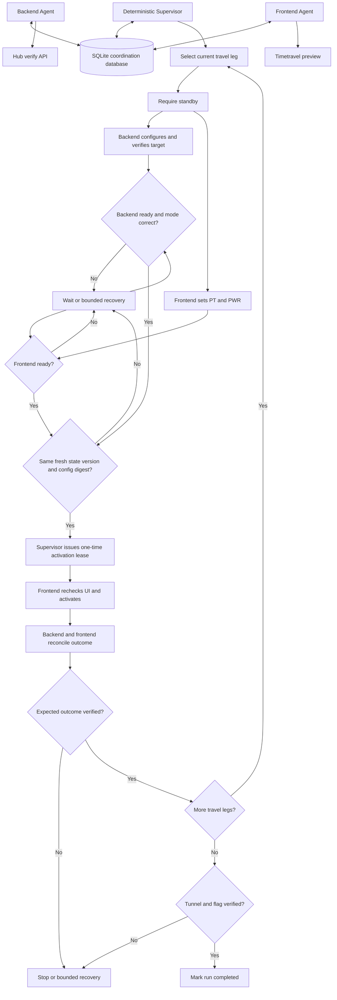

# L25 Timetravel

Planned autonomous solution for the AI_devs `timetravel` task. Two separate
AI agents will operate the Hub API and the browser preview, while ordinary
Python will own workflow state, safety rules, calculations, and permission to
activate the time machine.

The application is currently in the design and discovery stage. It has no
runnable source implementation yet.

## Table Of Contents

- [Purpose](#purpose)
- [Current Status](#current-status)
- [Architecture](#architecture)
- [Agent Responsibilities](#agent-responsibilities)
- [Workflow](#workflow)
- [Mermaid Logic Flow](#mermaid-logic-flow)
- [Travel Plan](#travel-plan)
- [Deterministic Safety Boundary](#deterministic-safety-boundary)
- [SQLite Coordination](#sqlite-coordination)
- [Browser Automation](#browser-automation)
- [LLM Usage And Reviews](#llm-usage-and-reviews)
- [Configuration](#configuration)
- [Runtime Data](#runtime-data)
- [Run](#run)
- [Planned Main Modules](#planned-main-modules)
- [Verification Plan](#verification-plan)
- [Open Questions](#open-questions)
- [Delivery Steps](#delivery-steps)

## Purpose

The task requires three consequential operations on one shared time machine:

1. Jump to November 5, 2238 and receive replacement batteries.
2. Return to the present date.
3. Open a tunnel to November 12, 2024.

The Hub API can configure only `day`, `month`, `year`, `syncRatio`, and
`stabilization`. The browser preview owns `PT-A`, `PT-B`, `PWR`, the
`standby`/`active` switch, and the activation sphere. Successful automation
therefore requires coordinated control of both surfaces.

The goal is to complete the entire task without operator involvement after
the required credentials and runtime dependencies have been prepared.

The machine documentation at
`data/L25_timetravel/input/timetravel.md` is the domain source of truth.

## Current Status

| Area | Status | Notes |
| --- | --- | --- |
| Architecture | Accepted for documentation | Two narrow AI agents plus one deterministic supervisor. |
| App README | Complete | This document records the design before discovery and implementation. |
| Python source | Not started | Source implementation is blocked until the LLM design review passes. |
| Hub API exploration | Pending | No real Hub request has been made for this app. |
| Preview UI exploration | Pending | DOM selectors and success signals are not known yet. |
| SQLite | Available | Python 3.11 includes `sqlite3`; local SQLite version observed as 3.45.1. |
| Browser library | Missing | Playwright is not yet installed in the project virtual environment. |
| Browser engine | Available | Microsoft Edge is installed locally. |

The in-app Codex browser was unavailable during design discovery. This does
not prevent a standalone Python application from controlling a local browser,
but browser compatibility with the preview must be proven by a smoke test.

## Architecture

The application will use a hybrid multi-agent architecture:

- the **Backend Agent** controls the Hub API;
- the **Frontend Agent** controls the browser preview;
- a deterministic **Supervisor** owns the workflow state machine and safety
  checks;
- SQLite is the durable coordination blackboard shared by all three roles.

The recommended first implementation uses one CLI process containing two
independent agent loops and one supervisor task. The agents remain separate
because they have different prompts, histories, permissions, and tool sets.
Separate operating-system processes are unnecessary for the first version and
would add avoidable browser lifecycle and OneDrive file-locking complexity.

Agents do not send free-form messages directly to one another. They exchange
validated commands and observations through SQLite. The supervisor remains
the only authority allowed to advance the workflow or authorize activation.

## Agent Responsibilities

### Backend Agent

The Backend Agent may use only typed Hub API tools:

- request API help;
- read the current configuration;
- configure `day`, `month`, `year`, `syncRatio`, and `stabilization`;
- publish validated API observations.

It is responsible for:

- confirming that the machine is in `standby` before configuration writes;
- configuring the full target date;
- obtaining the stabilization hint after the date is complete;
- interpreting the hint into a strict structured value;
- submitting the validated stabilization value;
- verifying the final backend configuration;
- polling for the required `internalMode`;
- reconciling backend state after every activation.

It cannot operate the browser, activate the machine, or execute `reset`
without a supervisor decision.

### Frontend Agent

The Frontend Agent may use only narrow browser tools scoped to the approved
preview origin:

- inspect the machine state;
- switch between `standby` and `active`;
- set `PT-A` and `PT-B`;
- set `PWR`;
- inspect readiness indicators;
- activate the machine with a valid one-time lease;
- capture bounded diagnostic evidence.

It is responsible for:

- applying the manual controls for the current travel leg;
- verifying each control after changing it;
- observing `Flux Density`, device condition, battery state, and activation
  readiness when those values are present in the UI;
- clicking the activation sphere only after supervisor authorization;
- detecting visible travel, battery replacement, tunnel, failure, and flag
  outcomes.

It cannot call the Hub API, navigate to arbitrary domains, execute arbitrary
page JavaScript, read credentials, or bypass an expired activation lease.

### Deterministic Supervisor

The Supervisor is ordinary Python, not a third AI agent. It owns:

- legal workflow transitions;
- target construction and date freezing;
- temporal ratio calculation;
- `PWR` and `internalMode` requirements;
- command creation and expiration;
- state versions and stale-observation rejection;
- activation readiness and one-time leases;
- retry, request, tool-call, and time limits;
- crash recovery and state reconciliation;
- terminal success and failure decisions.

The Supervisor may use model output only after schema and value validation. A
model statement such as `the machine is ready` never changes workflow state by
itself.

## Workflow

1. Start one run and freeze the present date. Prefer a server-authoritative
   date if API discovery exposes one; otherwise use the `Europe/Warsaw` local
   date captured once at startup.
2. Load and validate the machine rules required for the three planned target
   years.
3. Request API help and inspect the current backend configuration.
4. Inspect the preview without changing consequential state and reconcile both
   surfaces with the stored run state.
5. Prepare the 2238 jump in `standby`:
   - configure the date through the backend;
   - derive and configure `syncRatio`;
   - obtain and configure stabilization;
   - set `PT-A = off`, `PT-B = on`, and the required `PWR` in the browser.
6. Switch to `active`, wait for `internalMode = 3`, and require fresh backend
   and frontend readiness observations.
7. Issue a short-lived activation lease, activate once, and verify both the
   arrival and battery replacement.
8. Prepare the return to the frozen present date with `PT-A = on` and
   `PT-B = off`.
9. Wait for the present-date configuration and `internalMode = 2`, activate
   once, and verify the return.
10. Confirm that the replacement batteries still satisfy the tunnel minimum
    of 60 percent.
11. Prepare November 12, 2024 with both `PT-A` and `PT-B` enabled.
12. Wait for full readiness, open the tunnel once, and capture the final Hub or
    UI outcome.
13. Mark the run `completed` only after the tunnel outcome is verified and the
    course flag is found.

Planned workflow phases:

```text
BOOTSTRAP
PREPARE_2238
WAIT_MODE_3
JUMP_2238
VERIFY_BATTERY_REPLACEMENT
PREPARE_RETURN
WAIT_MODE_2_RETURN
JUMP_TO_PRESENT
VERIFY_PRESENT
PREPARE_2024_TUNNEL
WAIT_MODE_2_TUNNEL
OPEN_TUNNEL
VERIFY_FLAG
COMPLETED | FAILED | BLOCKED
```

## Mermaid Logic Flow



## Travel Plan

The temporal ratio is deterministic:

```text
weighted = day * 8 + month * 12 + year * 7
syncRatio = (weighted modulo 101) / 100
```

For a run started on July 18, 2026, the expected plan is:

| Leg | Target | PT-A | PT-B | PWR | Required mode | Sync ratio | Expected result |
| --- | --- | --- | --- | ---: | ---: | ---: | --- |
| Battery jump | 2238-11-05 | Off | On | 91 | 3 | 0.82 | Arrive in 2238 and receive replacement batteries. |
| Return | 2026-07-18 | On | Off | 28 | 2 | 0.68 | Return to the frozen present date. |
| Tunnel | 2024-11-12 | On | On | 19 | 2 | 0.54 | Open the tunnel and obtain the final result. |

The return row is an example for the date observed during design. Production
logic must calculate the return target, `PWR`, mode, and ratio from the present
date frozen at run start. It must not hardcode July 18, 2026.

Stabilization is intentionally absent from the table. Its value must be
obtained dynamically from the Hub hint after the complete target date has been
configured.

## Deterministic Safety Boundary

### Activation Barrier

Activation uses a two-sided readiness barrier:

1. The Backend Agent publishes a fresh snapshot confirming the complete date,
   `syncRatio`, stabilization, and required `internalMode`.
2. The Frontend Agent publishes a fresh snapshot confirming `PT-A`, `PT-B`,
   `PWR`, `active`, `Flux Density = 100%`, excellent device condition, and a
   ready activation sphere when the UI exposes those signals.
3. The Supervisor verifies that both snapshots belong to the current state
   version and expected configuration digest.
4. The Supervisor creates a short-lived, one-time activation lease.
5. The Frontend Agent rechecks visible readiness and consumes the lease while
   activating.
6. An expired or already consumed lease cannot be reused.

The acceptable snapshot age and lease duration will be chosen after API and UI
discovery reveals the actual `internalMode` rotation timing and browser
latency.

### Non-Idempotent Activation

Activation must never be retried blindly. If a click or response times out,
both agents first inspect the machine to determine whether travel already
occurred. A second click is permitted only after reconciliation proves that the
first activation did not happen.

### Reset Policy

`reset` is a recovery operation, not a generic retry. It must not be performed
automatically after replacement batteries have been obtained because discovery
has not yet established whether reset would erase that progress. The
Supervisor may authorize reset only from an explicitly reviewed recovery
state.

### Completion Guard

A run may finish successfully only when:

- all three legs have verified outcomes;
- replacement batteries were confirmed before the return leg;
- the battery level met the tunnel requirement before final activation;
- the final tunnel outcome was observed;
- a course flag was found in the final Hub or UI result;
- the terminal state and evidence were persisted.

## SQLite Coordination

SQLite is the durable shared resource for commands, observations, and workflow
state. It requires no additional package because Python provides the `sqlite3`
module.

Agents do not receive raw SQL access. Each role uses a narrow repository
adapter that exposes only its permitted operations.

### Planned Tables

| Table | Writer | Purpose |
| --- | --- | --- |
| `runs` | Supervisor | Current phase, status, state version, frozen date, active leg, and last error. |
| `commands` | Supervisor; assigned agent may claim and finish | Versioned and expiring commands addressed to one agent. |
| `observations` | Backend or Frontend Agent | Immutable API or UI facts with timestamps and evidence references. |
| `activation_leases` | Supervisor; Frontend Agent may consume | One-time authorization bound to a state version and configuration digest. |
| `events` | All roles through validated adapters | Append-only audit events without secrets. |
| `agent_status` | Owning agent | Heartbeat, current command, status, and consecutive failure count. |

### Concurrency And Stale-State Controls

- Every state transition increments `state_version`.
- Every command declares the version for which it is valid.
- Every observation carries its source, capture time, version, and travel leg.
- Commands use unique idempotency keys.
- Command claiming is atomic and restricted to the target role.
- Short transactions serialize the small number of writes.
- Foreign keys are enabled for every connection.
- A database busy timeout prevents immediate failure on a brief lock.
- The first version uses one process and serialized database access rather than
  multiple writers in separate processes.

The repository is stored in a OneDrive-synchronized path. The first version
should therefore avoid a long-lived multi-process WAL design. If later testing
proves that separate worker processes are valuable, the live database location
and synchronization strategy must be reviewed before changing this boundary.

## Browser Automation

The planned browser runtime is Python Playwright controlling the locally
installed Microsoft Edge through the `msedge` channel.

Current environment findings:

- Microsoft Edge is installed;
- Playwright is not installed in `venv`;
- Selenium is not installed and is not planned;
- using installed Edge should avoid a separate Chromium download;
- bundled Chromium remains a fallback if Edge launch or policy compatibility
  fails.

The UI discovery stage must identify and verify:

- the preview's authentication or session-binding behavior;
- stable accessible names or selectors for all controls;
- actual control value formats;
- how the machine exposes `Flux Density`, condition, mode, and battery state;
- the exact activation sphere readiness signal;
- visible arrival, battery replacement, tunnel, error, and flag outcomes;
- whether headless Edge behaves the same as headed Edge.

The Frontend Agent should use DOM and accessibility state first. Screenshots or
model-based visual interpretation are diagnostic fallbacks for ambiguous or
changed page structure, not the normal control path.

## LLM Usage And Reviews

| Area | Status | Evidence |
| --- | --- | --- |
| LLM usage | Yes | Two tool-using OpenAI agents are planned: one for Hub API interpretation and one for browser operation and bounded recovery. |
| Design review | Pending | `_agent/instructions/llm_design_checklist.md`; planned scope: full dual-agent L25 workflow; implementation boundary remains closed. |
| Optimization review | Pending | `_agent/instructions/llm_optimization_checklist.md`; required after the complete LLM workflow is implemented and tested. |

Planned model responsibilities:

- interpret potentially variable API help and stabilization hints;
- select the next permitted tool inside the agent's current phase;
- interpret bounded browser state when deterministic extraction is ambiguous;
- classify recoverable API or UI failures;
- propose a recovery using only currently permitted tools.

Deterministic Python remains responsible for:

- arithmetic and date validation;
- PWR and mode lookup;
- phase transitions;
- permissions and tool exposure;
- schema and value validation;
- retry, request, step, and time guards;
- activation leases;
- terminal success decisions.

Each model output consumed by code must use a strict Pydantic schema. Schema
shape alone is insufficient: values must also be checked against the current
phase, permissions, expected target, and machine rules.

No application source files, model prompts, tools, or agent-loop scaffolding
may be implemented until the design review passes.

## Configuration

The exact configuration contract will be finalized after API and UI discovery.
The planned boundary is:

| Setting | Purpose | Secret |
| --- | --- | --- |
| `AI_DEVS_API_KEY` | Authenticate Hub requests. | Yes |
| `OPENAI_API_KEY` | Run the two OpenAI agent loops. | Yes |
| `HUB_VERIFY_URL` | Approved Hub API endpoint supplied at runtime. | Operational value |
| `TIMETRAVEL_PREVIEW_URL` | Approved browser origin supplied at runtime. | Operational value |
| OpenAI model name | App-level model selection in `config.py`. | No |
| Request, tool, retry, and timing limits | App-level safety limits in `config.py`. | No |

Secrets must remain in `.env`. They must not appear in SQLite, logs,
screenshots, README, DEV_NOTES, source code, or command output.

Before any real OpenAI or Hub request, the application must apply the
repository TLS/CA setup documented in `TROUBLESHOOTING.md`.

## Runtime Data

Planned repository-root-relative paths:

| Path | Purpose |
| --- | --- |
| `data/L25_timetravel/input/timetravel.md` | Authoritative machine documentation. |
| `data/L25_timetravel/runs/{run_id}/coordination.sqlite3` | Durable workflow and agent coordination state. |
| `data/L25_timetravel/runs/{run_id}/screenshots/` | Bounded UI evidence captured for important failures or outcomes. |
| `data/L25_timetravel/runs/{run_id}/browser/` | Sanitized DOM or accessibility snapshots needed for diagnostics. |
| `data/L25_timetravel/runs/{run_id}/run_report.json` | Final machine-readable run status and evidence references. |
| `data/L25_timetravel/logs/` | Masked request metadata and validated event logs when separated from the run database. |

Full course responses and flags may be stored only under
`data/L25_timetravel/`. Documentation and source files may record only a
non-sensitive result such as `flag_found: true` or `Hub accepted`.

## Run

The application is not runnable yet.

The planned entrypoint is:

```powershell
.\venv\Scripts\python.exe -m src.apps.L25_timetravel.main
```

A future live mode must be explicit because it controls external state. The
exact command contract will be documented only after API and UI exploration
establish the real behavior.

## Planned Main Modules

Module names are provisional until the implementation plan is written in
DEV_NOTES.

| Module | Planned responsibility |
| --- | --- |
| `config.py` | Environment loading, normal settings, paths, limits, and TLS setup. |
| `models.py` | Strict commands, observations, machine snapshots, phases, and terminal results. |
| `machine_spec.py` | Deterministic machine rules, documentation-derived lookup data, and temporal ratio calculation. |
| `coordination.py` | SQLite schema, role-scoped repositories, transactions, versions, and leases. |
| `hub_client.py` | Guarded and masked `timetravel` Hub requests. |
| `backend_agent.py` | Narrow backend agent loop and API tools. |
| `browser_tools.py` | Deterministic Playwright operations and UI validation. |
| `frontend_agent.py` | Narrow frontend agent loop and bounded browser recovery. |
| `supervisor.py` | Workflow state machine, readiness barrier, reconciliation, and completion guard. |
| `run_log.py` | Sanitized artifacts, evidence references, and final run report. |
| `main.py` | CLI startup, dependency checks, agent lifecycle, and shutdown. |

## Verification Plan

Implementation is expected to prove behavior in layers:

1. **Specification tests**
   - temporal ratio examples;
   - PWR lookup for 2024, the frozen present year, and 2238;
   - `internalMode` boundaries;
   - tunnel battery threshold.
2. **SQLite tests**
   - role ownership;
   - atomic command claiming;
   - stale-version rejection;
   - lease expiration and one-time consumption;
   - crash-safe resume state.
3. **Backend tests with fake responses**
   - standby enforcement;
   - full date before stabilization lookup;
   - structured hint interpretation;
   - request and retry guards;
   - secret masking.
4. **Frontend tests against a controlled fixture page**
   - selector and accessibility behavior;
   - control verification;
   - readiness extraction;
   - domain restriction;
   - activation lease enforcement.
5. **Agent tests with fake models and fake tools**
   - tool separation;
   - invalid model action rejection;
   - bounded recovery;
   - no direct completion claims.
6. **Read-only live smoke checks**
   - Hub help and configuration inspection;
   - Edge launch and preview inspection;
   - no activation.
7. **Guarded end-to-end run**
   - three verified legs;
   - no blind activation retry;
   - complete audit trail;
   - final accepted result.

Real API calls, browser mutations, dependency installation, and final live
execution remain separate approval gates.

## Open Questions

API exploration must answer:

- the complete `help` response contract;
- the exact `getConfig` schema in every machine state;
- stabilization hint wording and valid value range;
- whether `getConfig` is safe and available while the machine is `active`;
- whether the API exposes server time or an authoritative present date;
- how battery replacement and travel outcomes appear in backend state;
- the exact consequences of `reset` after partial progress;
- transient failure and rate-limit behavior.

UI exploration must answer:

- how preview state is associated with the course API key or session;
- stable selectors for all controls and observations;
- whether control changes are immediately persisted;
- whether the UI exposes `internalMode` independently;
- whether `Flux Density`, condition, and sphere color can be read from DOM
  state rather than pixels;
- how arrival, battery replacement, tunnel success, and the flag are exposed;
- whether headless Edge is sufficient;
- how to distinguish a timed-out activation from an activation that actually
  succeeded.

Discovery results may change tool contracts, timing limits, or validation
details. Any larger architecture or data-flow change requires explicit review
before implementation.

## Delivery Steps

| Step | Scope | Status |
| ---: | --- | --- |
| 1 | Create README with the accepted design. | Complete |
| 2 | Install missing packages and update `requirements.txt`. | Pending approval and execution |
| 3 | Explore the Hub API. | Pending |
| 4 | Explore the preview UI. | Pending |
| 5 | Update README with observed contracts and decisions. | Pending |
| 6 | Create DEV_NOTES with the batch-based implementation plan. | Pending |

