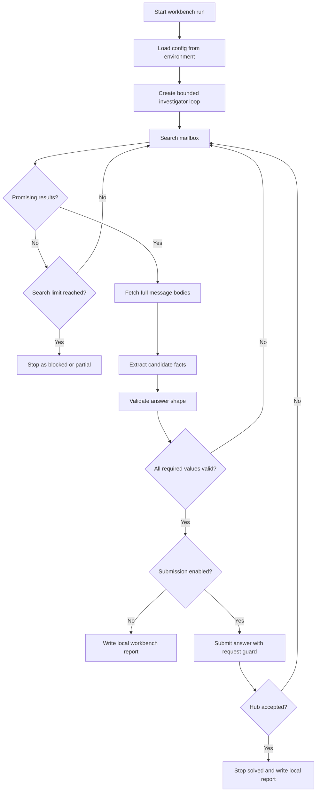

# L9 Mailbox README

## Table Of Contents

- [Purpose](#purpose)
- [Current Status](#current-status)
- [Workflow](#workflow)
- [Promising Results](#promising-results)
- [Mermaid Logic Flow](#mermaid-logic-flow)
- [Configuration](#configuration)
- [Data Layout](#data-layout)
- [Tool Strategy](#tool-strategy)
- [Result Contract](#result-contract)
- [Run](#run)
- [Main Modules](#main-modules)
- [Verification](#verification)
- [Safety Rules](#safety-rules)
- [What This Task Should Teach](#what-this-task-should-teach)

## Purpose

`L9_mailbox` is a learning app for the AI_devs L9 `mailbox` exercise. The task is to inspect a read-only mailbox API, find messages related to a suspected report from Wiktor, extract three required facts, and submit the final answer only after local validation.

The learning focus is controlled agentic search: the model should be able to choose useful mailbox queries, inspect full message bodies, keep track of evidence, and continue when the active mailbox changes during the run.

## Current Status

The app is in design and workbench planning state.

Completed:

- inspected the zmail `help` action,
- documented available mailbox API actions in `L9_mailbox_DEV_NOTES.md`,
- agreed to start with a workbench rather than a production app,
- added minimal package skeleton and configuration loading,
- added read-only zmail client methods for `help`, `getInbox`, `getThread`, `getMessages`, and `search`,
- added deterministic answer validators,
- added deterministic workbench search helpers for promising-result scoring and safe search reports,
- added deterministic structured extraction from fetched message payloads.

Not implemented yet:

- agent loop,
- Hub submission flow.

## Workflow

The planned workbench flow is:

1. Load configuration from environment variables.
2. Start a bounded `Mailbox Investigator` loop.
3. Search the mailbox with targeted queries.
4. Fetch full message bodies for promising message identifiers.
5. Extract candidate values for `date`, `password`, and `confirmation_code`.
6. Validate candidate values with deterministic checks.
7. If values are missing or rejected, continue searching within loop limits.
8. Submit only a locally valid answer, if submission is explicitly enabled.
9. Stop when the task is solved, blocked, or guard limits are reached.

## Promising Results

A result is promising when metadata or search context gives enough signal to fetch the full message body. Useful signals include `proton.me`, Wiktor-related text, power plant or security terms, `password` or credentials language, `SEC-`, or membership in an already suspicious thread.

Promising metadata is only a routing signal. Final facts must come from full message bodies fetched with `getMessages`.

## Mermaid Logic Flow



## Configuration

| Variable | Purpose |
| --- | --- |
| `AI_DEVS_API_KEY` | Authenticates zmail and Hub requests. |
| `ZMAIL_API_URL` | Mailbox API endpoint. |
| `HUB_VERIFY_URL` | Hub verification endpoint. |

Secrets must live in `.env`. Do not put real secrets in source, docs, logs, reports, or committed app data.

Model name and workbench guard limits are regular app constants in `config.py`, not `.env` secrets. The current planned model is the OpenAI model `gpt-5-mini`.

## Data Layout

Runtime artifacts should live outside source code:

| Path | Intended Use |
| --- | --- |
| `data/L9_mailbox/logs/` | Request, tool-call, API feedback, and debugging logs for local learning. |
| `data/L9_mailbox/output/` | Local run reports, including mailbox feedback and extracted candidate values when useful for debugging. |
| `data/L9_mailbox/cache/` | Optional short-lived mailbox result cache, if useful during workbench exploration. |

Source code and documentation belong under `src/apps/L9_mailbox/`.

The `data/L9_mailbox/...` directory is intended for ignored runtime artifacts. It may contain course API feedback such as mailbox contents, candidate values, final answers, Hub feedback, and FLAGS for debugging. It must not contain API keys, operational endpoints, or credentials that grant real external access.

## Tool Strategy

The workbench should expose narrow tools to the agent:

| Tool | Purpose |
| --- | --- |
| `search_messages` | Run a zmail search query with optional pagination. |
| `get_thread` | Inspect message identifiers inside a thread. |
| `get_messages` | Fetch full message bodies by `rowID` or `messageID`. |
| `propose_answer` | Return structured candidate values and evidence. |
| `submit_answer` | Submit only after local validation and only when enabled. |
| `finish` | End the run with `solved`, `partial`, or `blocked` status. |

The initial workbench can include lower-level debugging helpers, but the main agent path should use narrow tools.

## Result Contract

The investigator should produce structured output, not only prose:

```json
{
  "status": "solved | partial | blocked",
  "found_values": {
    "date": "YYYY-MM-DD or null",
    "password": "string or null",
    "confirmation_code": "SEC-... or null"
  },
  "evidence": [
    {
      "field": "date",
      "message_id": "32-char messageID or rowID",
      "reason": "short evidence note"
    }
  ],
  "uncertainties": [
    "short note about missing or ambiguous evidence"
  ],
  "next_queries": [
    "query to try if the run continues"
  ]
}
```

Course API feedback, including mailbox contents, extracted candidates, final answers, Hub feedback, and FLAGS, may be stored in ignored runtime data when useful for debugging and learning. Do not place these learning artifacts in source code, documentation, notes, markdown files, commit messages, or published artifacts.

## Run

No runnable entrypoint exists yet.

The expected future command shape is:

```powershell
.\venv\Scripts\python.exe -m src.apps.L9_mailbox.main --workbench
```

Submission should require an explicit flag, for example:

```powershell
.\venv\Scripts\python.exe -m src.apps.L9_mailbox.main --workbench --submit
```

## Main Modules

Planned modules:

| Module | Responsibility |
| --- | --- |
| `config.py` | Loads environment variables, paths, model settings, and runtime guard settings. |
| `zmail_client.py` | Calls read-only zmail actions, blocks unsupported actions, masks API keys before storage, and normalizes API responses. |
| `workbench_search.py` | Runs targeted search helpers, scores promising metadata, collects fetch IDs, and builds search reports. |
| `extractor.py` | Extracts structured answer candidates from fetched messages, validates the proposed answer, and builds debugging reports. |
| `tools.py` | Provide narrow tool functions for the investigator loop. |
| `validator.py` | Checks date, password, confirmation code, and full answer shape before any submission. |
| `agent.py` | Run the bounded mailbox investigator loop. |
| `report_writer.py` | Write local runtime reports under `data/L9_mailbox/...`. |
| `main.py` | Parse CLI arguments and run the selected workbench mode. |

## Verification

Current verification:

- the zmail `help` response was inspected successfully,
- available read-only actions were documented in dev notes,
- `zmail_client.py` passed local payload and masking checks,
- one guarded `help` call through `ZmailClient` returned HTTP `200` with `ok: true`,
- `validator.py` passed local checks with fake valid and invalid values,
- `workbench_search.py` passed local checks with fake mailbox data,
- one read-only dry run searched `from:proton.me` and performed a technical fetch check,
- `extractor.py` passed local checks with fake message bodies and debug reports.

When Python `requests` fails with `CERTIFICATE_VERIFY_FAILED`, follow the repository `TROUBLESHOOTING.md` guidance and set `REQUESTS_CA_BUNDLE` to the existing CA bundle. Keep TLS verification enabled.

Future verification should include:

- a bounded workbench loop dry run without submission,
- a guarded submit run only after local validation passes.

## Safety Rules

- Do not store API keys, operational endpoints, or credentials that grant real external access in docs, source files, logs, reports, commits, or app data.
- Course API feedback such as mailbox contents, extracted dates, extracted codes, Hub feedback, candidate values, final answers, and FLAGS may be stored under ignored `data/L9_mailbox/...` when useful for debugging.
- Do not place course FLAGS, final answers, or Hub feedback in source code, documentation, notes, markdown files, commit messages, or published artifacts.
- Do not submit to Hub unless the run was explicitly started in submission mode.
- Do not let the model submit values that failed deterministic validation.
- Do not extract facts from metadata alone; fetch full message bodies first.
- Do not run an unbounded agent loop against an active mailbox.

## What This Task Should Teach

This section is a draft until the exercise is solved. The intended lesson is that an agentic workflow is useful when a task needs iterative search, evidence tracking, and adaptation to changing data, but the surrounding code still needs deterministic guards, narrow tools, structured outputs, and clear secret-handling rules.
