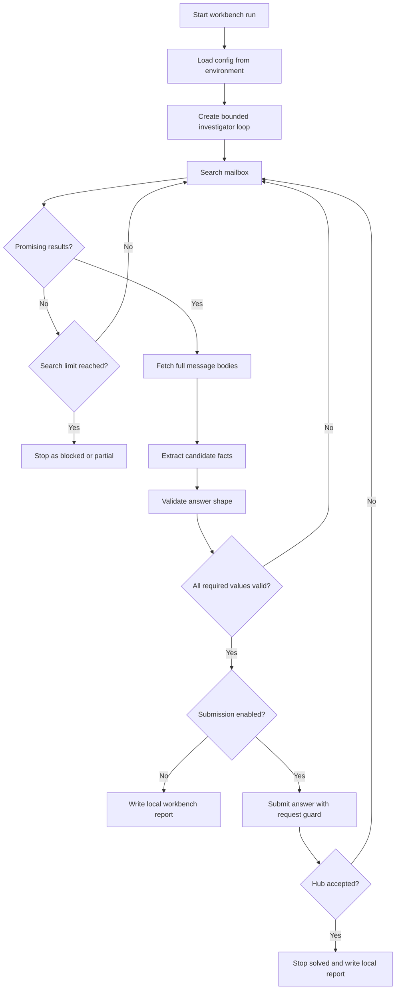

# L9 Mailbox README

## Table Of Contents

- [Purpose](#purpose)
- [Current Status](#current-status)
- [Workflow](#workflow)
- [Promising Results](#promising-results)
- [Mermaid Logic Flow](#mermaid-logic-flow)
- [LLM Usage And Reviews](#llm-usage-and-reviews)
- [Configuration](#configuration)
- [Data Layout](#data-layout)
- [Tool Strategy](#tool-strategy)
- [Result Contract](#result-contract)
- [Run](#run)
- [Main Modules](#main-modules)
- [Verification](#verification)
- [Safety Rules](#safety-rules)
- [What This Task Should Teach](#what-this-task-should-teach)

## Purpose

`L9_mailbox` is a learning app for the AI_devs L9 `mailbox` exercise. The task is to inspect a read-only mailbox API, find messages related to a suspected report from Wiktor, extract three required facts, and submit the final answer only after local validation.

The learning focus is controlled agentic search: the model should be able to choose useful mailbox queries, inspect full message bodies, keep track of evidence, and continue when the active mailbox changes during the run.

## Current Status

The app is in solved guarded submission workbench state. Steps 1-9 from the implementation plan are completed, so the mailbox investigator can now search, fetch, extract, retry, recover from weak retrieval, submit through a bounded Hub guard, and stop within explicit limits.

Completed:

- inspected the zmail `help` action,
- documented available mailbox API actions in `L9_mailbox_DEV_NOTES.md`,
- defined the workbench direction with one bounded `Mailbox Investigator`,
- added the package skeleton and configuration loading,
- added read-only zmail client methods for `help`, `getInbox`, `getThread`, `getMessages`, and `search`,
- added deterministic answer validators,
- added deterministic workbench search helpers for promising-result scoring, fetch-ID collection, and safe search reports,
- added deterministic structured extraction from fetched message payloads,
- implemented narrow agent tools for mailbox search, thread lookup, message fetch, deterministic answer proposal, and guarded finish,
- implemented the bounded `Mailbox Investigator` loop with one tool call per model turn and an iteration guard,
- added deterministic recovery helpers that widen suspicious thread fetches and rerun extraction from the cached corpus when the model stops too early,
- added a local JSON report writer with guard counters, runtime summary, and durable full-message archives,
- verified the Step 7 loop locally with fake OpenAI and fake zmail clients,
- added a guarded `submit_answer` tool and Hub client behind an explicit `--submit` flag,
- added a `main.py` CLI entrypoint for `--workbench` and optional `--submit`,
- verified Step 8 locally with fake OpenAI, fake zmail, and fake Hub clients,
- completed the first real live run against OpenAI, zmail, and Hub, which solved the task and stored the returned FLAG inside ignored runtime data.

Not implemented yet:

- optional prompt and retrieval cleanup to reduce the number of live iterations,
- optional report cleanup if the current value-bearing archive becomes too verbose for daily debugging.

## Workflow

The current implemented workflow is:

1. Load configuration from environment variables.
2. Start one bounded `Mailbox Investigator` loop with narrow mailbox tools.
3. Search mailbox metadata with targeted queries.
4. Score search metadata to decide which messages are worth fetching.
5. Fetch full message bodies for promising message identifiers.
6. Extract candidate values for `date`, `password`, and `confirmation_code`.
7. Validate candidate values with deterministic checks and let the model either retry or stop with a structured `finish` payload.
8. If the model stalls, expand suspicious threads and rerun deterministic extraction from all cached full messages.
9. If `--submit` is enabled, allow `submit_answer` only after local validation and grounded evidence.
10. Write a local workbench report with the final status, guard counters, Hub feedback, and full fetched-message archive.

The next workflow improvement is:

1. Reduce live iteration count by teaching the model to reach the suspicious thread earlier.
2. Keep deterministic recovery as the safety net when the active mailbox changes during the run.
3. Refine prompts or search heuristics only if future live feedback shows a concrete gap.

## Promising Results

A result is promising when metadata or search context gives enough signal to fetch the full message body. Useful signals include `proton.me`, Wiktor-related text, power plant or security terms, `password` or credentials language, `SEC-`, or membership in an already suspicious thread.

Promising metadata is only a routing signal. Final facts must come from full message bodies fetched with `getMessages`.

## Mermaid Logic Flow

This flowchart shows the target end-to-end workbench after Step 8 is implemented. Today the repository implements the full bounded loop, including optional guarded submission.



## LLM Usage And Reviews

| Area | Status | Evidence |
| --- | --- | --- |
| LLM usage | Yes | The bounded `Mailbox Investigator` loop uses an OpenAI model to choose mailbox tool calls, decide when to retry, and decide when to submit or finish. Deterministic code still owns validation, extraction, finish checks, and submit guards. |
| Design review | Passed | `_agent/instructions/llm_design_checklist.md`; 2026-06-05; scope: Step 7 bounded investigator loop and Step 8 guarded submit flow for the non-production workbench; result: PASS; boundary: implement one investigator agent only, expose narrow mailbox tools only, keep context limited to current evidence and validation state, require structured output, keep deterministic validation before submit, and require an explicit submit flag. |
| Optimization review | Passed | `_agent/instructions/llm_optimization_checklist.md`; 2026-06-05; scope: full Step 8 mailbox workbench plus deterministic recovery and runtime archive persistence; mode: non-production; result: PASS; follow-up: the first live `--submit` run solved the task and confirmed the workflow, so remaining work is iterative prompt and retrieval tuning only. |

## Configuration

| Variable | Purpose |
| --- | --- |
| `OPENAI_API_KEY` | Authenticates OpenAI Responses API calls for the bounded investigator loop. |
| `AI_DEVS_API_KEY` | Authenticates zmail and Hub requests. |
| `ZMAIL_API_URL` | Mailbox API endpoint. |
| `HUB_VERIFY_URL` | Hub verification endpoint. |

Secrets must live in `.env`. Do not put real secrets in source, docs, logs, reports, or committed app data.

Model name, reasoning effort, and workbench guard limits are regular app constants in `config.py`, not `.env` secrets. The current investigator loop uses the OpenAI model `gpt-5-mini` with low reasoning effort.

## Data Layout

Runtime artifacts should live outside source code:

| Path | Intended Use |
| --- | --- |
| `data/L9_mailbox/logs/` | Request, tool-call, API feedback, and debugging logs for local learning. |
| `data/L9_mailbox/output/` | Local run reports, full fetched-message archives, mailbox feedback, extracted candidate values, final answers, Hub feedback, and FLAGS when useful for debugging. |
| `data/L9_mailbox/cache/` | Optional short-lived mailbox result cache, if useful during workbench exploration. |

Source code and documentation belong under `src/apps/L9_mailbox/`.

The `data/L9_mailbox/...` directory is intended for ignored runtime artifacts. It may contain course API feedback such as mailbox contents, candidate values, final answers, Hub feedback, and FLAGS for debugging. It must not contain API keys, operational endpoints, or credentials that grant real external access.

## Tool Strategy

The repository now implements the narrow agent layer, so the model does not receive a broad raw mailbox API surface.

Current agent tools:

| Tool | Purpose |
| --- | --- |
| `search_messages` | Run a zmail search query with optional pagination. |
| `get_thread` | Inspect message identifiers inside a thread. |
| `get_messages` | Fetch full message bodies by `rowID` or `messageID`. |
| `propose_answer` | Return structured candidate values and evidence. |
| `submit_answer` | Submit only after local validation and only when `--submit` enables Hub submission. |
| `finish` | End the run with `solved`, `partial`, or `blocked` status. |

Current deterministic helpers that support the agent:

- `workbench_search.py` handles targeted queries, promising-result scoring, safe reports, and fetch-ID collection.
- `extractor.py` handles candidate extraction, structured answer proposals, and local debug views.
- `validator.py` keeps final answer checks deterministic and outside the model.
- `tools.py` also exposes deterministic recovery helpers that can widen suspicious thread fetches and rebuild the answer from all cached message bodies.

## Result Contract

The investigator should produce structured output, not only prose:

```json
{
  "status": "solved | partial | blocked",
  "found_values": {
    "date": "YYYY-MM-DD or null",
    "password": "string or null",
    "confirmation_code": "SEC-... or null"
  },
  "evidence": [
    {
      "field": "date",
      "message_id": "32-char messageID or rowID",
      "reason": "short evidence note"
    }
  ],
  "uncertainties": [
    "short note about missing or ambiguous evidence"
  ],
  "next_queries": [
    "query to try if the run continues"
  ]
}
```

Course API feedback, including mailbox contents, extracted candidates, full fetched message bodies, final answers, Hub feedback, and FLAGS, may be stored in ignored runtime data when useful for debugging and learning. Do not place these learning artifacts in source code, documentation, notes, markdown files, commit messages, or published artifacts.

## Run

The workbench now has a CLI entrypoint.

The current minimal smoke check is:

```powershell
.\venv\Scripts\python.exe -c "import src.apps.L9_mailbox; print('import ok')"
```

The current Step 7 local verification command is:

```powershell
.\venv\Scripts\python.exe -m unittest tests.L9_mailbox.test_agent_loop
```

The current dry-run command shape is:

```powershell
.\venv\Scripts\python.exe -m src.apps.L9_mailbox.main --workbench
```

Hub submission requires an explicit flag:

```powershell
.\venv\Scripts\python.exe -m src.apps.L9_mailbox.main --workbench --submit
```

When Python `requests` hits the known local TLS inspection issue, keep verification enabled and point both `REQUESTS_CA_BUNDLE` and `SSL_CERT_FILE` to the repository CA bundle before running the live command.

## Main Modules

Current and planned modules:

| Module | Status | Responsibility |
| --- | --- | --- |
| `config.py` | Implemented | Loads environment variables, paths, model settings, and runtime guard settings. |
| `zmail_client.py` | Implemented | Calls read-only zmail actions, blocks unsupported actions, masks API keys before storage, and normalizes API responses. |
| `workbench_search.py` | Implemented | Runs targeted search helpers, scores promising metadata, collects fetch IDs, and builds search reports. |
| `extractor.py` | Implemented | Extracts structured answer candidates from fetched messages, applies correction-aware candidate priority, validates the proposed answer, and builds debugging reports. |
| `validator.py` | Implemented | Checks date, password, confirmation code, and full answer shape before any submission. |
| `tools.py` | Implemented | Provides narrow mailbox tools, validates finish payloads, caches fetched messages, exposes deterministic recovery helpers, and tracks loop state for reports. |
| `agent.py` | Implemented | Runs the bounded mailbox investigator loop with one OpenAI-driven tool call per turn, explicit stop guards, and deterministic recovery before giving up. |
| `hub_client.py` | Implemented | Builds guarded Hub verification requests, masks API keys for reports, and preserves raw Hub feedback. |
| `report_writer.py` | Implemented | Writes `run_report.json` and `fetched_messages.json` under `data/L9_mailbox/output/`. |
| `main.py` | Implemented | Parses CLI arguments and runs the workbench in dry-run or guarded submit mode. |

## Verification

Current verification:

- the zmail `help` response was inspected successfully,
- available read-only actions were documented in dev notes,
- `zmail_client.py` passed local payload and masking checks,
- one guarded `help` call through `ZmailClient` returned HTTP `200` with `ok: true`,
- `validator.py` passed local checks with fake valid and invalid values,
- `workbench_search.py` passed local checks with fake mailbox data,
- one read-only dry run searched `from:proton.me` and performed a technical fetch check,
- `extractor.py` passed local checks with fake message bodies and debug reports,
- `tests.L9_mailbox.test_agent_loop` passed locally with fake OpenAI and fake mailbox clients,
- the local Step 7 test wrote a report with visible guard counters for iterations, model calls, and tool calls,
- the local Step 8 test passed with fake Hub submission and verified that submission mode cannot finish as `solved` before an accepted submit,
- the deterministic recovery test solved a fake mailbox after a weak model path and persisted a full fetched-message archive,
- the first live `--workbench --submit` run exercised real OpenAI, zmail, and Hub calls and finished as `solved`,
- the live report stored final values, Hub feedback, the returned FLAG, and the full fetched-message archive under ignored `data/L9_mailbox/output/`.

When Python `requests` fails with `CERTIFICATE_VERIFY_FAILED`, follow the repository `TROUBLESHOOTING.md` guidance and set `REQUESTS_CA_BUNDLE` to the existing CA bundle. Keep TLS verification enabled.

Future verification should include:

- a second live run to confirm the solution remains stable if the mailbox changes again,
- optional prompt tuning to reduce the current live iteration count.

## Safety Rules

- Do not store API keys, operational endpoints, or credentials that grant real external access in docs, source files, logs, reports, commits, or app data.
- Course API feedback such as mailbox contents, extracted dates, extracted codes, Hub feedback, candidate values, final answers, and FLAGS may be stored under ignored `data/L9_mailbox/...` when useful for debugging.
- Do not place course FLAGS, final answers, or Hub feedback in source code, documentation, notes, markdown files, commit messages, or published artifacts.
- Do not submit to Hub unless the run was explicitly started in submission mode.
- Do not let the model submit values that failed deterministic validation.
- Do not extract facts from metadata alone; fetch full message bodies first.
- Do not run an unbounded agent loop against an active mailbox.

## What This Task Should Teach

The solved exercise shows that an agentic workflow is useful when a task needs iterative search, evidence tracking, and adaptation to changing data, but the surrounding code still needs deterministic guards, narrow tools, recovery paths, structured outputs, and clear secret-handling rules.
